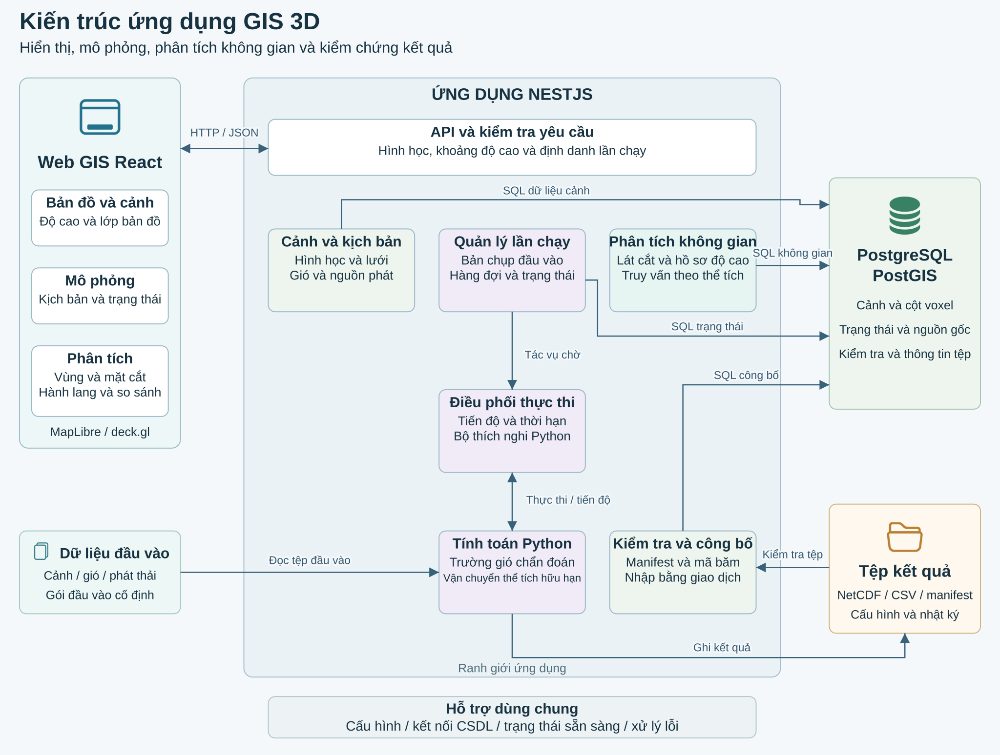
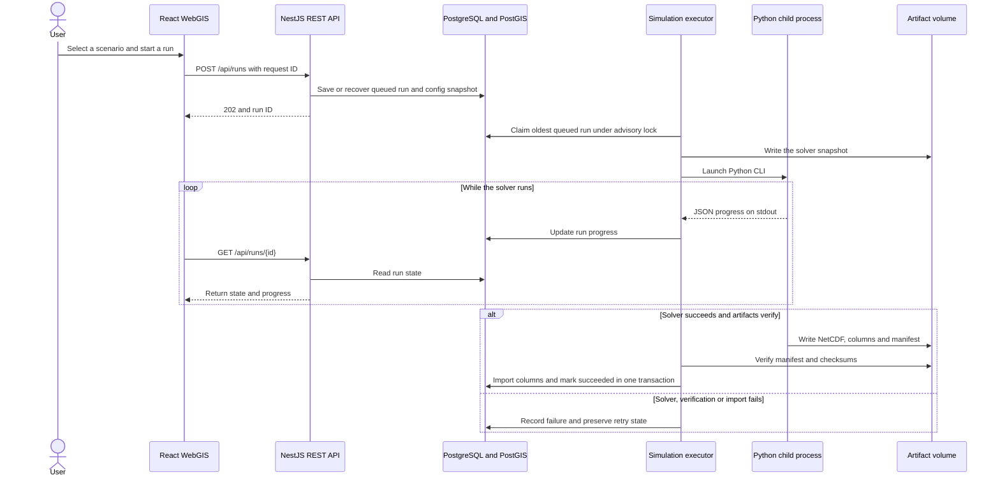
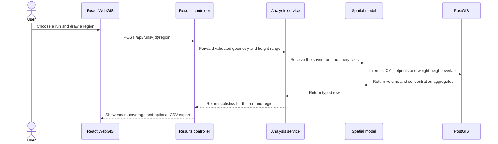

# IE402 — Urban Air Pollution Dispersion with 3D GIS

> A WebGIS project for simulating and exploring traffic-related PM2.5 dispersion around Nguyễn Huệ Walking Street in Ho Chi Minh City.


## What is IE402 Voxel Air?

The project combines a mass-consistent diagnostic wind field with finite-volume transport on a 3D voxel grid. The standard domain is 500 × 500 × 100 m with 500,000 cells of 5 × 5 × 2 m. The modeled concentrations represent the contribution of the selected emission source under the specified assumptions.

## Table of Contents

- [Features](#features)
- [Technology Stack](#technology-stack)
- [Team](#team)
- [Quick Start](#quick-start)
- [From Urban Inputs to a Query](#from-urban-inputs-to-a-query)
- [Architecture](#architecture)
- [Project Structure](#project-structure)
- [Verify and Reproduce](#verify-and-reproduce)
- [Project Documentation](#project-documentation)

## Features

- Explore buildings, roads, wind and modeled PM2.5 in 2D or 3D.
- Inspect horizontal slices, cell profiles and vertical sections at selected heights.
- Calculate regional statistics or compare results across road distance bands.
- Run seasonal wind and source-reduction scenarios, compare compatible runs and export maps and data.

## Technology Stack

| Layer | Technologies and role |
| --- | --- |
| WebGIS | React and TypeScript for the interface, Vite for development and builds, MapLibre GL JS for the basemap, and deck.gl for the voxel and wind overlays. |
| API | NestJS on Node.js with Swagger for REST documentation and a supervised Python process for solver execution. |
| Simulation | Python with numerical and geospatial libraries for voxelization, diagnostic wind and finite-volume transport. NetCDF stores the gridded output. |
| Spatial database | PostgreSQL 16 and PostGIS 3.4 for scene geometries, run state, spatial queries and indexed concentration reads. |
| Delivery and testing | Docker Compose for the application and database, Vitest for TypeScript tests, pytest for Python tests, and GitHub Actions for automatic tests and isolated demo verification. |

## Team

| Member | Responsibility | Deliverables |
| --- | --- | --- |
| **Tâm** | All four engineering upgrade phases | React migration, English-first localization with Vietnamese support, spatial SQL and CSV, run orchestration, Python subprocess reliability, deployment, CI and end-to-end verification. |
| **Thanh** | GIS data and scientific verification | Dataset provenance and rights, independent spatial reference calculations, numerical parity review, sensitivity studies and scientific figures. |
| **Both** | Release and course assessment | Align the demo and scientific artifacts with one verified revision. |

See the [upgrade plan](docs/UPGRADE_PLAN.md) and [milestone roadmap](docs/ROADMAP.md).

## Quick Start

Install Git and Docker with Compose v2. On Windows, start Docker Desktop with Linux containers. The first build downloads dependencies. The checkout contains the verified demo input bundle and scene seed. The map’s external basemap needs internet access.

### Docker quick start

From the repository root in PowerShell:

```powershell
$env:SOURCE_REVISION = (git rev-parse --short HEAD).Trim()
docker compose up -d --build --wait
docker compose ps
Invoke-RestMethod http://127.0.0.1:3000/api/health
```

Open [WebGIS](http://127.0.0.1:3000/) or [Swagger](http://127.0.0.1:3000/api/docs). Health should report `status: ok` and `database.status: up`. Startup verifies the bundled inputs, applies migrations and seeds the scene. The database and solver artifacts use named Docker volumes.

The host `data/` and `artifacts/` folders are generated on demand. Docker installs its solver inputs from `deploy/demo-inputs/` and stores run outputs in its named volume. For local Python development, restore the two packaged inputs with `python -m src.demo_bundle install --bundle deploy/demo-inputs`. The other raw research datasets require their preparation scripts.

| Situation | What to run |
| --- | --- |
| Port 3000 is occupied | Set `$env:APP_HOST_PORT = '3001'` before startup and open that port. |
| Inspect an unhealthy service | Run `docker compose logs --tail 100 app db` and inspect the health body. |
| Stop the demo and keep its results | Run `docker compose stop`. |
| Existing runs refer to a different scene/configuration | Use the isolated verification command below on a free port. |

### Isolated demo with existing verification scripts

Node.js 22 or newer, Docker and Chrome or Edge are needed for the local browser check. The script starts with empty volumes, runs both FV seasons, verifies downloads and spatial queries, and repeats result reads after restart.

```powershell
npm ci --prefix app --no-audit --no-fund
node scripts/rehearse.mjs --port 3107 --out artifacts/demo-local --keep
```

Open [the isolated demo](http://127.0.0.1:3107/) after its health check passes. The script prints its unique Compose project name. It removes its own containers and volumes when run without `--keep`. The ordinary demo can start with an empty result list. Create a run from **Simulation** or use the API example below.

### Develop with React, Vite and Vitest

With Docker serving a healthy API on port 3000:

```powershell
npm ci --prefix frontend
npm --prefix frontend run dev
npm --prefix frontend test
npm --prefix frontend run build
```

Vite prints the dev URL. Vitest runs the component, state and API-client tests. Use `npm --prefix frontend run test:watch` during development. See the [frontend guide](frontend/README.md) for the proxy target and the [backend guide](app/README.md) for local NestJS, migrations and PostGIS tests.

## From urban inputs to a query

The scene package clips building footprints, roads and other vector features to Nguyễn Huệ and stores metric geometry in EPSG:32648. Building heights determine the solid mask on a regular 100 × 100 × 50 grid. The road emission proxy, constrained by EDGAR, populates the source field. A configured seasonal wind scenario supplies the boundary wind. The Python solver calculates a mass-consistent wind field and solves finite-volume advection and diffusion for PM2.5. The solver writes checksummed NetCDF and column artifacts. NestJS verifies them and imports result arrays into PostGIS before exposing the run as succeeded.

Use the map at several heights, choose a cell for its full profile, or open **Analysis** for polygon statistics, vertical sections, road buffers and comparisons. The interaction uses the original simulation values. Heights are relative to the flat model ground. For example, 1 m is the center of the 0–2 m layer.

| Operation | REST endpoint under `/api/runs/{id}` | Spatial calculation |
| --- | --- | --- |
| Horizontal slice | `GET /slices?z_m=1` | Select layer `k` and join concentration columns to grid footprints. An optional viewport filters the candidate geometry. |
| Vertical profile | `GET /profile?i=0&j=0` | Read the altitude array in one grid column. |
| Polygon region | `POST /region` | Intersect the polygon with XY footprints. Multiply intersection area by the overlap in height. |
| Vertical section | `POST /transect` | Project a WGS84 line, sample it in metres and look up the intersected voxel columns. |
| Road corridor | `POST /road-corridor` | Clip disjoint road distance bands to the study area. Apply XY and vertical overlap weights. |
| Run difference | `GET /comparison?compare_run_id={other}&z_m=1` | Match compatible grids and masks and calculate comparison minus baseline. |

A zero concentration represents valid air with value zero. An occupied voxel and an air voxel with missing data are distinct states. The concentration unit is µg/m³. Region and corridor means are weighted by valid air volume. Exceedance uses a strict greater-than test against the selected reference threshold. The [database guide](docs/DATABASE.md) explains the schema, array indexing, GiST filters and SQL execution plans.

### Run and query from PowerShell

```powershell
$api = 'http://127.0.0.1:3000/api'
Invoke-RestMethod "$api/scenarios"
$body = @{scenario_id='dry_nov_apr'; model='fv'; emission_multiplier=1; request_id=[guid]::NewGuid().ToString()} | ConvertTo-Json
$run = Invoke-RestMethod "$api/runs" -Method Post -ContentType 'application/json' -Body $body
$id = $run.run_id
Invoke-RestMethod "$api/runs/$id"
# Repeat GET until status is succeeded. For failed/stale runs, inspect the returned error.
Invoke-RestMethod "$api/runs/$id/summary"
Invoke-RestMethod "$api/runs/$id/slices?z_m=15"
Invoke-RestMethod "$api/runs/$id/profile?i=0&j=0"

$areas = Invoke-RestMethod "$api/study-areas"
$scene = Invoke-RestMethod "$api/study-areas/$($areas[0].id)/scene"
$road = $scene.roads.features[0].properties.source_feature_id
$band = @{road_ids=@($road); distances_m=@(10,25,50); z_min_m=1; z_max_m=15; threshold_ug_m3=15} | ConvertTo-Json
Invoke-RestMethod "$api/runs/$id/road-corridor" -Method Post -ContentType 'application/json' -Body $band
Invoke-WebRequest "$api/runs/$id/road-corridor/csv" -Method Post -ContentType 'application/json' -Body $band -OutFile corridor.csv
```

The POST returns a run ID immediately. Keep the same request ID and payload if you need to recover after a lost response. Use the [Swagger schemas](http://127.0.0.1:3000/api/docs) for WGS84 polygon and line bodies. Use `GET /api/runs/{id}/artifacts` for manifest and field downloads. The [technical handoff](docs/TECHNICAL_HANDOFF.md) describes the independent corridor check and the scientific comparisons.

## Architecture



Docker Compose starts two containers. The application container serves the compiled React viewer and the NestJS REST API on the same origin. It includes the Python solver, which the NestJS executor starts as a child process. The second container runs PostgreSQL with PostGIS.

| Component | Responsibility |
| --- | --- |
| React WebGIS | MapLibre renders the map and deck.gl overlays the voxel and wind layers. The viewer facade coordinates API calls, view state, map updates and exports. |
| NestJS API | Controllers expose HTTP routes, DTOs validate inputs, services implement use cases, and models own parameterized SQL and database transactions. Schemas define TypeScript contracts. |
| Executor and Python adapter | The executor claims one run at a time. The adapter starts the Python CLI and translates progress events and exit codes. The executor verifies artifacts before publishing results. |
| PostgreSQL and PostGIS | Stores the scene, run lifecycle and vertical concentration arrays. Spatial models query these tables for the REST API. |
| Run artifact volume | Retains the run snapshot, checksummed manifest, NetCDF fields, CSV and solver logs. |

The main viewer uses `frontend/dist`. NestJS also serves the compatibility viewer from `frontend/legacy` at `/legacy/` and uses it at `/` when a React build is absent. See the [architecture guide](docs/ARCHITECTURE.md) for the full data model and constraints.

### Design patterns

- **Facade**: The React viewer facade coordinates map interaction, state, requests and exports behind one interface for the application shell.
- **Adapter**: The Python solver adapter translates the process invocation, stdout progress and exit status for the executor. The executor retains responsibility for claims, timeouts and publishing.
- **Observer**: State subscriptions notify the map and panels when the selected run, height or visible layers change, keeping the views synchronized without direct component-to-component control.

The database validates the publication boundary: complete XY columns, metrics, required passing checks and artifact metadata must exist before a run succeeds. Solid voxels must be null. Production runs require every air sample, while explicitly declared partial imports preserve missing values. Used scenes, thresholds and published run metadata are immutable under ordinary SQL writes. A composite foreign key links each concentration column to its grid cell. See the [database contract](docs/DATABASE.md#scientific-history-and-coverage-migration-0006).

Interactive SQL has server-side budgets of 15 seconds per statement and 3 seconds for lock waiting. Configure them with `DB_STATEMENT_TIMEOUT_MS` and `DB_LOCK_TIMEOUT_MS` in `app/.env`. Cancelled requests return a retryable HTTP 503, and failed transactions roll back before connections are reused. These are resource limits, not promised response times. Offline migration/seed commands use longer maintenance budgets.

### Simulation lifecycle


```mermaid
sequenceDiagram
    actor User
    participant UI as React WebGIS
    participant API as NestJS REST API
    participant DB as PostgreSQL and PostGIS
    participant Exec as Simulation executor
    participant Solver as Python child process
    participant Files as Artifact volume

    User->>UI: Select a scenario and start a run
    UI->>API: POST /api/runs with request ID
    API->>DB: Save or recover queued run and config snapshot
    API-->>UI: 202 and run ID
    Exec->>DB: Claim oldest queued run under advisory lock
    Exec->>Files: Write the solver snapshot
    Exec->>Solver: Launch Python CLI
    loop While the solver runs
        Solver-->>Exec: JSON progress on stdout
        Exec->>DB: Update run progress
        UI->>API: GET /api/runs/{id}
        API->>DB: Read run state
        API-->>UI: Return state and progress
    end
    alt Solver succeeds and artifacts verify
        Solver->>Files: Write NetCDF, columns and manifest
        Exec->>Files: Verify manifest and checksums
        Exec->>DB: Import columns and mark succeeded in one transaction
    else Solver, verification or import fails
        Exec->>DB: Record failure and preserve retry state
    end
```

### Spatial analysis query


```mermaid
sequenceDiagram
    actor User
    participant UI as React WebGIS
    participant API as Results controller
    participant Service as Analysis service
    participant Model as Spatial model
    participant DB as PostGIS

    User->>UI: Choose a run and draw a region
    UI->>API: POST /api/runs/{id}/region
    API->>Service: Forward validated geometry and height range
    Service->>Model: Resolve the saved run and query cells
    Model->>DB: Intersect XY footprints and weight height overlap
    DB-->>Model: Return volume and concentration aggregates
    Model-->>Service: Return typed rows
    Service-->>API: Return statistics for the run and region
    API-->>UI: Show mean, coverage and optional CSV export
```

## Project Structure

```text
.                                  IE402 Voxel Air repository
├── .github/workflows/             Tests on every push/PR and the manual demo verification
├── app/                           NestJS API and simulation executor
│   ├── src/                       Backend application code
│   │   ├── common/                Shared backend utilities
│   │   ├── config/                Runtime configuration and validation
│   │   ├── database/              Database CLI, imports and query benchmarks
│   │   └── modules/               Feature modules with controllers, DTOs, models, schemas and services
│   │       ├── health/            Application, database and solver readiness
│   │       ├── results/           Spatial queries, exports and artifact downloads
│   │       ├── scenarios/         Simulation scenario catalog
│   │       ├── simulation/        Run lifecycle, queue and Python subprocess
│   │       └── study-areas/       Study-area metadata and GIS scene layers
│   └── test/                      API integration tests, fixtures and helpers
├── artifacts/                     Generated local run outputs and verification evidence
├── config/                        Scene, scenario and artifact configuration
├── data/                          Generated or downloaded research inputs
│   ├── raw/                       Source downloads and original datasets
│   └── processed/                 Prepared geometry, voxel and emission inputs
├── db/                            PostgreSQL and PostGIS assets
│   ├── migrations/                Versioned schema changes
│   └── seeds/scene/               Packaged vector layers and grid cells
├── deploy/                        Container startup, demo profile and cleanroom configuration
│   └── demo-inputs/               Verified solver input archive and manifest
├── docs/                          Specification, architecture and research notes
│   ├── img/                       Project diagrams
│   └── reviews/                   Scientific audits and release evidence
├── frontend/                      React and Vite WebGIS application
│   ├── legacy/                    Compatibility viewer and its regression tests
│   ├── public/                    Static assets, vendor fonts and icons
│   └── src/                       WebGIS application code
│       ├── api/                   REST client and API contracts
│       ├── app/                   Application shell, viewer facade and offline screen
│       ├── export/                Export state and report formatting
│       ├── features/              Simulation, statistics, analysis and map controls
│       │   └── analysis/          Run comparison, road corridor, region and transect
│       ├── i18n/                  English and Vietnamese translations
│       ├── lib/                   Shared domain calculations and helpers
│       ├── map/                   MapLibre integration and deck.gl overlays
│       ├── shared/                Reusable UI components and hooks
│       ├── store/                 Viewer state and actions
│       ├── styles/                Global styles and design tokens
│       └── test/                  Frontend test setup and helpers
├── notebooks/                     Numerical debugging notebooks
├── output/                        Research outputs from offline pipelines
│   ├── analysis/                  Analysis reports and tables
│   ├── figures/                   Research plots
│   └── netcdf/                    Gridded research results
├── scripts/                       Demo, benchmarks and verification entry points
│   ├── lib/                       Shared script helpers
│   └── tests/                     Operational script regression tests
├── src/                           Python solver and research pipeline
│   ├── analysis/                  Analysis, figures and baseline comparisons
│   ├── dispersion/                Gaussian reference model
│   ├── edgar/                     Emission inventory loading and normalization
│   ├── emission/                  Road-source allocation and rasterization
│   ├── meteo/                     Meteorology ingestion and seasonal aggregation
│   ├── openaq/                    Optional air-quality observation research
│   ├── scene/                     GIS scene preparation and export
│   ├── voxel/                     3D grid construction and building masks
│   └── wind/                      Diagnostic wind and mass consistency
└── tests/                         Python regression tests and fixtures
```

## Verify and reproduce

```powershell
docker compose up -d --wait db
npm ci --prefix app --no-audit --no-fund
npm ci --prefix frontend --no-audit --no-fund
npm --prefix app test
npm --prefix frontend test
npm --prefix frontend run build
node --test (Get-ChildItem frontend/legacy/tests/*.test.cjs,scripts/tests/*.test.mjs | Select-Object -ExpandProperty FullName)
node scripts/demo-preflight.mjs --url http://localhost:3000
```

For the required API integration suite, install the Python dependencies into a
local virtual environment and set `PYTHON_BIN` if it is outside `.venv`.
The suite uses a separate database with a `_test` suffix and rebuilds its
schema. The default developer PostGIS listener is port 5433.

```powershell
python -m venv .venv
.venv/Scripts/python.exe -m pip install -r requirements.txt
npm --prefix app run test:e2e:required
```

To capture real query plans after a successful FV run, set
`BENCHMARK_RUN_ID` and run `npm --prefix app run db:benchmark:spatial`.
The output includes actual rows, buffers, index definitions and SQL timings.

### Scientific checks

From the repository root, use the research environment installed from
`requirements.txt`. Download `AF_caseH.csv` and `RS_caseH.csv` from
[AIJ Case H](https://zenodo.org/records/15429872) into `artifacts/aij-input`.
The benchmark verifies both published checksums. Choose new output directories
for each run.

```powershell
$env:PYTHONPATH = '.'
$env:OPENBLAS_NUM_THREADS = '1'
.venv/Scripts/python.exe scripts/benchmark-aij-case-h.py artifacts/aij-input artifacts/aij-check
.venv/Scripts/python.exe scripts/study-urban-robustness.py robustness artifacts/robustness-check
.venv/Scripts/python.exe scripts/study-urban-robustness.py numerics artifacts/numerics-check
```

Case H compares normalized tracer concentration against wind-tunnel measurements.
The urban checks compare the same road distance bands at 1–15 m and 15–31 m
after 90 simulated seconds. The horizontal grid study remaps one shared source
onto all three resolutions and keeps its total release rate fixed.

The [test workflow](.github/workflows/tests.yml) runs on every push to `main` and every pull request: API lint, types and unit tests; viewer types, tests and build; the required E2E suite against a PostGIS service container; and pytest. See the [backend guide](app/README.md) for PostGIS tests. The [independent CI workflow](.github/workflows/independent-demo.yml) checks a clean build, two real runs, queries, checksums and restart. Use the [demo profile](deploy/demo-profile.json) for provenance of the pinned handoff.

## Project Documentation

- [Specification](docs/spec.md) and [database design](docs/DATABASE.md)
- [Research and source reduction study](docs/RESEARCH.md) and [emission assumptions](docs/emission_assumptions.md)
- [PM2.5 and voxel resolution decisions](docs/reviews/PM25_VOXEL_DECISIONS.md)
- [Data rights and third-party notices](docs/LICENSING.md)

The legacy research exporter can regenerate its static files with `python src/06_export_web.py --config config/project.yaml` once the required GIS and NetCDF inputs are available.
