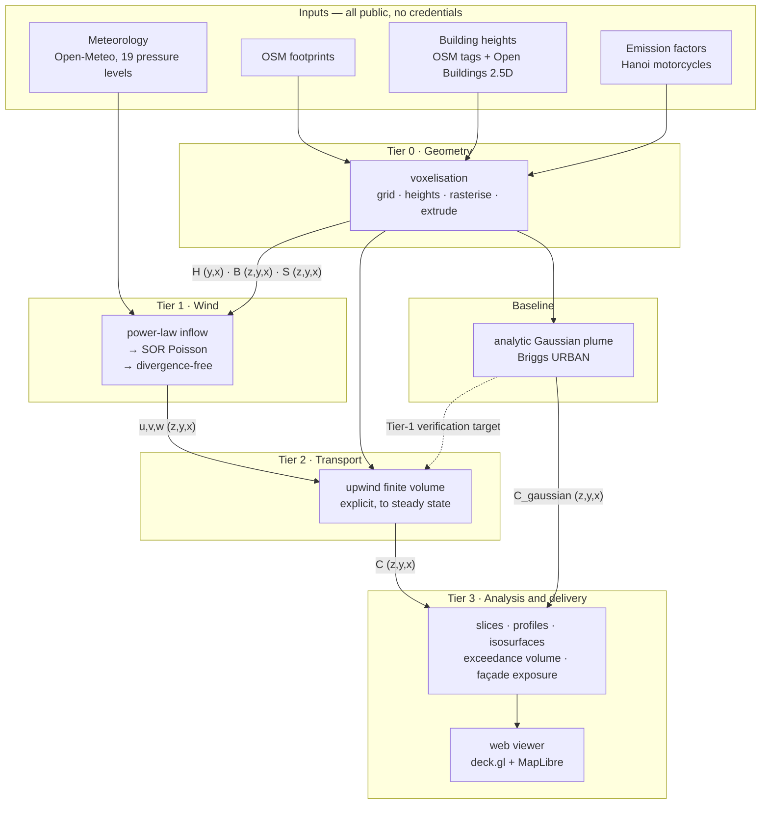

# Architecture

> **Derived from [`spec.md`](spec.md) and [`RESEARCH.md`](RESEARCH.md).** The spec says *what
> must be true*; this document says *how the parts fit and what was rejected*. Where the two
> disagree, **the spec is the requirement**. Where either disagrees with
> [`../CLAUDE.md`](../CLAUDE.md), the project file wins.
>
> The **implementation plan lives in [`ROADMAP.md`](ROADMAP.md)** — the week-by-week schedule,
> the person split, the assumptions and the confidence estimate. This document does not repeat
> it.

## 1 · Components

**Everything in the diagram shares one array shape.** The building mask, the three velocity
components, the Lagrange multiplier and the concentration are all `[z, y, x]` on the same
100 × 100 × 50 lattice (spec, *Constraints*). That is the architectural idea in one sentence:
there is no resampling, no interpolation and no coordinate translation between stages, so a bug
cannot hide in a conversion that does not exist.

## 2 · Data flow

Stages communicate through **files on disk**, never an in-memory handoff.

| # | Stage | Reads | Writes |
| --- | --- | --- | --- |
| 0 | Voxelisation | footprints, heights, grid configuration | `H (y,x)`, `B (z,y,x)` |
| 0b | Emissions | road network, emission factors | `S (z,y,x)` |
| B | Gaussian baseline | the voxel field | `C_gaussian (z,y,x)` |
| 1 | Wind | `B`, meteorology | `u, v, w (z,y,x)` |
| 2 | Transport | `u,v,w`, `S`, `B` | `C (z,y,x)` |
| 3 | Analysis and export | `C` | figures, statistics, web payload |

**Why files rather than a pipeline object.** Each stage re-runs alone. The wind field is the
slowest thing to get right, and being able to re-run transport fifty times against one frozen
wind field — without recomputing geometry — is the difference between a solver you can debug and
one you cannot.

## 3 · Boundaries

There is **no frontend/backend split and no database**. Stating that explicitly matters, because
the harness's other managed projects have both and the advisory skills assume them.

| Boundary | Source of truth | How the copies stay honest |
| --- | --- | --- |
| Grid geometry | the project configuration file | Nothing else defines domain or spacing. One constructor builds the grid; a spacing literal anywhere else is a defect |
| Array order | the grid model's documented convention | `[z, y, x]` for 3D, `[y, x]` for 2D, asserted by a unit test |
| On-disk field contract | the netCDF writer | CF conventions, `positive="up"` on `z`, so QGIS and Panoply open it unaided |
| Solver stability | the CFL helper | The time step is **computed from the velocity field**, never passed in as a constant, and the realised Courant number is reported back |
| Web payload | the exporter | The viewer reads only what the exporter wrote. There is no shared schema file — the exporter *is* the definition, and the viewer fails visibly if it drifts |

## 4 · The two solvers

**Wind (Tier 1).** Seed the domain with a power-law profile, set velocity to zero inside solid
voxels, then correct the field to be divergence-free by the variational method: minimise the
deviation from the seed subject to `∇·u = 0`, which reduces to a Poisson equation for a Lagrange
multiplier λ, solved by successive over-relaxation with ω = 1.78 (spec `EXT-4`). Buildings enter
**only** through the six face coefficients, set to zero on a wall (spec BR-2). **No momentum
equation is solved** — that is what makes it two to three orders of magnitude cheaper than LES
(spec `EXT-5`), and equally what removes cavity recirculation (spec `DEC-1`).

**Transport (Tier 2).** Solve `∂C/∂t + ∇·(uC) − ∇·(K∇C) = S` in flux form: compute advective and
diffusive fluxes on cell faces, difference them, step explicitly. Advection is first-order
upwind, taking the value from the upstream cell; diffusion is central. Face fluxes are zeroed on
building walls and at the ground, and are open at the domain edge with clean inflow. Because what
leaves one cell is exactly what enters its neighbour, **mass is conserved to machine precision**
(spec AC-9, AC-10).

## 5 · Failure modes

| Failure | How it shows | Where it is caught |
| --- | --- | --- |
| Central differencing reintroduced | negative concentrations, checkerboard pattern | spec AC-11; the boundedness test, and an assertion inside the 2D debug loop |
| Wall leakage from a wrong face coefficient | plume appears downwind of a solid block | spec AC-12 |
| Array order transposed in a new function | plume travels along the wrong axis — and often *looks* plausible | the `[z,y,x]` contract and its unit test |
| Time step too large | values blow up within tens of steps | the CFL helper computes it; the realised Courant number is reported |
| SOR fails to converge | residual divergence stays above tolerance | spec edge case *SOR hits its cap* — must fail loudly. **Not yet implemented; the wind stage is a stub** |
| Emission inside a solid voxel | mass accumulates and can never leave | spec edge case *source inside a building voxel* — **not yet implemented** |
| Silent default building height | plausible geometry, wrong heights, no warning | spec BR-11 — height resolution fails closed |
| Web payload too large | viewer never loads | spec edge case *payload too large* — the exporter downsamples and records the factor |
| Numerical diffusion mistaken for physics | plume looks realistically wide; it is the scheme | spec BR-14 — the value is computed and reported |

## 6 · Trade-offs and the alternatives that were rejected

**This is the section that matters.** A design with no rejected options is a design nobody chose.
The sourced comparison is in [`DECISION.md`](DECISION.md) §3–§4 and [`RESEARCH.md`](RESEARCH.md)
§10; this is the architectural summary.

### 6.1 Wind field

| Alternative | What it would buy | Why rejected |
| --- | --- | --- |
| **Full Röckle** — 7 empirical zones + mass consistency | cavity recirculation and street-canyon vortices, i.e. the single largest missing physics | ~15–20 person-days to stamp zone geometry per building per wind direction — over half the budget (spec `DEC-1`). **First thing to add if time appears** |
| **CFD RANS** | real turbulence closure, separation behind bluff bodies | 4–6 weeks of mesh work before any dispersion, and model skill depends on a tuning constant whose optimum is case-dependent and unknown in advance |
| **LES / LBM** | the most accurate option available | 404–4 744 GPU-hours **per case**; the project needs several |
| **Eulerian CTM** | full chemistry, regional context | smallest practical cell ~1 km against this project's 5 m. EPA describe the model as *"instantly dilut[ing] point emissions across the entire volume of the grid cell"* — a structural limit, not a resolution setting |
| **No wind model** — uniform flow with a building mask | trivial | buildings would not deflect the flow, which removes the only reason to build a 3D model |

**Chosen: mass-consistent only.** The cheapest rung that still makes buildings change the flow.
The cost is explicit, and it is written into the spec's *Out of scope* list rather than
discovered later.

### 6.2 Transport scheme

| Alternative | Why rejected |
| --- | --- |
| **Central differencing** | unbounded; produces negative concentrations at a front. This was an *actual defect* in the first draft and is now prohibited by spec BR-4 |
| **Higher-order / flux-limited** (MUSCL, van Leer) | genuinely better — far less numerical diffusion — but a limiter is a research-grade step for a team learning numpy, and a subtly wrong limiter is much harder to detect than a wrong upwind sign |
| **Implicit time stepping** | removes the CFL cap, but needs a large sparse solve every step; at 500 000 cells that is a real memory burden and substantially complicates verification. The explicit scheme is retained; its actual runtime is measured in B4.3 rather than assumed |
| **Lagrangian particles** | no numerical diffusion and no advective CFL limit, but needs a turbulence model this project does not have, and concentration recovery needs enough particles per voxel to be statistically stable |

**Chosen: explicit upwind finite volume.** Bounded, mass-conserving, about a hundred lines, and
every failure mode is visible in a 2D plot. The numerical diffusion it costs is quantified and
reported rather than absorbed (spec BR-14).

### 6.3 Grid resolution

5 m is not a preference. `RESEARCH.md` records NMSE rising **0.10 → 0.25 → 1.35** across
5 m → 10 m → 20 m against wind-tunnel data (spec `EXT-2`). Halving the cell multiplies memory by
8 and run time by roughly 16 — eight times the cells, twice the steps from CFL. 5 m sits at the
knee: fine enough that skill has not begun degrading quickly, while remaining small enough for a
laptop-scale benchmark. The actual per-scenario wall-clock is recorded in B4.3 rather than claimed in advance.

### 6.4 Web delivery

| Alternative | Why rejected |
| --- | --- |
| **CesiumJS voxel primitive** | the most "correct" answer — real ray-marched volume rendering — but a **draft extension on a side branch**, which Cesium's own documentation says *"is not final and is subject to change without Cesium's standard deprecation policy"*. Unacceptable against a fixed deadline |
| **Three.js from scratch** | full control, but no basemap, no geographic positioning and no camera controls without building them |
| **Qgis2threejs static export** | cheapest option, but little control over the height slider — the one interaction that carries the project's argument. **Retained as the fallback** |
| **A server-rendered app** | arbitrary capability, but needs hosting, a backend and a deployment story, none of which exist or are in scope |

**Chosen: deck.gl + MapLibre, one HTML file, CDN, no build step.** No npm, no bundler, no Node.
A grid layer per height level, an extrusion layer for buildings, and a slider that swaps the
active level.

### 6.5 Data interchange

netCDF-4 with CF conventions, over a bare array stack or Zarr. CF is what QGIS, ArcGIS Pro and
Panoply read unaided, which means a supervisor can open the output **without running any of this
project's code** — worth more here than Zarr's cloud story, which this project has no use for.

## 7 · Future improvements

In order of value per unit of effort:

1. **The 7 Röckle zones** — bounded work with a published formula set, and it removes the largest
   stated limitation. Roughly twice the current wind cost (spec `DEC-1`).
2. **Validation against Michelstadt or MUST** wind-tunnel data, free from Hamburg EWTL. Turns
   "verified" into "validated" — the single biggest credibility gain (spec `DEC-2`).
3. **A flux limiter** on advection, cutting numerical diffusion without abandoning boundedness.
4. **Traffic-produced turbulence** as an extra near-road diffusivity — what governs calm
   conditions, and currently absent entirely.
5. **A time series** rather than one steady state per run, enabling a diurnal cycle.
6. **NO₂ with the NO–O₃ reaction**, once the passive-scalar baseline is trusted.
