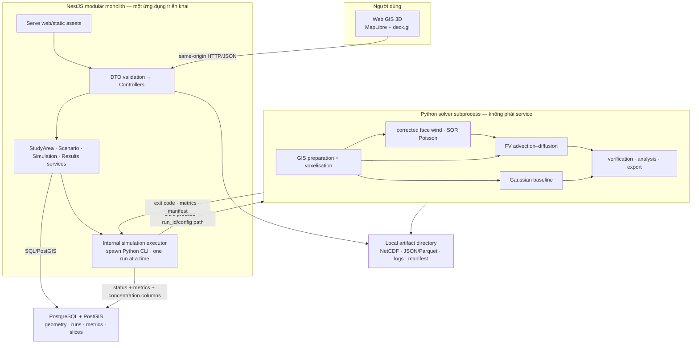
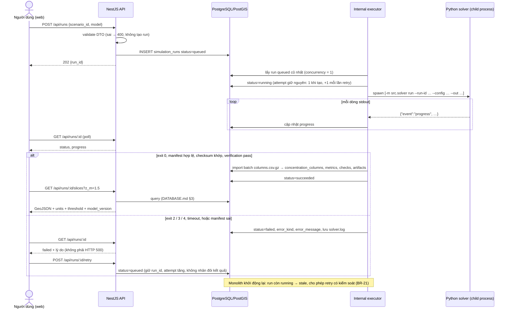

# Kiến trúc hệ thống

> Tài liệu này được dẫn xuất từ [`spec.md`](spec.md) và [`RESEARCH.md`](RESEARCH.md).
> Spec quy định *điều gì phải đúng*; tài liệu này mô tả *các thành phần ghép với nhau như thế
> nào và phương án nào bị loại*. Nếu có mâu thuẫn, spec là chuẩn yêu cầu.
>
> Kế hoạch triển khai nằm trong [`ROADMAP.md`](ROADMAP.md); tài liệu này không lặp lại lịch
> theo tuần và phân công nhân sự.

## 1 · Thành phần


```mermaid
flowchart TB
    subgraph USERS["Người dùng"]
        WEB["Web GIS 3D<br/>MapLibre + deck.gl"]
    end

    subgraph APP["NestJS modular monolith — một ứng dụng triển khai"]
        API["DTO validation → Controllers"]
        DOMAIN["StudyArea · Scenario · Simulation · Results services"]
        EXEC["Internal simulation executor<br/>spawn Python CLI · one run at a time"]
        STATIC["Serve web/static assets"]
        API --> DOMAIN
        DOMAIN --> EXEC
        STATIC --> API
    end

    subgraph PY["Python solver subprocess — không phải service"]
        VOX["GIS preparation + voxelisation"]
        WIND["corrected face wind · SOR Poisson"]
        TR["FV advection–diffusion"]
        GAU["Gaussian baseline"]
        AN["verification · analysis · export"]
        VOX --> WIND
        VOX --> GAU
        WIND --> TR
        VOX --> TR
        TR --> AN
        GAU --> AN
    end

    PG["PostgreSQL + PostGIS<br/>geometry · runs · metrics · slices"]
    ART["Local artifact directory<br/>NetCDF · JSON/Parquet · logs · manifest"]

    WEB -->|"same-origin HTTP/JSON"| API
    DOMAIN -->|"SQL/PostGIS"| PG
    EXEC -->|"child process + run_id/config path"| PY
    PY -->|"exit code · metrics · manifest"| EXEC
    PY --> ART
    EXEC -->|"status + metrics + concentration columns"| PG
    API --> ART
```

**Everything in the diagram shares one lattice.** Cell-centred fields — the building mask, the
Lagrange multiplier, the concentration and the analysis copy of `u,v,w` — are all `[z, y, x]` on
the same 100 × 100 × 50 grid (spec, *Ràng buộc*). The corrected face velocities are the one
deliberate exception: `uf` is `[z, y, x+1]`, `vf` is `[z, y+1, x]`, `wf` is `[z+1, y, x]`, staggered on
the same lattice so transport uses them without interpolation (spec BR-36). There is no resampling
and no coordinate translation between stages, so a bug cannot hide in a conversion that does not
exist.

Kiến trúc mục tiêu là **modular monolith**, không phải microservice. NestJS là một ứng dụng duy
nhất chứa các module nghiệp vụ, phục vụ frontend và gọi pipeline Python bằng tiến trình con.
PostgreSQL/PostGIS là cơ sở dữ liệu của monolith; NetCDF là định dạng artifact khoa học. Python
được giữ riêng về ngôn ngữ để tái sử dụng solver NumPy/SciPy, nhưng không có API, queue hay vòng
đời deployment riêng.

## 2 · Luồng dữ liệu

Các stage số trị vẫn giao tiếp bằng **file trên đĩa/artifact**, không truyền tensor lớn qua
HTTP hay giữ toàn bộ pipeline trong RAM của NestJS. `SimulationModule` tạo `run_id`, spawn
Python CLI với config đã snapshot và đọc manifest khi tiến trình kết thúc. PostgreSQL là nguồn
sự thật về trạng thái; không có message broker hoặc worker service.

| # | Stage | Reads | Writes |
| --- | --- | --- | --- |
| 0 | GIS preparation + voxelisation | footprints, heights, roads, water/green, grid | `scene package`, `H (y,x)`, `B (z,y,x)` |
| 0b | Emissions | road network, emission factors | `S (z,y,x)` |
| B | Gaussian baseline | the voxel field | `C_gaussian (z,y,x)` |
| 1 | Wind | `B`, meteorology | cell-centred `u,v,w` để phân tích + corrected face velocities `uf,vf,wf` cho transport |
| 2 | Transport | `uf,vf,wf`, `S`, `B` | `C (z,y,x)`, mass ledger, positivity metrics |
| 3 | Analysis and export | `C` | figures, statistics, web payload |
| 4 | Python subprocess completion | outputs + manifest + exit code | executor kiểm checksum/gate rồi import `columns.csv.gz` theo batch trong transaction |
| 5 | `ResultsModule` | run metadata, PostGIS columns, artifact refs | slice/exceedance/profile/summary/volume DTO + artifact download |
| 6 | Web 3D | API responses + versioned scene package | data-derived LoD1 city, concentration/wind layers, profiles, status dashboard |

### Vòng đời một run (user flow)


```mermaid
sequenceDiagram
    actor U as Người dùng (web)
    participant API as NestJS API
    participant DB as PostgreSQL/PostGIS
    participant EX as Internal executor
    participant PY as Python solver (child process)

    U->>API: POST /api/runs {scenario_id, model}
    API->>API: validate DTO (sai → 400, không tạo run)
    API->>DB: INSERT simulation_runs status=queued
    API-->>U: 202 {run_id}
    EX->>DB: lấy run queued cũ nhất (concurrency = 1)
    EX->>DB: status=running (attempt giữ nguyên: 1 khi tạo, +1 mỗi lần retry)
    EX->>PY: spawn [-m src.solver run --run-id … --config … --out …]
    loop mỗi dòng stdout
        PY-->>EX: {"event":"progress", …}
        EX->>DB: cập nhật progress
    end
    U->>API: GET /api/runs/:id (poll)
    API-->>U: status, progress
    alt exit 0, manifest hợp lệ, checksum khớp, verification pass
        EX->>DB: import batch columns.csv.gz → concentration_columns, metrics, checks, artifacts
        EX->>DB: status=succeeded
        U->>API: GET /api/runs/:id/slices?z_m=1.5
        API->>DB: query (DATABASE.md §3)
        API-->>U: GeoJSON + units + threshold + model_version
    else exit 2 / 3 / 4, timeout, hoặc manifest sai
        EX->>DB: status=failed, error_kind, error_message, lưu solver.log
        U->>API: GET /api/runs/:id
        API-->>U: failed + lý do (không phải HTTP 500)
        U->>API: POST /api/runs/:id/retry
        API->>DB: status=queued (giữ run_id, attempt tăng, không nhân đôi kết quả)
    end
    Note over EX,DB: Monolith khởi động lại: run còn running → stale, cho phép retry có kiểm soát (BR-21)
```

**Why files rather than a pipeline object.** Each stage re-runs alone. The wind field is the
slowest thing to get right, and being able to re-run transport fifty times against one frozen
wind field — without recomputing geometry — is the difference between a solver you can debug and
one you cannot.

## 3 · Ranh giới và nguồn sự thật

Hệ thống chỉ có **một application boundary**: NestJS modular monolith. Bên trong có module web,
API, simulation orchestration, results và persistence; Python là child process nội bộ chứ không
là service. Prototype web tĩnh được giữ để tái sử dụng renderer, nhưng bản cuối dùng same-origin
API của monolith và không đọc trực tiếp file nội bộ.

| Boundary | Source of truth | How the copies stay honest |
| --- | --- | --- |
| Grid geometry | the project configuration file | Nothing else defines domain or spacing. One constructor builds the grid; a spacing literal anywhere else is a defect |
| Array order | the grid model's documented convention | `[z, y, x]` for 3D, `[y, x]` for 2D, asserted by a unit test |
| On-disk field contract | the netCDF writer | CF conventions, `positive="up"` on `z`, so QGIS and Panoply open it unaided |
| Solver stability | the CFL helper | The time step is **computed from the velocity field**, never passed in as a constant, and the realised Courant number is reported back |
| Web payload | API DTO + OpenAPI của monolith | Viewer lấy study area/scene/scenario/run/volume từ `/api`; `web/data/*.js` chỉ còn fixture cũ, không được nạp trong `index.html` |
| Run state | `simulation_runs` trong PostgreSQL | monolith restart quét lại `queued/running`, đánh dấu run gián đoạn và cho phép chạy lại có kiểm soát |
| Spatial geometry | PostGIS với SRID + GiST | mọi phép đo dùng projected CRS; migration/ingest reject geometry sai |
| Full 3D tensor | NetCDF artifact + checksum | NetCDF là bản khoa học gốc; DB giữ bản dẫn xuất `concentration_columns` (`real[]` theo z) để query/profile/web, được import lại idempotent từ artifact đã kiểm checksum |
| Internal Python contract | CLI arguments + versioned manifest schema | không có network contract; NestJS kiểm exit code, checksum và schema |
| 3D city scene | versioned scene package derived from GIS sources | building IDs, footprints, `height_m`, roads, water/green and CRS match the voxel input; no hand-placed buildings |
| Scientific release gate | verification record attached to `run_id` | API chỉ công bố run khi face-divergence, CFL, positivity, wall flux, mass balance và artifact checksum đều pass |
| Thresholds and units | versioned project configuration + DB seed version | API/web/report đọc cùng nguồn; không hard-code các bản sao độc lập |

## 4 · Hai bộ giải

**Wind (Tier 1).** Seed the domain with a power-law profile, set velocity to zero inside solid
voxels, then correct the field to be divergence-free by the variational method: minimise the
deviation from the seed subject to `∇·u = 0`, which reduces to a Poisson equation for a Lagrange
multiplier λ, solved by successive over-relaxation with ω = 1.78 (spec `EXT-4`). Buildings enter
**only** through the six face coefficients, set to zero on a wall (spec BR-2). **No momentum
equation is solved** — that is what makes it two to three orders of magnitude cheaper than LES
(spec `EXT-5`), và cũng là lý do mô hình không tái tạo được cavity recirculation (spec *Ngoài phạm vi*).

Wind stage phải giữ **corrected face velocities** `uf`, `vf`, `wf` như output hạng nhất. Trường
cell-centred `u,v,w` chỉ phục vụ vector plot và phân tích; transport không được nội suy lại từ
chúng vì phép nội suy có thể phá tính divergence-free đã chứng minh ở face field.

**Transport (Tier 2).** Solve `∂C/∂t + ∇·(uC) − ∇·(K∇C) = S` in flux form: compute advective and
diffusive fluxes on cell faces, difference them, step explicitly. Advection is first-order
upwind, taking the value from the upstream cell; diffusion is central. Face fluxes are zeroed on
building walls and at the ground, and are open at the domain edge with clean inflow. Because what
leaves one cell is exactly what enters its neighbour, **mass is conserved to machine precision**
(spec AC-6, AC-7 và AC-29).

Transport kiểm positivity trên `updated` trước correction. Không dùng `maximum(C,0)` để làm test
xanh; giá trị âm vượt tolerance làm run thất bại. Nếu correction round-off được phép, mass delta
phải được ghi vào ledger. FV output là sản phẩm chính; Gaussian chỉ là lớp comparison.

## 5 · Các tình huống lỗi

| Failure | How it shows | Where it is caught |
| --- | --- | --- |
| Central differencing reintroduced | negative concentrations, checkerboard pattern | spec AC-8, AC-28; `NegativeConcentrationError` on the raw update, and the boundedness test |
| Wall leakage from a wrong face coefficient | plume appears downwind of a solid block | spec AC-5 |
| Array order transposed in a new function | plume travels along the wrong axis — and often *looks* plausible | the `[z,y,x]` contract and its unit test |
| Time step too large | values blow up within tens of steps | the CFL helper computes it; the realised Courant number is reported |
| SOR fails to converge | residual divergence stays above tolerance | spec edge case *SOR không hội tụ* — run `failed`, residual and iteration count recorded. SOR exists in `src/wind/core.py`; mapping non-convergence to exit code 3 is B4.4 |
| Emission inside a solid voxel | mass accumulates and can never leave | spec edge case *source inside a building voxel* — **not yet implemented** |
| Silent default building height | plausible geometry, wrong heights, no warning | spec BR-13 — height resolution fails closed |
| Web payload too large | viewer never loads | spec edge case *payload too large* — the exporter downsamples and records the factor |
| Numerical diffusion mistaken for physics | plume looks realistically wide; it is the scheme | spec BR-31 — giá trị phải được tính và báo cáo |
| Cell-centred wind được nội suy lại cho transport | flux transport không còn là field đã kiểm divergence | contract bắt buộc `uf,vf,wf`; integration test trên chính face field |
| Positivity được “đạt” nhờ clipping | test xanh nhưng mass và stability sai | kiểm giá trị thô trước correction; negative vượt tolerance làm run fail |
| Web mặc định vẫn là Gaussian | sản phẩm không chứng minh đóng góp voxel/building | release gate yêu cầu `model=fv` mặc định, Gaussian chỉ comparison |
| Config/DB/web dùng threshold khác nhau | kết quả và biểu đồ mâu thuẫn | một threshold source có version + consistency test |

## 6 · Trade-off và các phương án bị loại

**This is the section that matters.** A design with no rejected options is a design nobody chose.
Phân tích nguồn và so sánh đầy đủ nằm ở [`RESEARCH.md`](RESEARCH.md) §10; phần này là bản
tóm tắt kiến trúc.

### 6.1 Wind field

| Alternative | What it would buy | Why rejected |
| --- | --- | --- |
| **Full Röckle** — 7 empirical zones + mass consistency | cavity recirculation and street-canyon vortices, i.e. the single largest missing physics | ~15–20 person-days để dựng zone geometry theo nhà/hướng gió — vượt đường găng. **Là hướng nâng cấp sau MVP** |
| **CFD RANS** | real turbulence closure, separation behind bluff bodies | 4–6 weeks of mesh work before any dispersion, and model skill depends on a tuning constant whose optimum is case-dependent and unknown in advance |
| **LES / LBM** | the most accurate option available | 404–4 744 GPU-hours **per case**; the project needs several |
| **Eulerian CTM** | full chemistry, regional context | smallest practical cell ~1 km against this project's 5 m. EPA describe the model as *"instantly dilut[ing] point emissions across the entire volume of the grid cell"* — a structural limit, not a resolution setting |
| **No wind model** — uniform flow with a building mask | trivial | buildings would not deflect the flow, which removes the only reason to build a 3D model |

**Chosen: mass-consistent only.** The cheapest rung that still makes buildings change the flow.
The cost is explicit, and it is written into the spec's *Out of scope* list rather than
discovered later.

### 6.2 Transport scheme

| Alternative | Why rejected |
| --- | --- |
| **Central differencing** | unbounded; produces negative concentrations at a front. This was an *actual defect* in the first draft and is now prohibited by spec BR-5 |
| **Higher-order / flux-limited** (MUSCL, van Leer) | genuinely better — far less numerical diffusion — but a limiter is a research-grade step for a team learning numpy, and a subtly wrong limiter is much harder to detect than a wrong upwind sign |
| **Implicit time stepping** | removes the CFL cap, but needs a large sparse solve every step; at 500 000 cells that is a real memory burden and substantially complicates verification. The explicit scheme is retained; its actual runtime is measured in B3.4/B5.4 rather than assumed |
| **Lagrangian particles** | no numerical diffusion and no advective CFL limit, but needs a turbulence model this project does not have, and concentration recovery needs enough particles per voxel to be statistically stable |

**Chosen: explicit upwind finite volume.** Bounded, mass-conserving, about a hundred lines, and
every failure mode is visible in a 2D plot. The numerical diffusion it costs is quantified and
reported rather than absorbed (spec BR-31).

### 6.3 Grid resolution

5 m is not a preference. `RESEARCH.md` records NMSE rising **0.10 → 0.25 → 1.35** across
5 m → 10 m → 20 m against wind-tunnel data (spec `EXT-2`). Halving the cell multiplies memory by
8 and run time by roughly 16 — eight times the cells, twice the steps from CFL. 5 m sits at the
knee: fine enough that skill has not begun degrading quickly, while remaining small enough for a
laptop-scale benchmark. The actual per-scenario wall-clock is recorded in B5.4 rather than claimed in advance.

### 6.4 Web delivery

| Alternative | Why rejected |
| --- | --- |
| **CesiumJS voxel primitive** | the most "correct" answer — real ray-marched volume rendering — but a **draft extension on a side branch**, which Cesium's own documentation says *"is not final and is subject to change without Cesium's standard deprecation policy"*. Unacceptable against a fixed deadline |
| **Three.js from scratch** | full control, but no basemap, no geographic positioning and no camera controls without building them |
| **Qgis2threejs static export** | cheapest option, but little control over the height slider — the one interaction that carries the project's argument. **Retained as the fallback** |
| **Server-rendered toàn bộ viewer** | làm API phải dựng layer/HTML, khó tách tải tính toán và khó tận dụng GPU phía client |

**Chọn: deck.gl + MapLibre cho client, NestJS cho API.** Viewer dùng grid layer theo cao độ,
building extrusion, slider đổi active level và camera xoay/nghiêng 2D–3D. Lớp particle hiện tại
chỉ biểu diễn **gió nền của scenario** (`wind_from_deg`, `wind_speed_m_s`) và phải luôn mang nhãn
đó. Khi hoàn tất contract web cho `wind.nc`, API trả vector `u,v,w` downsampled theo `run_id`,
`z_m` và solid mask; lúc ấy viewer mới được gọi lớp này là **trường gió mô phỏng quanh công
trình**. API không render voxel và không chạy solver trong request HTTP.

### 6.5 Data interchange

NetCDF-4/CF vẫn là định dạng chuẩn cho tensor đầy đủ vì QGIS, ArcGIS Pro và Panoply đọc được.
PostgreSQL/PostGIS được bổ sung cho metadata, geometry, trạng thái run và truy vấn không gian;
JSON/GeoJSON/Parquet là payload nhẹ cho web. Không ép một định dạng làm mọi nhiệm vụ.

## 7 · Hướng phát triển

In order of value per unit of effort:

1. **The 7 Röckle zones** — bounded work with a published formula set, and it removes the largest
   stated limitation. Roughly twice the current wind cost.
2. **Validation against Michelstadt or MUST** wind-tunnel data, free from Hamburg EWTL. Turns
   "verified" into "validated" — the single biggest credibility gain sau MVP.
3. **A flux limiter** on advection, cutting numerical diffusion without abandoning boundedness.
4. **Traffic-produced turbulence** as an extra near-road diffusivity — what governs calm
   conditions, and currently absent entirely.
5. **A time series** rather than one steady state per run, enabling a diurnal cycle.
6. **NO₂ with the NO–O₃ reaction**, once the passive-scalar baseline is trusted.
7. **Tối ưu internal executor và cache** nếu benchmark cho thấy cần; vẫn giữ monolith.
8. **Object storage** chỉ khi artifact vượt khả năng lưu local; không đổi application boundary.

### Definition of done cho release mục tiêu 9+

Kiến trúc chỉ được coi là hoàn thành khi một môi trường sạch thực hiện được chuỗi:

```text
docker compose up
→ khởi động monolith + PostGIS, migrate + seed
→ POST /runs
→ monolith spawn Python subprocess tạo wind/FV artifacts
→ verification gate PASS
→ spatial queries trả kết quả có index evidence
→ web mở cảnh GIS 3D và mặc định hiển thị FV
```

Release phải kèm evidence index: `run_id`, commit/model version, input hash, manifest/checksum,
verification report, query plans, sensitivity table, external cross-check và các hình/bảng dùng
trong báo cáo. Thiếu một mắt xích thì đó là prototype hoặc plan, chưa phải sản phẩm hoàn thành.
