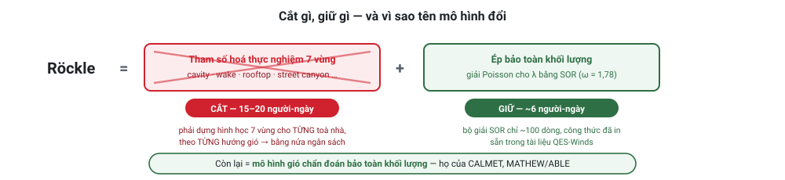
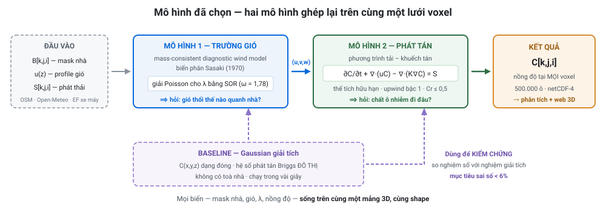
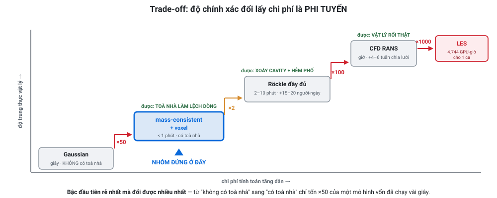

# DECISION — Chốt mô hình cho đề tài GIS 3D mô phỏng lan truyền ô nhiễm không khí đô thị

> **Đề tài:** Mô phỏng lan truyền ô nhiễm không khí đô thị bằng mô hình GIS 3D
> **Kỹ thuật yêu cầu:** Mô hình 3D Array / voxel, phân tích không gian
> **Phạm vi:** dùng chung cho **cả seminar và đồ án cuối kỳ** (seminar = trình bày lựa chọn + prototype; đồ án = làm đầy đủ + kiểm định)
> **Căn cứ:** mọi số liệu trong file này đều có nguồn trong [`RESEARCH.md`](./RESEARCH.md)

---

## 0. Phạm vi thực tế — 8 tuần, bán thời gian

**Ràng buộc thật của nhóm:** 2 người · numpy mức cơ bản · **8 tuần lịch** · làm song song với đồ án môn khác.

📐 Quy đổi: ~15–20 giờ/tuần/người → khoảng **30–35 người-ngày** cho toàn bộ đồ án, tính cả viết báo cáo và làm slide. Đây là ngân sách rất chặt, nên phạm vi phải cắt thẳng tay.

### Cắt cái gì

| | Hạng mục | Người-ngày | Quyết định |
|---|---|---|---|
| ✅ | Voxel hoá thành phố (extrude LoD1) | 4 | **LÀM** |
| ✅ | Gaussian giải tích trên voxel (baseline + chuẩn kiểm chứng) | 4 | **LÀM** |
| ✅ | Trường gió: profile luỹ thừa + nhà là vật rắn + **SOR bảo toàn khối lượng** | 6 | **LÀM** |
| ✅ | Bộ giải tải–khuếch tán FV | 10 | **LÀM** — nhưng theo chiến thuật 2D trước (§0.2) |
| ✅ | 5 sản phẩm phân tích không gian | 5 | **LÀM** |
| ✅ | Trực quan hoá: QGIS 3D + PyVista | 3 | **LÀM** |
| ✅ | Kiểm định Bậc 1 (so nghiệm giải tích) | 2 | **LÀM** |
| ✅ | Báo cáo + slide seminar | 6 | **LÀM** |
| | **Tổng lõi** | **~40** | ⚠️ đã vượt ngân sách ~15% → phải làm song song, không tuần tự |
| ❌ | **Tự cài Röckle 7 vùng** | 15–20 | **CẮT** — một mình nó bằng nửa ngân sách |
| ❌ | Kiểm định Bậc 2 (Michelstadt) — dựng lại 60 khối nhà, trích 196 điểm cảm biến | 8 | **CẮT**, nói rõ trong phần Hạn chế |
| ❌ | Web viewer CesiumJS (glTF + 3D Tiles) | 5 | **CẮT** — QGIS 3D đủ đẹp cho báo cáo |
| 🟡 | Chạy URock lấy trường gió có cavity/wake | 5 | **DỰ PHÒNG** — chỉ làm nếu lõi xong sớm |
| 🟡 | 6 kịch bản (3 hướng gió × 2 độ phân giải) | 3 | Rút còn **3 kịch bản**: 2 hướng gió + 1 lần đổi độ phân giải |

### 0.1 Hệ quả: tên mô hình ĐỔI

Cắt 7 vùng Röckle thì **không được gọi là mô hình Röckle nữa**. Cụ thể:



Còn lại là **mô hình gió chẩn đoán bảo toàn khối lượng (mass-consistent diagnostic wind model)** — họ mô hình của **CALMET** và **MATHEW/ABLE**, có trước Röckle. Phương pháp biến phân **Sasaki (1970)**.

**Nhóm mất gì:** không có bong bóng xoáy tái tuần hoàn sau nhà, không có xoáy hẻm phố.
**Nhóm vẫn được gì:** **gió đi vòng qua toà nhà đúng cách và khối lượng được bảo toàn** — đây là hiệu ứng 3D quan trọng nhất và cũng là thứ phân biệt đồ án này với một mô hình Gaussian phẳng.

> 📌 **Cắt đúng chỗ:** SOR Poisson chỉ ~100 dòng và công thức đã in sẵn trong [tài liệu QES-Winds](https://qes-documentation.readthedocs.io/en/latest/QES-Winds.html). Chỗ ngốn tuần là **đóng dấu hình học 7 vùng** cho từng toà nhà theo từng hướng gió. Nên cắt vùng, giữ SOR — giữ được ~80% giá trị với ~30% công sức.

### 0.2 Chiến thuật bắt buộc với numpy mức cơ bản: **làm 2D trước**

Đây là lời khuyên quan trọng nhất trong file này cho nhóm.

| | Làm gì | Vì sao |
|---|---|---|
| **Bước 1** | Viết bộ giải trên **mặt cắt 2D (x–z)**, lưới 200 × 100 = 20.000 ô | Chạy tức thì · in ra màn hình xem được · **debug bằng mắt** · kiểm CFL, bảo toàn khối lượng, biên tường |
| **Bước 2** | Chỉ khi 2D đã đúng **mới thêm trục y** → `C[k,j,i]` | Code gần như y hệt, chỉ thêm một bộ số hạng |

Debug một bộ giải 3D trực tiếp là cực hình: sai ở đâu cũng chỉ thấy "số ra kỳ kỳ". Ở 2D, một lỗi dấu hay lỗi upwind **nhìn phát ra ngay**. Chiến thuật này tiết kiệm dễ đến một tuần, và **mặt cắt 2D đó còn dùng lại được làm hình trong báo cáo**.

### 0.3 Van an toàn

> **Nếu hết tuần 5 mà bộ giải FV vẫn chưa chạy đúng: DỪNG, quay về Gaussian giải tích + mask toà nhà.**
>
> Gaussian trên lưới voxel vẫn cho trường 3D thật, vẫn làm được đủ phân tích không gian, vẫn đúng đề bài. Mất phần "có toà nhà trong động lực học", nhưng **có đồ án hoàn chỉnh để nộp**. Ghi rõ trong phần Hạn chế là hướng phát triển tiếp theo.

---

## 1. Mô hình đang dùng là gì?

Đây là chỗ hay bị lẫn, nên nói rõ trước: **không phải một mô hình, mà là hai mô hình ghép lại**, chạy trên cùng một lưới voxel.



> ⚠️ Hình trên vẽ theo **phạm vi 8 tuần đã cắt** (§0.1) — Mô hình 1 là *mass-consistent thuần*, không có 7 vùng Röckle.

### 1.1 Röckle là cái gì (nói bằng tiếng Việt thường)

> 📌 **Đọc mục này để HIỂU đầy đủ họ mô hình.** Với phạm vi 8 tuần, nhóm **chỉ cài Bước 2** (bảo toàn khối lượng) và **bỏ Bước 1** (7 vùng thực nghiệm) — xem §0.1. Vẫn cần nắm Bước 1 để trình bày và để trả lời câu hỏi.

**Röckle KHÔNG phải mô hình ô nhiễm.** Nó là cách tính **trường gió** quanh nhà mà **không cần giải CFD**.

Ý tưởng gồm đúng 2 bước:

**Bước 1 — Đóng dấu các "vùng gió" theo công thức thực nghiệm.**
Với mỗi toà nhà, người ta đã đo trong hầm gió và rút ra công thức cho từng vùng. Ví dụ ba vùng chính (H = chiều cao nhà, W = bề rộng, L = chiều dài):

| Vùng | Là gì | Công thức (đã xác thực từ mã nguồn URock) |
|---|---|---|
| **Displacement** | Vùng gió bị dồn phía trước mặt đón gió | `L_f = 1,5W / (1 + 0,8W/H)` |
| **Cavity** | Bong bóng xoáy tái tuần hoàn ngay sau nhà — **chỗ chất ô nhiễm bị bẫy lại** | `L_r = 1,8W / [(L/H)^0,3 · (1 + 0,24W/H)]` |
| **Wake** | Vùng hụt gió kéo dài phía sau | `L_w = 3·L_r` |

Còn có vùng tái tuần hoàn trên mái, vùng góc mái, và **vùng hẻm phố** (sinh ra khi cavity của nhà thượng lưu đụng vào mặt nhà hạ lưu). Tổng cộng 7 vùng.

Sau bước này ta có một trường gió "thô" — nó **sai về mặt vật lý**, vì gió chảy vào một voxel nhiều hơn chảy ra (divergence ≠ 0), tức là không khí tự sinh ra hoặc biến mất.

**Bước 2 — Ép bảo toàn khối lượng.**
Hiệu chỉnh trường gió sao cho **lượng khí vào = lượng khí ra ở mọi voxel**, mà thay đổi ít nhất so với trường thô. Bài toán này quy về giải một phương trình Poisson:

```
∂²λ/∂x² + ∂²λ/∂y² + (α₁/α₂)²·∂²λ/∂z² = R        (R = divergence của trường thô)
```

giải bằng SOR (Successive Over-Relaxation, hệ số nới lỏng ω = 1,78), rồi lấy:

```
u = u₀ + (1/2α₁²)·∂λ/∂x      (tương tự cho v, w)
```

**Toà nhà đi vào bài toán qua đâu?** Qua các hệ số mặt `e,f,g,h,m,n` trong công thức SOR — đặt bằng **0** ở mặt voxel nào là tường. Đơn giản vậy thôi.

> ⭐ **Điểm mấu chốt để hiểu tại sao nó rẻ:** Röckle **không giải phương trình động lượng (Navier–Stokes)**. Nó chỉ dùng công thức thực nghiệm + một lần giải phương trình elliptic. Không có mô hình rối, không có bước thời gian. Đó là lý do nó **nhanh hơn LES hai đến ba bậc độ lớn**.

### 1.2 Mô hình phát tán là cái gì

Sau khi có gió, chất ô nhiễm được vận chuyển bằng **phương trình tải–khuếch tán** — chính là phương trình mà OpenFOAM (`scalarTransportFoam`) và mọi mô hình CFD đều giải:

```
∂C/∂t + ∇·(uC) − ∇·(K∇C) = S
 (biến đổi   (bị gió     (khuếch tán   (nguồn
  theo t)     cuốn đi)     do rối)      phát thải)
```

Giải bằng **thể tích hữu hạn hiện (explicit finite volume)** trên lưới voxel:

```
C[i,j,k]^(n+1) = C[i,j,k]^n
   − (u·Δt/Δx)·(C[i,j,k] − C[i−1,j,k])            ← tải, upwind bậc 1
   − ... (tương tự cho y, z)
   + (K_x·Δt/Δx²)·(C[i+1,j,k] − 2C[i,j,k] + C[i−1,j,k])   ← khuếch tán
   + ... (tương tự cho y, z)
   + Δt·S[i,j,k]                                   ← phát thải giao thông
```

Ràng buộc ổn định (CFL): `Δt·(|u|/Δx + |v|/Δy + |w|/Δz) ≤ 1` → nhóm dùng **Cr ≤ 0,5** cho an toàn.

### 1.3 Gọi tên phương án cho đúng ⚠️

**Với phạm vi 8 tuần đã cắt ở §0**, gọi thế này:

> *"Mô hình gió chẩn đoán bảo toàn khối lượng (mass-consistent diagnostic wind model, phương pháp biến phân Sasaki 1970), ghép với phương trình tải–khuếch tán giải bằng phương pháp thể tích hữu hạn, toàn bộ trên lưới voxel 3D."*

**KHÔNG gọi là "mô hình Röckle"** nếu không cài 7 vùng thực nghiệm — xem §0.1. Röckle = mass-consistent **+** vùng thực nghiệm; nhóm chỉ làm vế đầu.

Họ mô hình rộng hơn trong văn liệu gọi là **fast-response urban dispersion model**. Các đại diện: **CALMET**, **MATHEW/ABLE** (mass-consistent thuần, giống nhóm), **QUIC-URB** (LANL, có Röckle), **QES-Winds** (Utah, mã nguồn mở, cần GPU), **URock** (mã nguồn mở, Python, chạy trong QGIS).

### 1.4 URock — hạ xuống làm DỰ PHÒNG, không phải đường găng

Bản kế hoạch trước đặt URock ở vị trí "khoá rủi ro". **Sửa lại: URock chính nó là phần rủi ro cài đặt cao nhất** (phụ thuộc Java/H2GIS trong QGIS), nên không dùng nó để khoá rủi ro được. Van an toàn thật nằm ở §0.3.

| Nếu | Thì |
|---|---|
| Lõi xong trước tuần 6 | Chạy **URock** → có trường gió **có cavity + wake + xoáy hẻm phố** → thay vào bộ giải FV → **so sánh hai trường gió**. Đây là phần nâng cấp giá trị nhất, chỉ ~5 người-ngày |
| Lõi chưa xong | Bỏ hẳn URock, không tiếc |

URock: CC-BY, Python, chạy **2–10 phút** cho lưới 0,5–3 triệu ô, một luồng CPU. Trần kỹ thuật: **30 triệu ô** — lưới của nhóm nhỏ hơn nhiều, an toàn.

### 1.5 Baseline bắt buộc: Gaussian giải tích

Song song, cài **mô hình chùm khói Gaussian dạng giải tích** trên cùng lưới voxel, dùng **hệ số phát tán Briggs ĐÔ THỊ** (không phải bảng nông thôn). Vai trò:

1. **Kiểm chứng bộ giải số** (nghiệm giải tích ↔ nghiệm số trong dòng đều, không nhà). Mốc: QES-Plume đạt sai số tương đối tối đa **5,91%** ở phép thử này.
2. Cho một **chương so sánh mô hình** gần như miễn phí (~3 ngày công).

---

## 2. Ưu – nhược điểm của phương án đã chọn

### ✅ Ưu điểm

| Ưu điểm | Cụ thể |
|---|---|
| **Đúng kỹ thuật đề bài** | Mọi biến (mask nhà, u, v, w, λ, C) đều sống trên **cùng một mảng 3D**. Đây đúng nghĩa "3D Array/voxel" |
| **Phân giải được toà nhà** | Khác hẳn Gaussian và CTM — có cavity, có wake, có xoáy hẻm phố |
| **Chạy được trên laptop** | 4 triệu voxel = 16 MB/trường float32; URock 2–10 phút; bộ giải phát tán vài phút đến ~1 giờ với NumPy |
| **Minh bạch, giải thích được** | Tự viết từng dòng → trả lời được mọi câu hỏi "tại sao ra số này". Phần mềm hộp đen không làm được |
| **Bảo toàn khối lượng chính xác** | Sơ đồ thể tích hữu hạn bảo toàn khối lượng đến độ chính xác máy |
| **Có phân tích ổn định viết ra được** | CFL, von Neumann — điểm cộng học thuật rõ ràng |
| **Có mô hình đối chiếu miễn phí** | URock (CC-BY) làm mốc, không phải tin mù vào code của mình |
| **Dữ liệu đầu vào lấy được hết ở Việt Nam** | OSM + Google Open Buildings 2.5D + Open-Meteo + EF xe máy Hà Nội (open access) |

### ❌ Nhược điểm (phải nói thẳng trong báo cáo)

| Nhược điểm | Mức độ | Xử lý |
|---|---|---|
| **Khuếch tán số** — upwind bậc 1 sinh độ khuếch tán giả `K_num ≈ ½·u·Δx·(1−Cr)`. Với u = 3 m/s, Δx = 5 m thì cỡ **vài m²/s — so sánh được với khuếch tán rối vật lý** | **Cao** | Đo và báo cáo con số này như một hạn chế **đã lượng hoá**. Nếu kịp, thử sơ đồ có limiter |
| **Không có rối do giao thông (TPT)** | Cao | OSPM nêu rõ: *"Trong điều kiện lặng gió, cơ chế phát tán duy nhất là do TPT"*. Nhóm thiếu cơ chế này → **kết quả lúc lặng gió sẽ ước lượng vượt**. Nêu rõ, hoặc thêm một số hạng K bổ sung ở mực đường và nói rõ là tham số hoá thô |
| **Không giải động lượng** → vật lý kém CFD | Trung bình | Đây là đánh đổi có chủ ý. URock được ghi nhận *"đánh giá vượt tốc độ gió ở hạ lưu cạnh đón gió của các toà nhà rộng"* |
| 🆕 **KHÔNG có xoáy tái tuần hoàn sau nhà và xoáy hẻm phố** (hệ quả của việc cắt 7 vùng Röckle, §0.1) | **Cao** | Gió vẫn **đi vòng qua nhà đúng cách** và khối lượng vẫn bảo toàn, nhưng không có bong bóng xoáy bẫy chất ô nhiễm ở mặt khuất gió → **nồng độ trong hẻm phố sẽ bị ước lượng THẤP**. Nêu rõ, và nếu kịp thì chạy URock để định lượng chênh lệch |
| 🆕 **Chưa kiểm định với số liệu thực nghiệm** (chỉ verification, không validation — §6) | **Cao** | Nói thẳng trong Hạn chế, kèm lý do (dựng lại hình học Michelstadt + trích 196 điểm cảm biến vượt ngân sách 8 tuần) |
| **LoD1** — nhà là khối hộp, không có mái dốc | Thấp | Ở voxel 5 m, mái LoD2 không sống sót qua rời rạc hoá. Trích García-Sánchez et al. 2021 để biện minh |
| **Không có hoá học** — coi chất ô nhiễm là thụ động | Trung bình | Đúng với PM2.5/PM10/CO; **sai với NO₂** (có phản ứng NO+O₃). Chọn PM2.5 làm chất chính |
| **Bất định lưu lượng giao thông** | **Rất cao** | **Không có bộ đếm mở nào cho Hà Nội/TP.HCM.** Dùng cấp đường OSM làm bộ phân bổ **tương đối**, chuẩn hoá theo tổng EDGAR. Báo cáo kết quả dạng tương đối nếu cần |
| **Chiều cao toà nhà chưa kiểm định ở Đông Nam Á** | Cao | Google ghi rõ MAE 1,5 m nhưng *"đánh giá chỉ giới hạn ở Bắc Mỹ, châu Âu và Nhật Bản — không phải Global South"*. Nhà ống Việt Nam là ca khó. Làm phân tích độ nhạy |
| **Một trường gió cho mỗi lần chạy** (trạng thái tựa dừng) | Trung bình | Chạy nhiều kịch bản hướng gió thay vì một chuỗi thời gian liên tục |

---

## 3. So sánh với các phương án khác

### 3.1 Bảng so sánh 6 tầng mô hình

Cột ⭐ tách làm hai để thấy rõ **cái gì bị mất khi cắt 7 vùng Röckle** (§0.1):

| | **Box** | **Gaussian** | **Street canyon** | ⭐ **PHƯƠNG ÁN NHÓM**<br>mass-consistent + voxel | **(Röckle đầy đủ**<br>nếu có thời gian) | **CFD RANS** | **LES/LBM** | **CTM (CMAQ)** |
|---|---|---|---|---|---|---|---|---|
| Giải cái gì | cân bằng khối lượng | nghiệm giải tích | hộp + chùm khói | **bảo toàn khối lượng + tải-khuếch tán** | + vùng thực nghiệm | RANS | Navier–Stokes lọc | hoá học-vận chuyển vùng |
| Phân giải toà nhà | ❌ | ❌ | 🟡 tham số hoá | ✅ **hình học** (gió đi vòng qua nhà) | ✅ | ✅ | ✅ | ❌ |
| **Xoáy tái tuần hoàn sau nhà** | ❌ | ❌ | 🟡 | **❌ ← mất cái này** | ✅ | ✅ | ✅ | ❌ |
| Xoáy hẻm phố | ❌ | ❌ | ✅ | **❌ ← mất cái này** | 🟡 tham số hoá | ✅ | ✅ | ❌ |
| Rối do xe cộ (lặng gió) | ❌ | ❌ | ✅ | ❌ | ❌ | 🟡 | 🟡 | ❌ |
| Trường 3D theo z | ✅ | ✅ | 🟡 1 giá trị/phố | ✅ **native voxel** | ✅ | ✅ | ✅ | ✅ nhưng thô |
| Độ phân giải | thành phố | 10–100 m | đoạn phố | **1–10 m** | 1–10 m | 0,5–5 m | < 1 m | **1–12 km** |
| **Chi phí thực đo** | tức thì | 1 M điểm ~3 phút | giây | **500k ô: dưới 1 phút** | URock 0,5–3 M ô: 2–10 phút | 2 M ô: "vài phút" song song | **4.744 GPU-giờ = 6,7 ngày/32 GPU** | **11.520 CPU-giờ** |
| Độ chính xác (FAC2) | — | thường < 0,5 ở khu dày | SIRANE 0,73–0,90 | (chưa có số công bố cho biến thể này) | **QES-Plume 0,59** | tới ~0,95 ca tốt | cao nhất | — |
| Mã nguồn mở | tự viết | ✅ AERMOD | 🟡 MUNICH | tự viết | ✅ **URock, QES, GRAL** | ✅ OpenFOAM | ✅ PALM, OpenLB | ✅ CMAQ |
| **Khả thi 2 SV / 8 tuần bán TG** | CAO | CAO | CAO | ✅ **CAO** | 🟡 TB (dự phòng) | THẤP | RẤT THẤP | RẤT THẤP |

### 3.2 Ba trade-off cốt lõi

**Trade-off 1 — Độ chính xác đổi lấy chi phí là PHI TUYẾN.**


**Bậc thang cuối đắt hơn rất nhiều nhưng lợi ích tăng thêm ít hơn.** Với đồ án sinh viên, **hai bậc đầu là nơi tỉ lệ lợi ích/chi phí cao nhất** — và bậc 1 (thêm toà nhà vào trường gió) là bậc rẻ nhất mà cũng đổi nhiều nhất về mặt "đây có phải mô hình 3D thật không".

**Trade-off 2 — Độ phân giải đổi lấy bộ nhớ là BẬC BA.**
Giảm một nửa kích thước ô → **×8 bộ nhớ, ×16 thời gian** (8× số ô × 2× số bước do CFL).

Bằng chứng để chọn điểm dừng — bảng CAIRDIO (GMD, open access), đối chiếu dữ liệu hầm gió:

| Độ phân giải | NMSE | FAC2 |
|---|---|---|
| **5 m** | **0,10** | **0,84** |
| 10 m | 0,25 | — |
| **20 m** | **1,35** | — |
| 80 m | — | 0,32 (vừa đủ đạt) |

→ Mọi độ phân giải đều "đạt" tiêu chí chấp nhận đô thị, **nhưng NMSE xấu đi hơn một bậc độ lớn từ 5 m lên 20 m**. **5–10 m là điểm ngọt.**

**Trade-off 3 — Vật lý đổi lấy tính minh bạch.**
Chạy GRAL/AUSTAL cho vật lý tốt hơn nhưng nhóm **không kiểm soát và không giải thích được nội bộ**. Tự viết cho vật lý kém hơn nhưng **giải thích được từng dòng, viết được phân tích ổn định, và đó mới là "kỹ thuật GIS 3D" mà đề tài yêu cầu**. Với một đồ án môn học, trục thứ hai quan trọng hơn.

### 3.3 Vì sao loại từng phương án

Mỗi mục có **một câu trả lời** và **một con số** — dùng được luôn khi bị hỏi.

| Loại | Lý do ngắn | Con số |
|---|---|---|
| ❌ **CFD RANS (OpenFOAM)** | Thời gian nằm ở chia lưới chứ không ở vật lý, và kết quả phụ thuộc một hằng số không biết trước | Chia lưới `snappyHexMesh` trên hình học thật: **4–6 tuần**. Nghiên cứu Michelstadt ghi rõ kỹ năng mô hình phụ thuộc hằng số *"tối ưu tuỳ ca và không biết trước được"* |
| ❌ **LES / PALM / LBM-LES** | Chi phí sai một bậc so với nguồn lực | **404,9 → 4.744 GPU-giờ cho MỘT ca.** Nhóm cần 6 kịch bản |
| ❌ **CMAQ / CAMx / WRF-Chem** | Không phân giải được toà nhà về mặt **cấu trúc**, không phải cấu hình | EPA nói thẳng: *"pha loãng tức thời phát thải điểm ra toàn bộ thể tích ô lưới"*. Ô nhỏ nhất **1 km** vs lưới nhóm **5 m** → chênh 200× mỗi chiều. WRF-Chem còn *"không còn được phát triển tiếp"* |
| ❌ **Chỉ Gaussian / AERMOD** | Không có toà nhà, và bỏ đúng chế độ gây ô nhiễm nặng nhất ở VN | Giả định **u ≥ 1 m/s**; EPA cảnh báo ước lượng vượt khi u < 1 m/s. Trong khi OSPM: *"lặng gió → cơ chế phát tán duy nhất là rối do giao thông"* |
| ❌ **QES-Winds/Plume** | Rất phù hợp về khoa học nhưng có cổng chặn phần cứng | **Bắt buộc GPU NVIDIA Compute Capability ≥ 7.0.** Không có = dự án chết giữa chừng. **Nhưng vẫn dùng tài liệu QES** để lấy công thức SOR |
| ❌ **GRAL / AUSTAL (chạy phần mềm)** | Đồ án sẽ không còn nội dung GIS 3D nào để trình bày | Chỉ là chuẩn bị input + bấm nút; nhóm không cài đặt cấu trúc voxel nào. Giữ làm mô hình đối chứng nếu còn thời gian |
| ❌ **Chỉ nội suy 3D từ cảm biến** | Nội suy không phải mô hình phát tán | 3–10 cảm biến mặt đất → chỉ ra **những đốm trơn quanh cảm biến**, không phải chùm khói. Không khớp được variogram 3D bất đẳng hướng từ < 30 điểm. **Không tìm được bài báo nào làm nội suy 3-D thể tích thật cho mạng cảm biến đô thị** |
| ❌ **ML surrogate** | Cần kho dữ liệu CFD để huấn luyện mà nhóm không có | Chỉ khả thi nếu dùng bộ UrbanFlow-3K có sẵn → để làm hướng mở rộng |
| ❌ **Gọi là "Cellular Automata"** | Cùng một đoạn code, nhưng khung finite-volume mạnh hơn về học thuật | CA bảo toàn khối lượng có trọng số gió **tương đương đại số** với FV upwind. Khung FV cho phân tích CFL viết ra được. **Nhưng nên NÊU sự tương đương này** — nó là insight và cho phép trích văn liệu voxel automata |

---

## 4. Thông số chốt

| Tham số | Giá trị | Căn cứ |
|---|---|---|
| **Miền** | **500 m × 500 m × 100 m** — một khu có hẻm phố rõ rệt (Hà Nội hoặc TP.HCM) | ⬇️ **Đã thu nhỏ từ 1 km × 1 km × 200 m.** Nhỏ hơn **8 lần** → lặp thử nhanh hơn 8 lần, cực kỳ quan trọng khi đang học numpy. Mở rộng lại ở cuối nếu dư thời gian |
| **Δx = Δy** | **5 m** | Bảng CAIRDIO: NMSE 0,10 ở 5 m → 1,35 ở 20 m |
| **Δz** | **2 m** | Cần phân giải mực hô hấp 1,5 m và chênh lệch tầng |
| Kích thước lưới | 100 × 100 × 50 = **500.000 voxel** | |
| Bộ nhớ | **2 MB/trường** float32; ~30 MB tổng cả bản tạm | Chạy được trên bất kỳ laptop nào |
| **Δt** | **0,5 s** (Cr ≤ 0,5) | u=5 m/s → tải Δt ≤ 1 s; K_z=1 m²/s, Δz=2 m → khuếch tán Δt ≤ 2 s |
| **Thời gian mô phỏng** | **Chạy tới trạng thái dừng, KHÔNG chạy đủ 1 giờ** | Gió 5 m/s xuyên miền 500 m mất 100 s → chạy ~400–600 s mô phỏng là hội tụ = **800–1.200 bước ≈ dưới 1 phút thực tế**. Đây là chỗ tiết kiệm lớn nhất |
| LoD | **LoD1** (extrude footprint) | Mái dốc LoD2 không sống sót qua voxel 5 m |
| Kiểu dữ liệu | **float32** | Tiết kiệm 2× miễn phí |
| Kịch bản | ⬇️ **3 lần chạy**: 2 hướng gió (ĐB mùa đông, ĐN mùa hè) + 1 lần ở Δ = 10 m để kiểm độ nhạy | Rút từ 6 xuống 3 |
| Chất ô nhiễm chính | **PM2.5** | Thụ động, không phản ứng → hợp giả định. NO₂ có hoá học, khó hơn |

### Stack công nghệ

| Vai trò | Công cụ |
|---|---|
| Chuẩn bị không gian | QGIS + `geopandas`, `rasterio`, `osmnx` |
| Trường gió (giai đoạn 1) | **URock** qua plugin UMEP trong QGIS → NetCDF 3D |
| Trường gió (giai đoạn 2) | Tự cài Python + NumPy + **Numba** |
| Bộ giải phát tán | NumPy slicing + Numba `@njit` |
| Cấu trúc dữ liệu | **xarray** Dataset `(time, z, y, x)`, chuẩn CF, `positive="up"` |
| Lưu trữ | **netCDF-4** nén (mở được bằng QGIS/ArcGIS/Panoply) + `.vti` cho ParaView |
| Phân tích | `scipy.ndimage`, `skimage.measure.marching_cubes` (nhớ `spacing=(2,5,5)`) |
| Hình cho báo cáo | PyVista / ParaView / matplotlib |
| Web (nếu kịp) | **CesiumJS: glTF isosurface + 3D Tiles toà nhà** |

> 🔴 **KHÔNG dùng `VoxelPrimitive` của CesiumJS.** Cesium ghi nguyên văn: *"Tính năng này chưa hoàn thiện và có thể thay đổi mà không theo chính sách deprecation tiêu chuẩn."* Nó là extension **draft** trên nhánh riêng. Dùng **marching cubes → glTF** thay thế: đẹp, theo chuẩn, chạy mọi máy. Dự phòng: MapLibre `fill-extrusion` + `fill-extrusion-base` xếp slab bán trong suốt.

---

## 5. Dữ liệu chốt

| Nhu cầu | Chốt | Ghi chú |
|---|---|---|
| **Ground truth** | **US Embassy Hà Nội / Lãnh sự TP.HCM** — [gispub.epa.gov/airnowembassy](https://gispub.epa.gov/airnowembassy/), tab Archive | **Cấp tham chiếu.** Cảm biến giá rẻ không đủ tư cách làm ground truth |
| Quan trắc bổ sung | **OpenAQ API v3** (60 req/phút miễn phí) | Giấy phép khai báo theo từng nguồn |
| **Khí tượng** | ⭐ **Open-Meteo** — không cần key, **19 mực áp suất + geopotential height + PBL height** | **Nguồn miễn phí duy nhất cho profile gió đứng thật.** Dự phòng: ERA5 qua CDS |
| Cấp ổn định | ERA5 heat flux + u\* → L → biểu đồ **Golder (1972)** với z₀ từ OSM | Chặt chẽ hơn bảng tra độ che phủ mây |
| Kiểm định profile đứng | **CAMS EAC4** — 60 mực mô hình, CC-BY | ⚠️ 0,75° ≈ 80 km → **chỉ kiểm định HÌNH DẠNG profile** |
| Tổng phát thải | **EDGAR v8.1** 0,1° | ⚠️ ≈ 11 km → Hà Nội chỉ 3–5 ô, **chỉ để đối chiếu tổng** |
| **Phát thải giao thông** | ⭐⭐ **Tran et al. 2024** — EF xe máy Hà Nội, **open access CC BY**: PM **0,053 g/km**, CO 4,8, NOₓ 0,13 | **Đo tại chỗ, đặc thù VN.** Dùng thay COPERT châu Âu cho xe 2 bánh |
| Lưu lượng giao thông | Cấp đường OSM × cơ cấu đội xe + 1 điểm đếm tay | 🔴 **Không có bộ đếm mở nào.** Bất định lớn nhất — phải nói thẳng |
| Footprint nhà | **OSM** (Geofabrik VN / Overpass), ODbL | Hình học thường tốt hơn ML ở nội đô VN |
| **Chiều cao nhà** | **Google Open Buildings 2.5D Temporal** (4 m hiệu dụng, **Việt Nam có tên**) + `building:levels × 3 m` đối chứng | 🔴 **Trích nguyên văn: MAE 1,5 m nhưng "đánh giá chỉ giới hạn ở Bắc Mỹ, châu Âu và Nhật Bản — không phải Global South"** |
| Địa hình | **Copernicus DEM GLO-30** (< 4 m, 90% LE) | 🔴 **Là DSM — đã chứa nhà. KHÔNG extrude nhà lên trên nó** (đếm 2 lần). Dùng DTM riêng hoặc nói rõ |
| Dân số | **WorldPop VNM 100 m UN-adjusted constrained** | CC BY 4.0, file đã xác thực tồn tại |
| Ngưỡng | **QCVN 05:2023** + **WHO 2021** | 🔴 Tự mở PDF QCVN đọc Bảng 1 — ba lần trích tự động cho kết quả mâu thuẫn |
| Dữ liệu kiểm định | **Michelstadt / MUST** từ [Hamburg EWTL](https://www.mi.uni-hamburg.de/en/arbeitsgruppen/windkanallabor/data-sets.html) | Miễn phí, cần ký Data Policy Agreement |
| Prior work | **Ngo et al. 2023** (street-scale Hà Nội) + **[luận án TS Hung](https://www2.dmu.dk/pub/phd_hung.pdf)** (PDF miễn phí) | Bài Ngo dùng cùng ràng buộc dữ liệu mở như nhóm |

---

## 6. Kiểm định — trong 8 tuần chỉ làm được Bậc 1

| | Bậc | Làm gì | Chi phí |
|---|---|---|---|
| ✅ | **Bậc 1 — VERIFICATION**<br>*"mã có đúng không?"* | So bộ giải voxel với **nghiệm Gaussian giải tích** trong dòng đều, không nhà. Mục tiêu **sai số < 6%** (mốc QES-Plume: 5,91%).<br>→ Làm **TRƯỚC** khi thêm bất kỳ toà nhà nào. Không đạt = có bug.<br>→ Thêm: kiểm **bảo toàn khối lượng** (tổng trong miền + thoát ra biên = tổng đã phát thải) — rẻ và rất thuyết phục | **BẮT BUỘC**<br>~2 người-ngày |
| ❌ | **Bậc 2 — VALIDATION vật lý**<br>*hầm gió Michelstadt/MUST* | Không phải vì khó, mà vì phải dựng lại hình học **60 khối nhà**, chạy mô hình, trích kết quả tại **196 vị trí cảm biến** rồi mới tính được FAC2.<br>→ Ghi thẳng trong Hạn chế: *"chưa kiểm định với số liệu thực nghiệm, đây là hướng phát triển tiếp theo"* | **CẮT**<br>~8 người-ngày |
| 🟡 | **Bậc 3 — SO SÁNH ĐỊNH TÍNH**<br>*với quan trắc* | So **bậc độ lớn** nồng độ mô phỏng với trạm US Embassy Hà Nội / OpenAQ.<br>→ Chỉ là kiểm tra hợp lý (sanity check), **KHÔNG gọi là "kiểm định"** | LÀM NẾU KỊP<br>~2 người-ngày |

> ⚠️ **Nói thật trong báo cáo thay vì giấu.** Một đồ án môn học trung thực rằng *"mới verification, chưa validation, và đây là lý do"* mạnh hơn nhiều một đồ án khoe FAC2 tính từ dữ liệu ghép vội. Giám khảo phân biệt được hai thứ đó.
>
> 🔴 **Nếu cuối cùng vẫn làm Bậc 2:** hiện có **ba giá trị NMSE khác nhau (1,5 / 3 / 4)** đang lưu hành cho cùng một trích dẫn Chang & Hanna. Phải tự mở [Chang & Hanna 2004](https://doi.org/10.1007/s00703-003-0070-7) và [Hanna & Chang 2012](https://doi.org/10.1007/s00703-011-0177-1) qua thư viện và chép đúng bảng.

---

## 7. Sản phẩm phân tích không gian

Đây là phần đáp ứng yêu cầu "phân tích không gian" — chọn ít nhất 5 trong danh sách:

1. **Lát cắt ngang** ở z = 1,5 m (mực hô hấp) / 6 m (tầng 2) / 15 m / 30 m → chứng minh nồng độ đổi theo độ cao
2. **Mặt cắt đứng** cắt ngang hẻm phố → thấy xoáy tái tuần hoàn, chênh lệch leeward/windward
3. **Profile đứng** tại vị trí trạm quan trắc → so với CAMS EAC4
4. **Bề mặt đẳng trị** (marching cubes) ở ngưỡng QCVN (PM2.5 24h = 50 µg/m³) và WHO (15 µg/m³) → hai "bong bóng" lồng nhau, hình ảnh rất mạnh
5. **Thể tích vượt ngưỡng** theo giờ: `V = (C > ngưỡng).sum() × Δx·Δy·Δz` → một đường cong tóm tắt cả mô phỏng
6. **Phơi nhiễm mặt đứng toà nhà**: `binary_dilation(B) & ~B` → lấy mẫu C ở các voxel sát tường, phân theo tầng
7. **Phơi nhiễm dân số**: giao lưới mực người đi bộ với WorldPop 100 m
8. **Phân tích độ nhạy**: 3 hướng gió × 2 độ phân giải
9. **So sánh mô hình**: Gaussian giải tích vs bộ giải voxel, bản đồ hiệu số

> ⚠️ Lưu ý: **"3D zonal statistics" và "exceedance volume" KHÔNG có định nghĩa chuẩn trong tài liệu GIS.** Trình bày chúng như **toán tử tự định nghĩa** của nhóm — neo ngưỡng vào QCVN/WHO, neo số học vào bước lưới voxel. Đừng nhận là phương pháp có sẵn trong văn liệu.

---

## 8. Việc phải tự kiểm chứng trước khi đi tiếp

Research để lại 37 mục chưa xác minh được (`RESEARCH.md` §18). Với phạm vi 8 tuần, **bốn cái đầu là bắt buộc** (ảnh hưởng trực tiếp tới con số trong báo cáo), hai cái cuối chỉ cần nếu làm tới phần tương ứng.

⭐ **Làm mục "Overpass đếm nhà" NGAY TRONG TUẦN 1** — nó quyết định chọn địa bàn nào, và đó là quyết định không sửa lại được về sau mà không mất cả tuần.

- [ ] Mở **PDF QCVN 05:2023/BTNMT**, đọc **Bảng 1 và 2 bằng mắt**. 🔴 Ba lần trích tự động cho kết quả mâu thuẫn; chỉ PM2.5 = 50/25 được hai nguồn độc lập xác nhận
- [ ] Mở **PDF WHO 2021 AQG**, chép **Bảng 4.1** (WHO đăng bảng dưới dạng **ảnh**, không phải text)
- [ ] ⭐ **Chạy Overpass** đếm `building` vs `building["building:levels"]` trong bbox vài địa bàn ứng viên → **chọn địa bàn có tỉ lệ gắn thẻ chiều cao cao nhất**. Việc số 1 của tuần 1
- [ ] Lấy **API key OpenAQ**, chạy `GET /v3/locations?iso=VN` → **đếm thật** Việt Nam có bao nhiêu trạm. Không giả định
- [ ] *(chỉ nếu làm Bậc 2)* Lấy **Chang & Hanna 2004 + 2012** qua thư viện, chép **đúng bảng ngưỡng chấp nhận** 🔴 — với phạm vi 8 tuần thì §6 đã cắt Bậc 2, nên **không cần**
- [ ] *(chỉ nếu chạy URock)* Mở [`InitWindField.py`](https://github.com/UMEP-dev/UMEP-processing/tree/main/functions/URock) để hiểu URock làm gì bên trong. **Không cần nếu chỉ dùng đầu ra NetCDF của nó**

---

## 9. Tóm lại

| | |
|---|---|
| **Mô hình gì?** | **Mô hình gió chẩn đoán bảo toàn khối lượng** (profile gió + nhà là vật rắn + giải Poisson bằng SOR ép divergence = 0, phương pháp biến phân Sasaki) **+ phương trình tải–khuếch tán giải bằng thể tích hữu hạn**, toàn bộ trên **lưới voxel 3D**. ⚠️ **Không gọi là "Röckle"** vì đã cắt 7 vùng thực nghiệm — xem §0.1 |
| **Họ mô hình?** | *Fast-response urban dispersion model* — cùng họ với QUIC-URB, QES-Winds, URock |
| **Công cụ?** | Python + NumPy/Numba + xarray; dữ liệu qua QGIS; **URock (UMEP/QGIS)** làm mô hình đối chiếu |
| **Baseline?** | Gaussian giải tích (σ Briggs **đô thị**) để verification + nội suy 3D để so sánh |
| **Vì sao chọn?** | Tầng duy nhất thoả đồng thời: **phân giải toà nhà** (Gaussian không có) + **chạy trên laptop** (CFD không có) + **native voxel** (đúng đề bài). Khoảng cách chi phí tới LES là **2–3 bậc độ lớn** |
| **Yếu nhất ở đâu?** | Khuếch tán số, thiếu rối do giao thông, và bất định lưu lượng giao thông — **cả ba đều nêu thẳng và lượng hoá trong báo cáo** |

📚 **Toàn bộ công thức, số liệu, link nguồn (339 link): [`RESEARCH.md`](./RESEARCH.md)**

---

## Amendment, 21/09/2026 — tuần 1 đã chạy thật, hai điều cần ghi lại

Ghi thêm, **không sửa** các mục trên.

### A. §5 "Chiều cao nhà" — đã thực hiện đúng, và đây là số đo

`docs/RESEARCH.md` §1007 và §5 chốt: **footprint OSM + chiều cao Google Open Buildings 2.5D
Temporal**, `building:levels × 3 m` làm **đối chứng chéo**. Đã cài đặt đúng như vậy
(`src/voxel/gob_heights.py`, gọi từ `src/00_prepare_osm_data.py`).

**Truy cập KHÔNG cần đăng nhập.** Bucket `open-buildings-temporal-data` đọc ẩn danh qua
HTTPS — chính notebook tải dữ liệu của Google dùng `AnonymousCredentials`. **Không cần tài
khoản Earth Engine, không cần dự án Google Cloud, không cần OAuth.** Các tile là
Cloud-Optimised GeoTIFF (block 512 × 512, có overview) nên đọc cửa sổ 500 m chỉ tốn vài trăm
kB thay vì tải cả file 1,54 GB. Không thêm thư viện nào: `rasterio` và `pyproj` đã có sẵn.

**Kết quả trên địa bàn Nguyen Hue:**

| | Trước (chỉ OSM) | Sau (Google 2.5D) |
|---|---|---|
| Có chiều cao thật | 21/62 (34 %) | **62/62 (100 %)** |
| Phải suy ra | **41 (66 %)** | **0** |
| Khoảng chiều cao | 6 – 186 m | 0,5 – 91 m |
| Voxel đặc | 42.399 | 41.084 |

### B. Đối chứng chéo — bắt buộc phải đọc trước khi trích số

Trên 21 toà nhà mà OSM có gắn thẻ:

| | |
|---|---|
| MAE | **23,2 m** |
| Sai lệch tuyệt đối trung vị | **7,0 m** |
| Thiên lệch | **−8,8 m** (Google thấp hơn OSM) |
| Tương quan | r = **0,740** |

🔴 **Google công bố MAE 1,5 m, nhưng con số đó không áp dụng ở đây.** Nguyên văn:
*"đánh giá này chỉ giới hạn ở Bắc Mỹ, châu Âu và Nhật Bản — không phải ở Global South nơi bộ
dữ liệu được triển khai"*. Số đo tại chỗ của nhóm — MAE 23,2 m — là bằng chứng trực tiếp cho
cảnh báo đó, và **phải dùng số 23,2 m trong báo cáo, không dùng 1,5 m**.

🔴 **Trần 100 m.** Sản phẩm chặn mọi chiều cao ở 100 m. Ba toà tháp mà OSM ghi 154 / 164,9 /
186 m trả về **88,5 / 62,5 / 91,0 m**. Với ba toà này, giá trị Google là **cận dưới, không
phải phép đo**.

**Nhưng hệ quả thực tế nhỏ hơn con số gợi ý:** miền mô hình cũng chỉ cao **100 m**
(`config/project.yaml`), nên `01_voxelize.py` vốn đã cắt ngọn mọi toà cao hơn 100 m. Trước
đây có cảnh báo *"241 ô raster vượt z_max"*; nay không còn, vì trần sản phẩm và trần miền
trùng nhau. Chênh lệch còn lại trong lưới chỉ khoảng 9 m ở ba toà, tức 4–5 voxel.

**Đầu thấp cũng cần nói:** 2 toà nhận chiều cao < 1 m nên **không xuất hiện trong mask**
(Δz = 2 m), và 2 trong 5 toà thấp nhất mang thẻ `building=roof` — mái che, thấp là đúng.

### C. §8 — tiêu chí chọn địa bàn đổi từ độ phủ sang khả năng phân giải

§8 viết: *"chọn địa bàn có **tỉ lệ gắn thẻ chiều cao cao nhất**"*. **Thay bằng:** chọn địa
bàn mà **khối nhà trung vị phân giải được ở Δ = 5 m** (≥ 4 voxel mỗi cạnh ngang); độ phủ thẻ
chỉ còn là tiêu chí phụ.

Lý do: hai ứng viên đầu chênh nhau **0,105 điểm phần trăm** trên cỡ mẫu 62 và 154 — nhiễu —
trong khi khối nhà trung vị của chúng chênh **2,0 so với 4,8 voxel mỗi cạnh**. Một vật cản 2
voxel không sinh được vùng tách dòng. Tiêu chí cũ càng mất ý nghĩa sau mục A: khi Google phủ
100 % chiều cao thì **độ phủ thẻ OSM không còn là tiêu chí chọn địa bàn nữa**, nó chỉ còn
quyết định có bao nhiêu điểm để đối chứng chéo.

**Cả hai tiêu chí đều chọn Nguyen Hue**, nên đổi tiêu chí không đổi kết quả tuần 1 — chỉ đổi
lý do, và làm nó đúng.

### D. Hai việc chưa làm

- **Phân tích độ nhạy theo trường chiều cao** (RESEARCH §1007 yêu cầu). Nay đã có **hai
  trường chiều cao độc lập** cho cùng một địa bàn, nên việc này rẻ hơn nhiều so với lúc lập
  kế hoạch: chạy mô hình hai lần và so kết quả.
- **Tỉ lệ H/W của địa bàn chưa đo.** §4 đòi "một khu có hẻm phố rõ rệt"; Nguyen Hue là đại lộ
  rộng. `docs/RESEARCH.md` §5.1 ghi 🔴 rằng ngưỡng H/W của Oke (1988) chỉ có trong search
  snippet và **không được trích nếu chưa mở bài gốc**, nên không thể kết luận bằng suy đoán.

---

## Amendment, 22/09/2026 — mạng đường, và quyết định BỎ địa hình

Ghi thêm, **không sửa** các mục trên. Đây là phần còn lại tuần 1 của Người A.

### A. Mạng đường đã tải và phân cấp

`data/raw/roads.geojson`, khai trong `config/project.yaml` → `paths.roads`.

| `highway=` | cạnh | chiều dài |
|---|---|---|
| residential | 45 | 4.789 m |
| tertiary | 32 | 3.132 m |
| primary | 6 | 553 m |
| secondary | 8 | 302 m |
| **tổng** | **91** | **8.777 m** |

Mỗi cạnh mang `highway`, `length_m` (đo ở **UTM**, không đo ở độ), `name`, `oneway`,
`lanes`, `maxspeed`.

**Phân bổ phát thải ở tuần 3 phải dựa trên CẤP ĐƯỜNG, không dựa trên `maxspeed`.** Đo được:
`name` và `oneway` phủ 100 %, `lanes` 75 %, nhưng **`maxspeed` chỉ 47 %** — một nửa số đường
không có dữ liệu tốc độ.

`network_type="drive"` là cố ý. Lòng đường Nguyễn Huệ nằm trong mạng (gắn `tertiary`);
quảng trường đi bộ là feature riêng `highway=pedestrian` và **bị loại đúng chủ ý** — không
có xe thì không có phát thải.

### B. 🔴 GIẢ ĐỊNH ĐẤT PHẲNG — mô hình đặt mọi toà nhà trên mặt phẳng z = 0

**Copernicus DEM GLO-30 bị bỏ khỏi phạm vi.** Đây là quyết định, không phải bỏ sót. Ba lý do
độc lập, mỗi lý do tự nó đã đủ:

1. **Pipeline không có khái niệm địa hình.** `src/voxel/rasterizer.py:326` dựng mask bằng
   `z_centers[:, None, None] < height_field[None, :, :]`. Grep `terrain|ground_level|dem`
   toàn bộ `src/` không ra kết quả nào. Thêm địa hình là sửa Tầng 0 đã xong và đã có test.
2. **Chiều cao Google Open Buildings là *"relative to the terrain"***, tức **đã trừ nền đi
   rồi**. Đó đúng là đại lượng mô hình đất phẳng cần. Cộng thêm cao độ nền vào là **làm sai
   đi**, không phải làm đúng hơn.
3. **GLO-30 là DSM đã chứa nhà.** §5 của chính tài liệu này đã cảnh báo *"KHÔNG extrude nhà
   lên trên nó (đếm 2 lần)"*. Dùng đúng thì cần một DTM riêng — tức thêm một nguồn nữa.

**Đây là GIẢ ĐỊNH, không phải kết luận đã đo.** Chưa ai đo độ chênh cao trong ô 500 m. Phương
án "tải DEM chỉ để đo rồi vẫn bỏ" đã được cân nhắc và **loại**, vì kết quả đo không đổi được
quyết định: lý do 2 và 3 đúng bất kể chênh cao là 1 m hay 5 m. **Phải nêu trong chương Hạn
chế** như một giả định.

### C. Tiêu chí "gần trạm quan trắc" — ĐẠT, nhưng không như ROADMAP tưởng

| | Khoảng cách tới tâm địa bàn |
|---|---|
| **Tổng Lãnh sự quán Hoa Kỳ** — feed AirNow, §5 chốt làm ground truth | **931 m** ✅ |
| Trạm thuỷ văn Phú An | 419 m — đo **thuỷ văn** |
| Trạm Khí tượng Tân Sơn Hoà | 4.707 m — đo **khí tượng** |

⚠️ **Truy vấn `monitoring:air_quality=yes` bán kính 30 km: OSM không có trạm nào gắn thẻ.**
Hai "trạm" gần nhất trong OSM đo thuỷ văn và khí tượng.

🔴 **Đọc cho đúng: đây là phát biểu về ĐỘ ĐẦY ĐỦ CỦA OSM, không phải về thực tế.** Trạm
tham chiếu vẫn tồn tại và vẫn hoạt động — chính §5 của tài liệu này chốt nó là **feed AirNow
của Lãnh sự quán Mỹ**, và nó cách địa bàn 931 m. OSM chỉ là chưa ai gắn thẻ.

**Hệ quả với phạm vi: không có.** §6 chỉ cần trạm cho **Bậc 3 (so định tính)**, vốn đã ghi
là *"LÀM NẾU KỊP"*. Bậc 1 verification — phần bắt buộc — không cần trạm nào.

**Việc thật sự phải làm nếu muốn Bậc 3** không phải gắn thẻ OSM mà là kiểm dữ liệu có tải
được không: §8 giao Người B *"lấy API key OpenAQ, chạy `GET /v3/locations?iso=VN`, đếm thật"*
— **vẫn chưa làm**.

Nguồn đối chiếu khả dĩ duy nhất là AirNow của Lãnh sự quán Mỹ, và **931 m là khoảng cách
tốt**. Nhưng có trạm gần **không** biến verification thành validation — `docs/spec.md` BR-15
vẫn nguyên, và §6 của tài liệu này vẫn đặt validation ngoài phạm vi.
