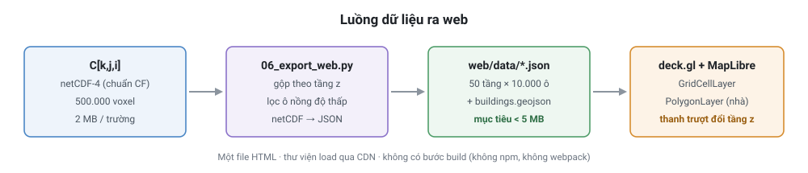
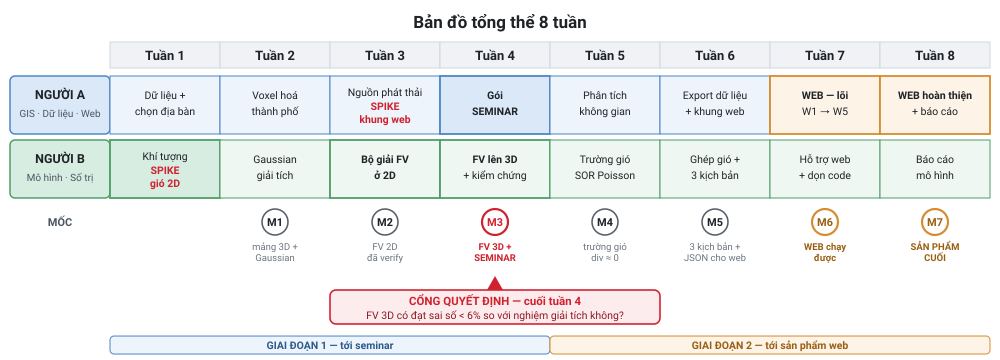

# ROADMAP — 8 tuần, 2 người, sản phẩm cuối là ứng dụng web 3D

**Ràng buộc:** 2 người · numpy mức cơ bản · 8 tuần lịch · bán thời gian (~4 người-ngày/tuần, ~32 tổng)
**Phạm vi đã cắt:** xem [`DECISION.md`](DECISION.md) §0
**Giả định về seminar:** gói seminar sẵn sàng cuối tuần 4. Seminar rơi vào tuần khác thì dịch Giai đoạn 1, giữ nguyên thứ tự và giữ cổng quyết định ở M3.

---

## 1. Sản phẩm cuối

Một **ứng dụng web 3D** chạy trong trình duyệt, hiển thị trường nồng độ ô nhiễm trên mô hình thành phố voxel.

| Mã | Tính năng | Bắt buộc |
|---|---|---|
| W1 | Bản đồ nền + toà nhà 3D (extrude từ footprint) | Có |
| W2 | Trường nồng độ hiển thị theo từng tầng độ cao | Có |
| W3 | **Thanh trượt chọn độ cao z (1,5 → 100 m)** | Có — quan trọng nhất |
| W4 | Chuyển kịch bản gió (ĐB mùa đông ↔ ĐN mùa hè) | Có |
| W5 | Bật/tắt ngưỡng QCVN 50 và WHO 15 µg/m³ | Có |
| W6 | Click một điểm → hiện profile đứng | Nên có |
| W7 | Panel số liệu: thể tích vượt ngưỡng, trung bình theo tầng | Nên có |
| W8 | Isosurface 3D | Nếu dư thời gian |

**W3 là tính năng mang toàn bộ luận điểm của đồ án.** Kéo thanh trượt là thấy ngay nồng độ đổi theo độ cao — chứng minh trực tiếp "phải 3D" ngay trên sản phẩm, không cần giải thích bằng lời.

### Công nghệ

**Chốt: deck.gl + MapLibre, một file HTML, load qua CDN, không có bước build.** Không npm, không webpack, không Node.

| Phương án | Chi phí | Quyết định |
|---|---|---|
| deck.gl + MapLibre, 1 file HTML | ~5 người-ngày | **Chọn** |
| CesiumJS + 3D Tiles | ~8 | Loại — `VoxelPrimitive` là extension draft, Cesium ghi rõ có thể đổi bất cứ lúc nào |
| Three.js thuần | ~6 | Loại — phải tự làm bản đồ nền, định vị địa lý, camera |
| Qgis2threejs export | ~2 | **Dự phòng** nếu deck.gl vỡ |

### Luồng dữ liệu ra web



### Đã cắt gì để có web

Web tốn ~6 người-ngày trên ngân sách vốn không có đệm.

| Cắt | Thu về | Lý do |
|---|---|---|
| URock (trường gió có cavity/wake) | 5 pd | Rủi ro cài đặt Java/H2GIS cao, nằm ngoài đường găng |
| Phơi nhiễm dân số WorldPop | 2 pd | Web quan trọng hơn |
| Isosurface đưa lên web | 1 pd | Giữ isosurface cho hình báo cáo, không lên web |

---

## 2. Bản đồ tổng thể



| Mốc | Cuối tuần | Có gì trong tay |
|---|---|---|
| M1 | 2 | Mảng chiếm chỗ 3D + trường nồng độ Gaussian đầu tiên |
| M2 | 3 | Bộ giải FV chạy đúng ở 2D |
| M3 | 4 | Bộ giải FV 3D đã verify + gói seminar + **cổng quyết định** |
| M4 | 5 | Trường gió mass-consistent, div ≈ 0 |
| M5 | 6 | 3 kịch bản đã chạy + dữ liệu đã export cho web |
| M6 | 7 | Web chạy được với W1–W5 |
| M7 | 8 | Web hoàn thiện + báo cáo + slide |

---

## 3. Phân vai

| | **Người A — GIS, Dữ liệu, Web** | **Người B — Mô hình, Số trị** |
|---|---|---|
| Kỹ năng cần | QGIS, geopandas/rasterio, chút HTML/JS, thẩm mỹ trình bày | numpy, vòng lặp số, debug, toán |
| Sở hữu | Tầng 0 voxel hoá · nguồn phát thải · phân tích không gian · **ứng dụng web** · báo cáo phần dữ liệu và kết quả | Tầng 1 trường gió · Tầng 2 vận chuyển · kiểm chứng · tối ưu tốc độ · báo cáo phần mô hình và hạn chế |
| File chính | `01_voxelize.py` · `emissions.py` · `04_analysis.py` · `05_viz.py` · `06_export_web.py` · `web/` | `gaussian.py` · `02_wind.py` · `03_transport.py` · `tests/` |

**Giao diện giữa hai người là file netCDF, không phải lời gọi hàm.** A đưa B hai mảng, B trả A một mảng. Cách này để người đang sửa code không chặn người kia.

**Ở mỗi mốc M, cả hai phải chạy được toàn bộ pipeline trên máy mình.** Dành 30 phút cuối mốc để người kia clone về chạy thử. Chỉ một người chạy được là đồ án có điểm chết.

---

## 4. Tiến độ thực tế — cập nhật 22/09/2026

**Trạng thái từng việc nằm ở cột `TT` trong §5 và §6, không lặp lại ở đây.** Mục này chỉ
giữ ba thứ mà bảng tuần không nói được: con số tổng, danh sách "đã làm nhưng còn thiếu", và
kết luận.

| | Xong | Làm dở | Chưa | Tổng |
|---|---|---|---|---|
| **Người A** | 12 | 0 | 30 | 42 |
| **Người B** | 10 | 1 | 21 | 32 |

- **Người A:** tuần 1 xong trọn vẹn, tuần 2 xong sớm. Dừng ở A2.4. Từ A3.1 trở đi chưa động.
- **Người B:** tuần 2–4 phần số trị xong (B2.x, B3.x, B4.1). Còn **4 việc tuần 1** chưa làm
  (B1.2–B1.5), trong đó **B1.5 là việc quan trọng nhất còn treo của cả đồ án**.

### Đã làm nhưng còn thiếu — ghi lại để không quên

| # | Việc | Thiếu gì | Chặn việc nào |
|---|---|---|---|
| 1 | **Xung đột thứ tự thành phần gió** | `02_wind.py` dùng `(u,v,w) = (x,y,z)`, `03_transport.py` dùng `(w,v,u)` khớp `[z,y,x]`. Docstring đã cảnh báo, **chưa ai chốt**. Nối hai tầng mà chưa chốt sẽ ra trường gió **xoay trục** trong khi test từng tầng vẫn xanh | B5.1 → B5.2 |
| 2 | **Tầng 0 báo sai provenance** | `src/voxel/heights.py` in `height_source: direct:height 62` cho cả 62 toà, vì bước 00 đã điền số cho mọi toà. Dữ liệu từng toà đúng, chỉ **log và thuộc tính netCDF sai** | — |
| 3 | **Chưa phân tích độ nhạy chiều cao** | `RESEARCH.md` §1007 yêu cầu. Nay **rẻ hơn nhiều** vì đã có hai trường chiều cao độc lập cho cùng địa bàn — chỉ cần chạy mô hình hai lần và so | B8.1 (chương Hạn chế) |
| 4 | **Giả định đất phẳng chưa đo** | Chưa ai tính độ chênh cao trong ô 500 m. Phải nằm trong chương Hạn chế như **giả định**, không phải kết luận | B8.1 |
| 5 | **H/W của địa bàn chưa đo** | `DECISION.md` §4 đòi "khu có hẻm phố rõ rệt"; Nguyễn Huệ là đại lộ rộng. `RESEARCH.md` §5.1 cấm trích ngưỡng Oke từ nguồn thứ cấp nên không kết luận bằng suy đoán | B8.1 |
| 6 | **`maxspeed` chỉ phủ 47 %** | Đã đo, đã thành BR-28: phân bổ phát thải theo **cấp đường**, không theo tốc độ | A3.2 |
| 7 | **Notebook 02 chưa chạy hết** | `01_fv_2d_debug.ipynb` có output ở 4 cell; `02_wind_2d_debug.ipynb` cũng 4 cell nhưng **cell spike chưa chạy** | B1.5 |
| 8 | **Landmark 81 đang ghi `failed` trong CSV** | Overpass chặn tần suất ngày 22/09. Không phải lỗi code, không ảnh hưởng lựa chọn. Chạy lại `00_prepare_osm_data.py` là khôi phục | — |

### Đọc thẳng

**Nhánh dữ liệu đi trước lịch, nhánh số trị đi sau.**

Tầng 0 và Tầng 2 — hai phần nhiều code nhất — đã xong và có test thật. Đầu vào đã đủ cho
tới tuần 3.

Nhưng **Tầng 1 vẫn là một dòng `NotImplementedError`**, và nó chặn mọi thứ phía sau: không
có gió thì Tầng 2 không chạy được trên dữ liệu thật, không có kết quả thì không có gì để
phân tích hay đẩy lên web. **Web — thứ bị chấm điểm — chưa có một dòng nào.**

**Hai việc cấp nhất, độc lập nhau nên làm song song được:**

| Người | Việc | Vì sao gấp |
|---|---|---|
| **B** | **B1.5** — chạy nốt spike SOR 2D | Rủi ro số 1 của cả đồ án, đã trễ so với chính kế hoạch đưa nó lên tuần 1 |
| **A** | **A3.6** — spike khung web, rồi A3.1–A3.5 | Web là thứ bị chấm mà chưa động tới; dữ liệu đường cho `emissions.py` thì đã sẵn |

---

## 5. Giai đoạn 1 — tới seminar

Mỗi việc có một **mã** (`A1.2` = Người A, tuần 1, việc 2) để tham chiếu được trong họp,
trong commit và trong §4.

### Tuần 1 — Dữ liệu và chọn địa bàn

Tuần này quyết định một thứ **không sửa lại được: chọn địa bàn**.

**Người A — GIS và dữ liệu**

| Mã | Việc | Output | TT |
|---|---|---|---|
| A1.1 | Chọn 3 địa bàn ứng viên ở TP.HCM | 3 toạ độ tâm trong `CANDIDATES` | ✅ |
| A1.2 | Chạy Overpass đếm `building` / `building:levels` / `height` từng ứng viên | Số liệu độ phủ thẻ cho cả 3 | ✅ |
| A1.3 | Đo hình thái: λ_P, diện tích trung vị, **số voxel mỗi cạnh** ở Δ = 5 m | 3 chỉ số cho cả 3 ứng viên | ✅ |
| A1.4 | Chốt địa bàn theo **khả năng phân giải**, không theo độ phủ thẻ | `data/raw/study_area.geojson`<br>`data/raw/study_area_candidates.csv` | ✅ |
| A1.5 | Ghép chiều cao từ Google Open Buildings 2.5D | `data/raw/buildings.geojson`, 62/62 có chiều cao thật | ✅ |
| A1.6 | Đối chứng chéo chiều cao Google ↔ thẻ OSM | MAE 23,2 m · trung vị 7,0 m · r = 0,740 | ✅ |
| A1.7 | Tải mạng đường OSM và phân theo `highway=` | `data/raw/roads.geojson` — 91 cạnh, 8.777 m | ✅ |
| A1.8 | Quyết định về DEM GLO-30 | Quyết định **BỎ** + giả định đất phẳng ghi vào `DECISION.md` | ✅ |
| A1.9 | Kiểm tiêu chí "gần trạm quan trắc" | Lãnh sự quán Mỹ **931 m** | ✅ |

**Người B — mô hình và môi trường**

| Mã | Việc | Output | TT |
|---|---|---|---|
| B1.1 | Dựng repo và môi trường chạy được trên cả 2 máy | `.venv` Python 3.12, `pytest` xanh | ✅ |
| B1.2 | Kéo Open-Meteo: profile gió 19 mực áp suất + PBL height | `data/raw/wind_profile.csv` | ❌ |
| B1.3 | Vẽ hoa gió theo mùa, **chốt 2 hướng gió đại diện** | 2 hình hoa gió + 2 hướng đã chốt | ❌ |
| B1.4 | Lấy quyền truy cập OpenAQ, chạy `GET /v3/locations?iso=VN`, **đếm thật** | Số trạm Việt Nam có thật — quyết định Bậc 3 trong `DECISION.md` §6 có làm được không | ❌ |
| B1.5 | ⭐ **Spike SOR 2D** — lưới 100 × 50, một khối nhà, giải Poisson cho λ | Trả lời 3 câu hỏi dưới đây | 🟡 |

> **⭐ B1.5 là việc quan trọng nhất còn treo của cả đồ án.** Khung có sẵn ở
> `notebooks/02_wind_2d_debug.ipynb`; **cell spike chưa chạy**. Ba câu hỏi phải trả lời:
>
> 1. SOR có **hội tụ** không, sau bao nhiêu vòng lặp?
> 2. `div(u)` sau khi giải có về dưới ngưỡng ở **mọi ô khí** không?
> 3. Vẽ vector — dòng khí có **đi vòng qua** khối nhà không?
>
> Không cần dữ liệu thật, không cần Tầng 0: mask dựng bằng `np.zeros` rồi gán `True` cho
> một khối chữ nhật. Chi phí ~1 người-ngày.
>
> **Đạt cả ba** → độ tin cậy nhảy từ ~70 % lên ~85 %, phần còn lại chỉ là mở lên 3D.
> **Không hội tụ** → còn sáu tuần để đổi hướng, thay vì hai.

### Tuần 2 — Voxel hoá và Gaussian → M1

**Người A**

| Mã | Việc | Output | TT |
|---|---|---|---|
| A2.1 | Rasterize footprint thành `H[y,x]` ở Δ = 5 m | Trường chiều cao 100 × 100 | ✅ |
| A2.2 | Dựng mask 3D `B = Z < H` | `B (z,y,x)` — 41.084 voxel đặc | ✅ |
| A2.3 | Ghi netCDF chuẩn CF | `data/processed/voxel_grid.nc` | ✅ |
| A2.4 | **Kiểm bằng mắt**: cắt 3 mặt phẳng, chồng lên ảnh vệ tinh | 3 hình kiểm tra | ❌ |

**Người B**

| Mã | Việc | Output | TT |
|---|---|---|---|
| B2.1 | Gaussian giải tích 2D với σ **Briggs đô thị** | Hàm chạy đúng | ✅ |
| B2.2 | Mở lên 3D, profile gió luỹ thừa p đô thị | `C_gaussian_ug_m3 (z,y,x)` | ✅ |
| B2.3 | Nguồn đường = chồng chập nguồn điểm | Hình lát cắt ngang đầu tiên | ✅ |

**M1 quan trọng về mặt tâm lý:** từ đây đồ án **luôn có kết quả để nộp**.

### Tuần 3 — Bộ giải FV ở 2D và nguồn phát thải → M2

**Người A**

| Mã | Việc | Output | TT |
|---|---|---|---|
| A3.1 | Đọc `roads.geojson`, phân nhóm theo `highway=` | Bảng chiều dài theo cấp | ❌ |
| A3.2 | Nhân EF xe máy Hà Nội (PM 0,053 g/km) theo **cấp đường** | Cường độ phát thải mỗi cạnh | ❌ |
| A3.3 | Raster hoá vào voxel ở z ≈ 1 m | `S[z,y,x]` trong netCDF | ❌ |
| A3.4 | Chuẩn hoá tổng theo EDGAR | Hệ số chuẩn hoá đã ghi lại | ❌ |
| A3.5 | **Ghi mọi giả định phát thải vào file** | File giả định — dùng cho chương Hạn chế | ❌ |
| A3.6 | ⭐ **Spike khung web** | `web/index.html` chạy với dữ liệu bịa | ❌ |

> **A3.2 dùng cấp đường, KHÔNG dùng `maxspeed`.** Đã đo: cấp đường phủ 100 % số cạnh,
> `maxspeed` chỉ 47 %. Trọng số theo tốc độ sẽ bỏ im lặng một nửa mạng lưới. Xem BR-28.

> **A3.6 spike khung web, ~0,5 người-ngày.** Một `web/index.html`, MapLibre + deck.gl qua
> CDN, và **dữ liệu bịa** — 3 tầng độ cao, mỗi tầng lưới 10 × 10 số ngẫu nhiên viết thẳng
> trong JS, một thanh trượt đổi tầng. Không cần netCDF, không cần kết quả mô hình. Chỉ trả
> lời một câu: **thanh trượt có chạy trong trình duyệt không?**

**Người B**

| Mã | Việc | Output | TT |
|---|---|---|---|
| B3.1 | Bộ giải FV 2D x–z: upwind bậc 1 + khuếch tán trung tâm | `transport_step()` chạy đúng | ✅ |
| B3.2 | Ràng buộc CFL `Cr ≤ 0,5` | `cfl_time_step()`, `courant_number()` | ✅ |
| B3.3 | Biên: tường flux 0 / đất phản xạ / ra mở | Biên đã cài và có test | ✅ |
| B3.4 | Verify so nghiệm giải tích, mục tiêu sai số < 6 % | Đồ thị so sánh | ✅ |
| B3.5 | Verify bảo toàn khối lượng | Đồ thị bảo toàn + `total_mass()` | ✅ |

**Mẹo debug 2D:** `matplotlib.imshow` sau mỗi 50 bước. Lỗi dấu upwind hay lỗi biên nhìn ra
ngay — chùm khói đi ngược, nồng độ âm, hoặc vệt sọc ở biên.

### Tuần 4 — FV lên 3D và gói seminar → M3, cổng quyết định

**Người A**

| Mã | Việc | Output | TT |
|---|---|---|---|
| A4.1 | Làm 4 hình H1–H4 cho seminar | 4 hình | ❌ |
| A4.2 | Dựng slide 13 trang + bản PDF dự phòng | Slide + PDF | ❌ |
| A4.3 | Viết báo cáo seminar theo **5 mục bắt buộc** | Báo cáo seminar | ❌ |
| A4.4 | **Tập dượt bấm giờ ít nhất 2 lần** | 2 lần chạy thử đúng 10–12 phút | ❌ |

**Người B**

| Mã | Việc | Output | TT |
|---|---|---|---|
| B4.1 | Mở FV lên 3D (thêm trục y), gió đồng nhất | `transport_step()` nhận velocity 3 thành phần | ✅ |
| B4.2 | **Kiểm định Bậc 1**: so Gaussian giải tích 3D, mục tiêu < 6 % | Báo cáo sai số | ❌ |
| B4.3 | Đo thời gian chạy một kịch bản | Con số thời gian thật | ❌ |

> **B4.1 thực chất đã xong**: `transport_step()` làm việc trên `[z,y,x]` với velocity 3
> thành phần, và 2D chỉ là trường hợp một trục dày 1 ô. Còn thiếu **B4.2** — chưa ai chạy
> phép so 3D với nghiệm giải tích.

**Cổng quyết định — cuối tuần 4.** Bộ giải FV 3D có đạt sai số < 6 % không?

| Trả lời | Làm gì |
|---|---|
| Đạt | Đi tiếp, tuần 5 làm trường gió |
| Gần đạt (8–10 %) | Cho thêm tuần 5 để sửa rồi chốt lại, dời trường gió sang tuần 6 |
| Không đạt | **Dừng phần số trị.** Dùng `C_gauss` làm kết quả chính + mask toà nhà. Dồn tuần 5–8 vào phân tích không gian, web và báo cáo. Ghi rõ trong Hạn chế. Vẫn đúng đề bài, vẫn có web, vẫn có đồ án hoàn chỉnh |

---

## 6. Giai đoạn 2 — tới sản phẩm web

### Tuần 5 — Trường gió và phân tích không gian → M4

**Người A**

| Mã | Việc | Output | TT |
|---|---|---|---|
| A5.1 | Lát cắt ngang ở z = 1,5 / 6 / 15 / 30 m | 4 lát cắt | ❌ |
| A5.2 | Mặt cắt đứng qua hẻm phố | 1 mặt cắt đứng | ❌ |
| A5.3 | Profile đứng tại vị trí trạm quan trắc | 1 profile | ❌ |
| A5.4 | Chuẩn hoá lưu trữ: xarray `(z,y,x)`, CF, `positive="up"` | netCDF mở được bằng QGIS | ❌ |

**Người B**

| Mã | Việc | Output | TT |
|---|---|---|---|
| B5.1 | **Chốt thứ tự thành phần gió** giữa `02_wind.py` và `03_transport.py` | Một quy ước duy nhất, ghi vào docstring cả hai file | ❌ |
| B5.2 | Cài `sor_poisson()`: SOR ω = 1,78, dừng khi tổng biến thiên λ dưới 1e-4 | Hàm chạy, không còn `NotImplementedError` | ❌ |
| B5.3 | Hệ số mặt = 0 ở tường, `u = v = w = 0` trong nhà | Mask tường đã áp đúng | ❌ |
| B5.4 | Khôi phục `u = u₀ + (1/2α₁²)·∂λ/∂x` | `wind_field.nc` với `div(u) ≈ 0` mọi ô khí | ❌ |
| B5.5 | **Kiểm tra trực quan**: vector gió trên lát cắt z = 10 m | Hình vector — dòng phải **đi vòng qua** nhà | ❌ |

> **B5.1 phải làm TRƯỚC B5.2.** `02_wind.py` đang dùng `(u,v,w) = (x,y,z)`, còn
> `03_transport.py` dùng `(w,v,u)` khớp `[z,y,x]`. Nối hai tầng mà chưa chốt sẽ ra một
> trường gió **xoay trục**, trong khi test đơn lẻ của từng tầng vẫn xanh.

> **B5.5 là phép thử thật.** Nếu gió đi **xuyên** nhà thì hệ số mặt đang sai — bắt được
> ngay bằng mắt, không cần test.

### Tuần 6 — Kịch bản và dữ liệu cho web → M5

**Người A**

| Mã | Việc | Output | TT |
|---|---|---|---|
| A6.1 | `06_export_web.py`: netCDF → JSON, gộp theo 50 tầng z | `web/data/*.json` tổng < 5 MB | ❌ |
| A6.2 | Lọc bỏ ô nồng độ thấp để giảm dung lượng | Hệ số giảm mẫu đã ghi lại | ❌ |
| A6.3 | Xuất `buildings.geojson` cho web | File toà nhà cho deck.gl | ❌ |
| A6.4 | Dựng khung web thật: MapLibre + deck.gl + `PolygonLayer` extrude | **W1** — web hiện được toà nhà 3D | ❌ |

**Người B**

| Mã | Việc | Output | TT |
|---|---|---|---|
| B6.1 | Ghép trường gió vào bộ giải vận chuyển | Pipeline đầu-cuối chạy được | ❌ |
| B6.2 | Chạy 3 kịch bản: ĐB đông Δ=5, ĐN hè Δ=5, ĐB Δ=10 | 3 file kết quả | ❌ |
| B6.3 | So độ phân giải 5 m vs 10 m | Bảng so sánh | ❌ |
| B6.4 | **Viết test tích hợp đầu-cuối** — hiện chưa có cái nào | `tests/test_integration.py` | ❌ |
| B6.5 | Kiểm nguồn phát thải không nằm trong voxel rắn | Test khẳng định điều đó | ❌ |

### Tuần 7 — Xây web → M6

**Người A**

| Mã | Việc | Output | TT |
|---|---|---|---|
| A7.1 | Lớp nồng độ hiển thị theo tầng độ cao | **W2** | ❌ |
| A7.2 | ⭐ **Thanh trượt chọn độ cao z** | **W3** — tính năng mang toàn bộ luận điểm đồ án | ❌ |
| A7.3 | Nút chuyển kịch bản gió | **W4** | ❌ |
| A7.4 | Bật/tắt ngưỡng QCVN 50 và WHO 15 µg/m³ | **W5** | ❌ |
| A7.5 | Legend, tiêu đề, chú thích nguồn dữ liệu | Web đọc được không cần giải thích | ❌ |

**Người B**

| Mã | Việc | Output | TT |
|---|---|---|---|
| B7.1 | Tính sẵn profile đứng cho mỗi ô lưới ngang | JSON profile đứng (cho W6) | ❌ |
| B7.2 | Tính số liệu panel: thể tích vượt ngưỡng, trung bình theo tầng | JSON số liệu (cho W7) | ❌ |
| B7.3 | Giúp A giảm dung lượng nếu file quá nặng | File trong ngưỡng | ❌ |
| B7.4 | Dọn code, viết docstring, đảm bảo chạy lại được từ đầu | Repo sạch | ❌ |

**Thứ Sáu tuần 7 là hạn chót của W1–W5.** Chưa xong thì bỏ deck.gl, chuyển sang
Qgis2threejs (~2 người-ngày). Xấu hơn nhưng vẫn là web và vẫn nộp được.

### Tuần 8 — Hoàn thiện và bảo vệ → M7

**Người A**

| Mã | Việc | Output | TT |
|---|---|---|---|
| A8.1 | Click một điểm → hiện profile đứng | **W6** | ❌ |
| A8.2 | Panel số liệu | **W7** | ❌ |
| A8.3 | Làm đẹp giao diện | Web trình bày được | ❌ |
| A8.4 | **Test trên 2 máy khác nhau và điện thoại** | Biên bản test 3 thiết bị | ❌ |
| A8.5 | Viết 6 chương: Bối cảnh, Dữ liệu, Quy trình, Kết quả, Phân tích không gian, Web | 6 chương báo cáo | ❌ |
| A8.6 | Quay video demo 1–2 phút | Video | ❌ |

**Người B**

| Mã | Việc | Output | TT |
|---|---|---|---|
| B8.1 | Viết 4 chương: Mô hình, Phương pháp số, Kiểm chứng, **Hạn chế** | 4 chương báo cáo | ❌ |
| B8.2 | Chuẩn bị trả lời câu hỏi kỹ thuật (`SEMINAR.md` §7) | Bộ Q&A | ❌ |

**Cả hai:** đọc chéo bài của nhau, kiểm mọi con số truy được nguồn, tập dượt bảo vệ 2 lần
bấm giờ, đóng gói repo kèm hướng dẫn chạy web.

**Chương Hạn chế phải liệt kê đủ** — đây là chương ghi điểm, không phải chương thú tội:

1. Không có xoáy tái tuần hoàn và xoáy hẻm phố → nồng độ trong hẻm bị ước lượng thấp
2. Khuếch tán số của upwind bậc 1, kèm con số `K_num` đo được
3. Không có rối do giao thông → sai lệch lúc lặng gió
4. Chỉ verification, chưa validation với số liệu thực nghiệm, kèm lý do
5. Lưu lượng giao thông là bất định lớn nhất, dùng proxy cấp đường OSM
6. **Chiều cao nhà từ sản phẩm ML**: MAE tự đo **23,2 m**, không phải 1,5 m của Google
7. **Trần 100 m của sản phẩm chiều cao** cắt ngọn 3 toà tháp
8. **Giả định đất phẳng z = 0** — chưa đo độ chênh cao
9. LoD1, không có hoá học, một trường gió tựa dừng mỗi lần chạy
10. Web hiển thị dữ liệu đã gộp và giảm mẫu, không phải toàn bộ 500.000 voxel

---

## 7. Ngân sách

| Tuần | A | B | Cộng dồn | Trọng tâm |
|---|---|---|---|---|
| 1 | 2 | **3** | 5 | Dữ liệu + spike gió 2D |
| 2 | 2 | 2 | 9 | Voxel + Gaussian |
| 3 | **2,5** | 2 | 13,5 | FV 2D + spike khung web |
| 4 | 2 | 2 | 17,5 | FV 3D + Seminar |
| 5 | 2 | 2 | 21,5 | Gió + phân tích |
| 6 | 2 | 2 | 25,5 | Kịch bản + export + test tích hợp |
| 7 | 2,5 | 1,5 | 29,5 | Web |
| 8 | 2 | 2 | **33,5** | Web + báo cáo |

**33,5 người-ngày trên ngân sách ~32 — vượt 1,5 ngày, và đó là chi phí của hai spike.** Không giả vờ là chúng miễn phí.

**Vì sao vẫn đáng:** cả hai spike mua lại thứ đắt hơn nhiều so với 1,5 ngày. Nếu SOR không hội tụ, biết ở tuần 1 còn bảy tuần để đổi hướng; biết ở tuần 5 thì còn hai. Nếu deck.gl không chạy, biết ở tuần 3 còn bốn tuần để chuyển Qgis2threejs; biết ở tuần 7 thì hết đường.

**Bù 1,5 ngày ở đâu:** cắt kịch bản thứ 3 (Δ = 10 m) và panel số liệu web (W7) ngay từ đầu, thay vì để dành cắt sau. Hai cái cộng lại đúng khoảng 1,5 ngày và không cái nào nằm trong phần bị chấm.

**Thứ tự cắt tiếp nếu vẫn trượt:** W8 isosurface web → W6 click profile → mặt cắt đứng → phân tích độ nhạy độ phân giải.

**Không được cắt:** hai spike ở tuần 1 và 3, W1–W5 của web, kiểm định Bậc 1, test tích hợp, chương Hạn chế.

---

## 8. Giả định và độ tin cậy

Kế hoạch đứng trên bảy giả định, liệt kê riêng từng cái để ai cũng phản bác được từng cái một.

| | Giả định | Nếu sai |
|---|---|---|
| A1 | Có địa bàn với độ phủ thẻ chiều cao OSM đủ tốt để extrude | Dùng raster chiều cao và báo cáo tỉ lệ nhà bị suy ra; hoặc số hoá tay ~50 nhà |
| **A2** | **SOR Poisson hội tụ trên mask toà nhà thật trong số vòng lặp chấp nhận được** | Tầng gió tắc, kéo theo Tầng 2 và 3. **Ẩn số lớn nhất** — chính là lý do có spike tuần 1 |
| A3 | ω = 1,78 chuyển được từ lưới so le sang lưới tâm-ô | Dò ω bằng thực nghiệm. Tốc độ hội tụ đổi, tính đúng đắn không đổi |
| A4 | 500.000 voxel × vài trăm bước chạy dưới một phút bằng numpy | Hạ về Δ = 10 m — bảng CAIRDIO cho thấy vẫn chấp nhận được (NMSE 0,25) |
| A5 | Xuất JSON theo tầng vừa ngân sách dung lượng trình duyệt | Giảm mẫu thêm và ghi lại hệ số giảm mẫu |
| A6 | Cả hai thành viên chạy được toàn bộ pipeline | Đồ án có điểm chết. Kiểm ở mỗi mốc M |
| A7 | Phát thải sai trị tuyệt đối nhưng dùng được về tương đối | Báo cáo nồng độ chuẩn hoá thay vì µg/m³ tuyệt đối, và nói rõ |

### Độ tin cậy: ~70%

**Đứng trên:** Tầng 0 và Tầng 2 đã cài xong, Tầng 2 đã verify với 12 test — khoảng một nửa rủi ro kỹ thuật đã trả.

**Bị kéo xuống bởi:** A2 chưa giải quyết — chưa ai chạy phép giải này trên mask thật, mà nó nằm trên đường găng. A1 chưa đo — địa bàn chưa chọn.

| Việc nâng độ tin cậy | Lên | Chi phí |
|---|---|---|
| SOR 2D hội tụ trên mask thật (spike tuần 1) | **~85%** | ~1 người-ngày |
| Đếm được độ phủ thẻ chiều cao của địa bàn | +5% | ~0,5 |
| Khung deck.gl chạy với dữ liệu giả (spike tuần 3) | +5% | ~0,5 |

Dưới ~60% thì đây là bản nháp cần thử nghiệm chứ không phải kế hoạch để thực thi. Ở 70% nó thực thi được, **với điều kiện hai spike được kéo lên sớm**.

### Các tầng test

| Tầng | Chứng minh gì | Trạng thái |
|---|---|---|
| Unit, hàm thuần | hệ số σ, số học CFL, parse chiều cao | Có — `tests/test_verification.py` |
| Verification vs giải tích | luật phương sai khuếch tán, quãng đường tải | Có — `tests/test_transport_verification.py` |
| Bất biến ở mọi bước | bảo toàn khối lượng, không âm, tường không lọt | Có — rẻ nhất, bắt đúng lỗi quan trọng nhất |
| **Tích hợp đầu-cuối** | 4 tầng ghép lại chạy được | **Chưa có** — thêm ở tuần 6 |

---

## 9. Quy tắc làm việc

1. **Git từ ngày đầu.** Một repo, hai nhánh, merge ở mỗi mốc. Không gửi file qua Zalo.
2. **`.gitignore` cho `data/raw/` ngay commit đầu** — OSM extract Việt Nam nặng 313 MB.
3. **Giao diện giữa hai người là file netCDF**, không phải lời gọi hàm.
4. **Lưu mọi kết quả trung gian ra netCDF.** Chạy lại được từng tầng độc lập.
5. **Không tối ưu sớm.** numpy slicing cho chạy đúng trước; chỉ dùng Numba khi đo được là chậm thật.
6. **Ghi nguồn ngay lúc viết**, không để cuối kỳ mới truy lại.
7. **Hình xuất ≥ 300 dpi ngay từ đầu.** Vẽ lại hình vào tuần 8 là lãng phí.
8. **Web test trên ít nhất 2 máy.** "Chạy được trên máy tôi" không tính.

---

## 10. Bốn thứ dễ làm trượt lịch nhất

| Nguy cơ | Dấu hiệu sớm | Xử lý |
|---|---|---|
| Bộ giải FV không hội tụ hoặc ra nồng độ âm | Xuất hiện ngay ở 2D tuần 3 | Kiểm theo thứ tự: dấu upwind với u âm, `Cr` có thực sự ≤ 0,5, biên tường có đúng flux = 0. **Đừng đụng 3D khi 2D còn sai** |
| Dữ liệu web quá nặng | File JSON > 20 MB, trình duyệt lag | Gộp ô cho web (Δ = 10 m), lọc ô nồng độ thấp, tách file theo tầng và tải lười |
| ✅ **ĐÃ XẢY RA, ĐÃ XỬ LÝ** — dữ liệu chiều cao OSM tệ | Phát hiện ở tuần 1 đúng như dự kiến: **66 % số toà nhà không có thẻ chiều cao** | Google Open Buildings 2.5D phủ 100 %, không cần số hoá tay. **Phân tích độ nhạy vẫn nên làm** — nay đã có hai trường chiều cao độc lập nên chỉ tốn một lần chạy lại |
| Web không kịp | Hết thứ Sáu tuần 7 mà W1–W5 chưa chạy | Chuyển sang Qgis2threejs export |

---

## 11. Cấu trúc repo

```
IE402_Voxel-air-dispersion/
├── README.md
├── docs/
│   ├── RESEARCH.md · DECISION.md · spec.md · ARCHITECTURE.md · ROADMAP.md · SEMINAR.md
│   └── img/
├── src/
│   ├── 01_voxelize.py         A   Tầng 0
│   ├── emissions.py           A   nguồn phát thải
│   ├── gaussian.py            B   baseline + chuẩn kiểm chứng
│   ├── 02_wind.py             B   Tầng 1, SOR Poisson
│   ├── 03_transport.py        B   Tầng 2, thể tích hữu hạn
│   ├── 04_analysis.py         A   Tầng 3, phân tích không gian
│   ├── 05_viz.py              A   hình cho báo cáo
│   └── 06_export_web.py       A   netCDF → JSON cho web
├── web/                       A   SẢN PHẨM CUỐI
│   ├── index.html                 deck.gl + MapLibre, CDN, không build
│   ├── app.js · style.css
│   └── data/                      *.json đã export, dưới 5 MB
├── tests/
│   ├── test_verification.py       voxel hoá
│   ├── test_transport_verification.py   B   Bậc 1
│   └── test_integration.py        B   thêm ở tuần 6
├── notebooks/
│   ├── 01_fv_2d_debug.ipynb       debug bộ giải ở 2D
│   └── 02_wind_2d_debug.ipynb     khung spike SOR tuần 1
├── config/project.yaml
├── data/                          raw/ và processed/, đều gitignore
├── output/                        netCDF + hình
├── requirements.txt · pyproject.toml
└── .gitignore
```
