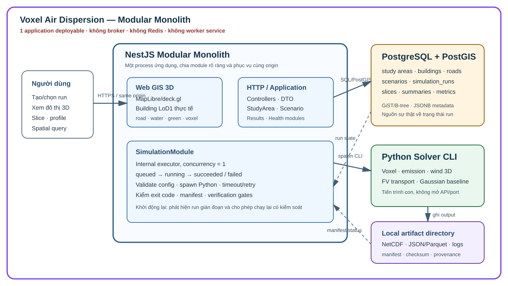
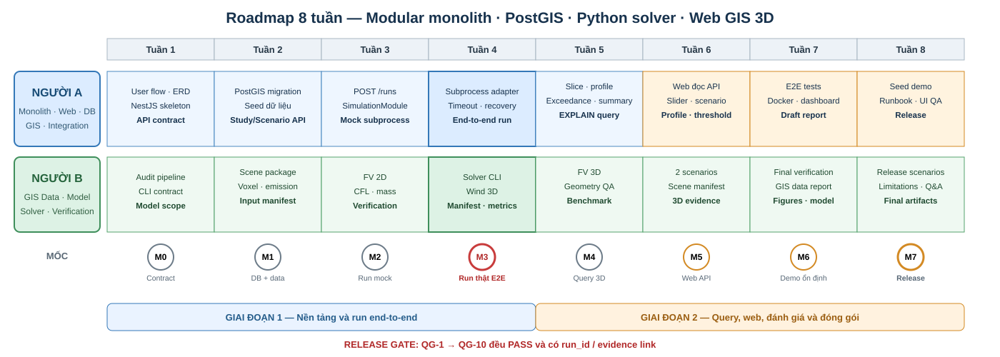

# ROADMAP — 8 tuần, 2 người, sản phẩm cuối là ứng dụng web GIS 3D

**Ràng buộc:** 2 người · 8 tuần · bán thời gian · một study area · PM2.5 · chạy được trên
laptop. Kế hoạch không có gói seminar; thời gian được dùng cho API, cơ sở dữ liệu, tích hợp,
kiểm thử và báo cáo cuối kỳ.

Quy ước trạng thái:

- ✅ Đã có trong repository hoặc đã kiểm tra được.
- 🟡 Đã có một phần nhưng chưa đạt contract sản phẩm cuối.
- ⬜ Chưa thực hiện.
- ✂️ Cắt khỏi phạm vi.

---

## 1. Sản phẩm cuối

Một ứng dụng web GIS 3D cho phép người dùng chọn khu vực/kịch bản, yêu cầu mô phỏng, theo
dõi trạng thái và xem nồng độ PM2.5 theo độ cao. Hệ thống đích:

```text
Web GIS 3D → NestJS modular monolith → PostgreSQL/PostGIS
                                      → Python solver subprocess
                                      → local NetCDF/JSON artifacts
```

| Mã | Tính năng | Người sở hữu | Bắt buộc | Trạng thái đầu kỳ |
|---|---|---|---|---|
| `P1` | Dựng cảnh đô thị 3D từ footprint, chiều cao, đường, sông/công viên thực | B chuẩn bị dữ liệu, A render web | Có | 🟡 dữ liệu/prototype đã có |
| `P2` | PostgreSQL/PostGIS, migration và seed | A | Có | ⬜ |
| `P3` | NestJS modular monolith cho web, API, persistence và simulation orchestration | A | Có | ⬜ |
| `P4` | Internal executor và trạng thái `queued/running/succeeded/failed` | A | Có | ⬜ |
| `P5` | Python CLI chạy pipeline theo `run_id`, được monolith spawn nội bộ | B, A tích hợp | Có | 🟡 pipeline script đã có |
| `P6` | Trường gió mass-consistent + FV transport | B | Có | 🟡 code/test có, còn integration |
| `P7` | Lát cắt theo z, exceedance, profile và summary query | A | Có | 🟡 analysis Python có, API chưa có |
| `P8` | Web 3D có height slider, scenario, threshold và profile | A | Có | 🟡 viewer tĩnh đã có |
| `P9` | Verification và provenance theo từng run | B | Có | 🟡 nhiều test đã có, chưa gắn run |
| `P10` | Docker/demo, runbook, báo cáo và số liệu cuối | A + B | Có | ⬜ |

### Công nghệ

| Lớp | Công nghệ chốt | Lý do |
|---|---|---|
| Web | MapLibre + deck.gl | Dựng nhà LoD1 đúng footprint/height, lớp đường–nước–cây xanh và nồng độ theo z |
| API | NestJS + TypeScript | Module/controller/service/DTO rõ, thuận tiện OpenAPI và test |
| DB | PostgreSQL + PostGIS | Bắt buộc có DB/query; hỗ trợ geometry, GiST và spatial predicates |
| Điều phối run | `SimulationModule` + bảng `simulation_runs`, concurrency=1 | Không cần broker/queue service |
| Solver | Python CLI + NumPy/SciPy/xarray, gọi bằng child process | Tái sử dụng lõi mô phỏng mà không thành service riêng |
| Artifact | NetCDF cho tensor; JSON/GeoJSON/Parquet cho web | Không ép PostGIS chứa toàn bộ tensor |
| Đóng gói | Một app container + PostgreSQL bằng Docker Compose | Monolith đơn giản, dễ demo và tái lập |

### Yêu cầu cảnh đô thị 3D dựa trên thực tế

Web không dùng các khối nhà minh hoạ đặt thủ công. Cảnh 3D phải được dựng từ cùng bộ dữ liệu
GIS mà voxeliser sử dụng, để hình học mô phỏng và hình học người dùng nhìn thấy không lệch nhau.

| Lớp cảnh | Nguồn/thuộc tính | Cách dựng | Người phụ trách |
|---|---|---|---|
| Toà nhà | OSM footprint + Open Buildings/OSM `height` | Extrude LoD1 theo `height_m` | B chuẩn hoá, A render |
| Đường | OSM centerline + `highway` | Line layer theo cấp đường | B chuẩn hoá, A render |
| Sông/mặt nước | OSM polygon/line | Polygon đúng vị trí | B chuẩn hoá, A render |
| Công viên/cây xanh | OSM landuse/leisure/natural | Polygon lớp phủ | B chuẩn hoá, A render |
| Nền địa lý | MapLibre basemap | Kiểm tra CRS và alignment | A |
| Nồng độ/gió | Output đúng `run_id` | Voxel/slab và vector/particle overlay | B xuất, A render |

MVP dùng toà nhà **LoD1**: footprint thực và mái phẳng theo chiều cao dữ liệu. Không tự tạo
mặt đứng/cửa sổ khi không có nguồn. Địa hình vẫn phẳng `z=0` và phải được ghi là hạn chế.

### Luồng dữ liệu ra web



1. Web gửi `POST /runs`.
2. `SimulationModule` validate, ghi run `queued` và trả `202`.
3. Internal executor tuần tự hoá run và spawn Python CLI bằng arguments whitelist.
4. Python ghi NetCDF/manifest; monolith kiểm exit code, verification và persist metrics/slices.
5. Web poll status rồi gọi API để lấy layer/query kết quả.

### Đã cắt gì để giữ đúng đường găng

| Cắt | Lý do | Thời gian giữ lại |
|---|---|---:|
| Auth nhiều vai trò/multi-tenant | Không đóng góp vào câu hỏi GIS 3D | 2–3 người-ngày |
| CFD/RANS/LES | Vượt khả năng tính toán và lịch | Trên 10 người-ngày |
| Chemistry/NO₂ | Cần mô hình phản ứng và dữ liệu mới | 4–6 người-ngày |
| Kubernetes/cloud production | Docker Compose đủ cho demo | 2–3 người-ngày |
| Volume ray-marching hoàn chỉnh | Height slice/voxel layer đã chứng minh được 3D | 2 người-ngày |
| WorldPop/exposure nâng cao | Chỉ làm sau khi MVP ổn định | 1–2 người-ngày |

---

## 2. Bản đồ tổng thể



| Mốc | Cuối tuần | Kết quả phải có | Điều kiện qua mốc |
|---|---:|---|---|
| `M0` | 1 | Contract monolith–Python CLI, ERD, skeleton ứng dụng | Hai người thống nhất command/manifest schema |
| `M1` | 2 | DB dựng sạch, data seed, pipeline input reproducible | Migration + seed chạy trên máy mới |
| `M2` | 3 | API tạo run mock; FV 2D verification xanh | Có `run_id`, CFL/mass tests đạt |
| `M3` | 4 | Run thật đi HTTP → monolith → Python subprocess → artifact | Một run end-to-end không thao tác tay |
| `M4` | 5 | Kết quả 3D query được qua PostGIS/API | Slice/exceedance/profile/summary đúng |
| `M5` | 6 | Web 3D đọc API, hai scenario chạy được | Không còn đọc trực tiếp file nội bộ |
| `M6` | 7 | Demo ổn định, integration tests, số liệu báo cáo | Chạy lại từ DB rỗng và tạo kết quả |
| `M7` | 8 | Release candidate, báo cáo, runbook, rehearsal | Có bản đóng gói và bằng chứng nghiệm thu |

### Cổng chất lượng mục tiêu 9+

Hoàn thành task không đồng nghĩa tự động đạt cổng. Release chỉ được gọi là hoàn thành khi tất
cả điều kiện dưới đây có bằng chứng lưu trong repository/artifacts:

| Gate | Bằng chứng bắt buộc | Nếu chưa đạt |
|---|---|---|
| `QG-1` Đúng đề tài | FV voxel 3D là kết quả chính trên web; Gaussian chỉ là baseline | Không release |
| `QG-2` Đúng số trị | Transport dùng corrected face velocities của wind; divergence của chính flux transport dưới tolerance | Không công bố kết quả |
| `QG-3` Không che lỗi | Không clip nồng độ âm trước kiểm tra; mass correction bằng 0 hoặc được định lượng | Run `failed` |
| `QG-4` Verification | CFL, divergence, positivity, wall flux, mass budget và nghiệm giải tích đều pass | Run `failed` |
| `QG-5` DB/query thật | Migration/seed, 4 query endpoint và `EXPLAIN ANALYZE` có bằng chứng | Chưa đạt yêu cầu DB |
| `QG-6` GIS 3D thật | Web/DB/voxel dùng cùng footprint, height, CRS; scene có provenance và QA | Không dùng hình demo làm kết quả |
| `QG-7` Đánh giá bất định | Sensitivity chiều cao + ít nhất một external benchmark/cross-check | Chỉ được tuyên bố verification nội bộ |
| `QG-8` Tái lập | Máy sạch chạy seed → run → query → web bằng runbook/Compose | Chưa đóng gói |
| `QG-9` Nhất quán tài liệu | Threshold, units, version và số liệu giống nhau giữa config, DB, web, report | Không chốt báo cáo |
| `QG-10` Bằng chứng 3D | Có số liệu chênh lệch theo z, profile đứng và exceedance volume | Chưa chứng minh đóng góp 3D |

---

## 3. Phân vai

| | **Người A — Monolith, Web, DB và tích hợp** | **Người B — Dữ liệu GIS 3D, mô hình và Python solver** |
|---|---|---|
| Sở hữu | Toàn bộ NestJS modular monolith, PostgreSQL/PostGIS, migration, query, web renderer, Docker và adapter gọi Python subprocess | Thu thập/chuẩn hoá dữ liệu cảnh 3D, voxel, emission, wind, FV transport, Gaussian, verification, benchmark |
| File/thư mục đích | `app/`, `db/`, `docker-compose.yml` | `src/`, `tests/`, `config/`, solver CLI |
| Đầu ra chính | API contract, ERD, migrations, query plans, UI và demo | Scene package có provenance, NetCDF, manifest, metrics và kết quả khoa học |
| Phần báo cáo | Kiến trúc, DB/query, dữ liệu GIS, web và kết quả trực quan | Phương pháp, phương trình, verification và hạn chế |

**Ranh giới trách nhiệm:** A chịu toàn bộ API/web/DB/integration. B chịu dữ liệu GIS nguồn và
pipeline biến dữ liệu thật thành building/road/water/green layers cùng voxel/model. B không làm
frontend hoặc NestJS; A không sửa geometry khoa học hay phương trình khi chưa có review của B.

### Hợp đồng B → A

Python solver CLI nhận `run_id` và đường dẫn/snapshot cấu hình từ `SimulationModule`, sau đó tạo:

```text
artifacts/<run_id>/
├── concentration.nc
├── wind.nc
├── web-payload.json hoặc *.parquet
├── metrics.json
├── manifest.json
└── solver.log
```

`manifest.json` bắt buộc có `run_id`, `model_version`, `input_hash`, scenario, grid, units,
artifact checksum, warnings và verification status. A chỉ đánh dấu run `succeeded` khi manifest
hợp lệ, subprocess thoát thành công và B trả verification pass.

---

## 4. Tiến độ thực tế tại thời điểm lập kế hoạch

### Kết quả đã đạt được

| Nhóm việc | Kết quả đang có | Mức dùng lại |
|---|---|---|
| Geometry/voxel | Pipeline footprint, height, rasterisation, NetCDF | Cao |
| Emission | Road processing, rasteriser, EDGAR normalisation, assumptions | Cao |
| Gaussian | Baseline và hình minh hoạ | Cao |
| Wind/transport | Module, notebook debug và test verification | Trung bình; cần nối run contract |
| Analysis | Slices, morphology, figures, web export | Cao |
| Web | Viewer deck.gl/MapLibre đọc dữ liệu tĩnh | Trung bình; phải chuyển sang API |
| API | Chưa có NestJS application | Chưa có |
| Database | Chưa có PostgreSQL/PostGIS schema/migration | Chưa có |
| Monolith–Python integration | Pipeline CLI có nhưng chưa có subprocess lifecycle | Thấp |

### Khoảng trống bắt buộc đóng

| Mã | Khoảng trống | Người | Hạn |
|---|---|---|---:|
| `G1` | Chưa có ERD/schema/migration PostGIS | A | Tuần 2 |
| `G2` | Chưa có API và DTO | A | Tuần 3 |
| `G3` | Chưa có state machine và internal executor | A | Tuần 4 |
| `G4` | Solver CLI chưa nhận `run_id` và ghi manifest chuẩn | B | Tuần 4 |
| `G5` | FV 3D chưa trở thành output chính của web | B + A | Tuần 6 |
| `G6` | Spatial query chưa có query plan/index evidence | A | Tuần 5 |
| `G7` | Chưa có integration test seed → run → query → web | A + B | Tuần 7 |
| `G8` | Chưa có release/runbook/bộ số liệu cuối | A + B | Tuần 8 |

### Câu hỏi bảo vệ cần có kết quả định lượng

| Câu hỏi | Bằng chứng cần tạo | Người |
|---|---|---|
| Vì sao cần 3D thay vì bản đồ 2D? | So sánh lát 1,5 m, 15 m và profile đứng | A + B |
| Mô hình có bảo toàn và ổn định không? | CFL, divergence, mass balance, analytic tests | B |
| DB được dùng để làm gì? | ERD, 4 query endpoint, `EXPLAIN ANALYZE` | A |
| Vì sao không lưu toàn bộ voxel vào DB? | Benchmark/giải thích hybrid PostGIS + NetCDF | A |
| Kết quả đáng tin tới đâu? | Verification, sensitivity, limitations; không tuyên bố validation | B |

---

## 5. Giai đoạn 1 — Nền tảng và run end-to-end

### Tuần 1 — Chốt contract, ERD và baseline → M0

**Người A**

| ID | Công việc | Đầu ra | Tiêu chí đạt |
|---|---|---|---|
| `A1.1` | Vẽ user flow create run → status → result | `docs/user-flow.md` hoặc sơ đồ trong architecture | Bao phủ success/failure/retry |
| `A1.2` | Thiết kế ERD PostGIS | ERD + data dictionary | Có PK/FK/SRID/index dự kiến |
| `A1.3` | Scaffold NestJS modular monolith | Application skeleton | `/health` chạy, phục vụ web và có config validation |
| `A1.4` | Chốt DTO/API endpoints | OpenAPI draft | Khớp `spec.md` |
| `A1.5` | Chốt single source of truth cho threshold/units | Config + DB seed contract | QCVN/WHO không mâu thuẫn giữa research, config và web |

**Người B**

| ID | Công việc | Đầu ra | Tiêu chí đạt |
|---|---|---|---|
| `B1.1` | Chạy lại pipeline hiện tại | Log + danh sách dependency | Xác định bước chạy được/bước lỗi |
| `B1.2` | Chốt Python CLI input/output contract | JSON schema/typed model | Có `run_id`, config, manifest, metrics và exit code |
| `B1.3` | Chốt tên mô hình và giới hạn | Đoạn phương pháp cho report | Không gọi Röckle đầy đủ/CFD |
| `B1.4` | Kiểm kê dữ liệu dựng cảnh 3D thực tế | Bảng layer/source/license/coverage | Có footprint, height, road, water, green và provenance |
| `B1.5` | Chọn external benchmark/cross-check khả thi | Benchmark plan + metric | Có dataset/case, cách chạy và giới hạn tuyên bố |

**Kết quả tuần 1:** ERD, API contract và Python CLI contract được review chéo; `/health` chạy;
pipeline hiện trạng có log tái lập. Nếu chưa thống nhất contract thì chưa sang tuần 2.

### Tuần 2 — Database, dữ liệu và reproducibility → M1

**Người A**

| ID | Công việc | Đầu ra | Tiêu chí đạt |
|---|---|---|---|
| `A2.1` | Dựng PostgreSQL/PostGIS | Docker service | Healthcheck xanh |
| `A2.2` | Viết migration các bảng lõi | Migration files | Up/down hoặc rebuild sạch được |
| `A2.3` | Tạo GiST/B-tree indexes | Migration + query kiểm tra | Index tồn tại đúng cột |
| `A2.4` | API read-only study areas/scenarios | Endpoints + tests | Trả geometry/metadata đúng schema |

**Người B**

| ID | Công việc | Đầu ra | Tiêu chí đạt |
|---|---|---|---|
| `B2.1` | Chuẩn hoá voxel/emission input | NetCDF + manifest | `[z,y,x]`, units, CRS đầy đủ |
| `B2.2` | Chạy Gaussian baseline | Baseline artifact | Có hai scenario để so sánh |
| `B2.3` | Đóng gói config loader | Python solver CLI | Không hard-code grid/path |
| `B2.4` | Chuẩn hoá scene package và seed input | GeoJSON/Parquet + metadata | Building/road/water/green cùng CRS, counts và provenance |

**Kết quả tuần 2:** từ DB rỗng có thể migrate + seed bằng scene package của B; API đọc study
area/scenario; dữ liệu toà nhà, đường, mặt nước và cây xanh cùng CRS, có provenance; B tạo được
input artifacts và Gaussian baseline.

### Tuần 3 — Run API và verification 2D → M2

**Người A**

| ID | Công việc | Đầu ra | Tiêu chí đạt |
|---|---|---|---|
| `A3.1` | `POST /runs` + DTO validation | Endpoint + tests | Trả `202` và `run_id` |
| `A3.2` | `GET /runs/:id` | Status endpoint | Trả progress/error/metrics schema |
| `A3.3` | Internal executor và DB state transition | Service tests | Concurrency=1; không chạy trùng một `run_id` |
| `A3.4` | Mock subprocess integration | Fake completed run | UI/API flow test được trước solver thật |

**Người B**

| ID | Công việc | Đầu ra | Tiêu chí đạt |
|---|---|---|---|
| `B3.1` | Verify advection 2D | Tests/plots | Blob đi đúng `u·t` trong tolerance |
| `B3.2` | Verify diffusion 2D | Tests/metrics | `σ²=2Kt` trong tolerance chốt |
| `B3.3` | Kiểm CFL, positivity, mass balance | Test suite | Không clip âm để che lỗi |
| `B3.4` | Benchmark nhỏ | Bảng runtime/memory | Có số đo, không ước lượng miệng |
| `B3.5` | Bỏ clipping che lỗi positivity | Solver + regression test | Kiểm tra giá trị âm trước correction; fail nếu vượt tolerance |

**Kết quả tuần 3:** API tạo và hoàn tất mock run; solver 2D vượt verification gate; metrics
schema đã ổn định để A lưu vào DB.

### Tuần 4 — Python subprocess thật và pipeline end-to-end → M3

**Người A**

| ID | Công việc | Đầu ra | Tiêu chí đạt |
|---|---|---|---|
| `A4.1` | `SimulationModule` và subprocess lifecycle | Integration service | `queued→running→succeeded/failed` |
| `A4.2` | Timeout, restart recovery và retry policy | State transition tests | Không để run `running` vô hạn |
| `A4.3` | Artifact + metrics persistence | DB records | Checksum/path/manifest truy xuất được |
| `A4.4` | Error mapping/log retrieval | API response | Lỗi Python process không thành HTTP 500 mơ hồ |
| `A4.5` | Lưu verification gate theo run | DB/API fields | Run chỉ `succeeded` khi toàn bộ gate pass |

**Người B**

| ID | Công việc | Đầu ra | Tiêu chí đạt |
|---|---|---|---|
| `B4.1` | Solver CLI nhận `run_id` | Command/module | Chạy không cần thao tác tay |
| `B4.2` | Mass-consistent wind 3D | `wind.nc` + metrics | Divergence dưới tolerance |
| `B4.3` | Ghi manifest/metrics/log | Artifact bundle | Đúng contract tuần 1 |
| `B4.4` | Failure exit codes | Test case lỗi | API phân biệt input/model/system error |
| `B4.5` | Xuất corrected face velocities | `uf`, `vf`, `wf` contract + tests | Transport dùng đúng face flux đã được kiểm divergence |

**Kết quả tuần 4:** một request thật được modular monolith điều phối và spawn Python subprocess, tạo artifact và metrics,
sau đó xem lại bằng `GET /runs/:id`. Đây là cổng quyết định quan trọng nhất.

---

## 6. Giai đoạn 2 — Query, web, đánh giá và đóng gói

### Tuần 5 — FV 3D và truy vấn PostGIS → M4

**Người A**

| ID | Công việc | Đầu ra | Tiêu chí đạt |
|---|---|---|---|
| `A5.1` | Persist concentration slices/summaries | Importer + schema | Không nhân đôi khi retry |
| `A5.2` | Slice endpoint | `/runs/:id/slices` | Filter đúng `z_m`/bbox |
| `A5.3` | Exceedance endpoint | `/exceedance` | Threshold và units rõ |
| `A5.4` | Profile + summary endpoint | `/profile`, `/summary` | Trả đúng trục z và aggregates |
| `A5.5` | Đo query plan | File SQL/report | Có `EXPLAIN (ANALYZE, BUFFERS)` |
| `A5.6` | Benchmark DB ở kích thước demo | Bảng latency/storage | Query chính có p50/p95 và không full-scan ngoài chủ ý |

**Người B**

| ID | Công việc | Đầu ra | Tiêu chí đạt |
|---|---|---|---|
| `B5.1` | Chạy FV 3D tới steady state | `concentration.nc` | Có stopping criterion |
| `B5.2` | Mass budget toàn run | Metrics | emitted≈remaining+escaped |
| `B5.3` | Numerical diffusion estimate | Bảng kết quả | Đặt cạnh physical K |
| `B5.4` | Benchmark production grid | Runtime/memory | Có số đo trên máy demo |
| `B5.5` | Đối chiếu geometry web với voxel mask | QA report + overlay | Footprint/height/occupancy không lệch CRS hoặc đảo trục |
| `B5.6` | Verification trên production grid | Gate report theo run | Face divergence, mass budget, positivity và wall flux pass |

**Kết quả tuần 5:** output chính là FV voxel 3D, không còn chỉ Gaussian; bốn loại query DB
trả kết quả đúng và có bằng chứng index/query plan.

### Tuần 6 — Web 3D đọc API và so sánh scenario → M5

**Người A**

| ID | Công việc | Đầu ra | Tiêu chí đạt |
|---|---|---|---|
| `A6.1` | Chuyển viewer từ file tĩnh sang API | API client | Không đọc `web/data/*.js` làm nguồn chính |
| `A6.2` | Render cảnh đô thị thực tế | Building/road/water/green layers | Nhà extrude đúng footprint/height, các lớp khớp basemap |
| `A6.3` | Height slider + legend | UI | Layer đổi đúng `z_m` |
| `A6.4` | Scenario/run selector + threshold | UI/map layer | Đổi run không trộn dữ liệu, hiện units |
| `A6.5` | Profile đứng và summary panel | Chart/panel | Click điểm trả profile đúng |
| `A6.6` | Đặt FV làm kết quả mặc định | UI + API integration test | Viewer mặc định dùng `model=fv`; Gaussian chỉ là comparison toggle |

**Người B**

| ID | Công việc | Đầu ra | Tiêu chí đạt |
|---|---|---|---|
| `B6.1` | Chạy hai wind scenarios | Hai artifact bundles | Plume đổi hướng hợp lý |
| `B6.2` | So sánh FV với Gaussian | Tables/figures | Gắn nhãn model rõ ràng |
| `B6.3` | So sánh lát 1,5 m và 15 m | Figure/metrics | Có khác biệt định lượng |
| `B6.4` | Sensitivity tối thiểu | Bảng sensitivity | Một tham số chính được thay đổi |
| `B6.5` | Xuất scene manifest và kiểm tra coverage | Manifest + QA figures | Mọi feature hiển thị truy được nguồn; không có building đặt tay |
| `B6.6` | Sensitivity chiều cao và benchmark/cross-check | Tables/figures | Kết luận chính không dựa vào một bộ height duy nhất; claim đúng mức bằng chứng |

**Kết quả tuần 6:** web dựng lại study area bằng footprint và chiều cao thực, có đường, mặt
nước/cây xanh nếu nguồn tồn tại; cảnh khớp basemap và voxel mask. Người dùng tạo/chọn run,
kéo height slider, đổi scenario, xem threshold, profile và summary hoàn toàn qua API.

### Tuần 7 — Kiểm thử tích hợp, dashboard và báo cáo kết quả → M6

**Người A**

| ID | Công việc | Đầu ra | Tiêu chí đạt |
|---|---|---|---|
| `A7.1` | Loading/error/empty states | UI states | Python process lỗi không làm UI treo |
| `A7.2` | API e2e + DB integration tests | Test suite | Bao phủ create/status/query/failure |
| `A7.3` | Docker Compose đầy đủ | Compose file | Một lệnh dựng monolith + PostGIS |
| `A7.4` | Dashboard metrics/provenance | UI | Hiện version, input hash, warnings |
| `A7.5` | Viết phần kiến trúc/DB/web | Draft report | Có ERD, sequence, query evidence |
| `A7.6` | Clean-room E2E rehearsal | Log/script/checklist | Máy sạch chạy Compose → migrate → seed → run → query → web |

**Người B**

| ID | Công việc | Đầu ra | Tiêu chí đạt |
|---|---|---|---|
| `B7.1` | Chạy final verification suite | Test report | Không có test chính bị skip vô lý |
| `B7.2` | Freeze model parameters | Config/version | Mọi run cuối dùng cùng version |
| `B7.3` | Viết phương pháp và hạn chế | Draft report | Verification ≠ validation |
| `B7.4` | Xuất figure/table 300 dpi | Report assets | Có caption, units, scenario |
| `B7.5` | Viết phần dữ liệu GIS 3D và độ tin cậy hình học | Draft report | Có coverage, nguồn height, clipping và flat-terrain limitation |
| `B7.6` | Lập bảng kết quả 9+ | Final evidence table | Mỗi claim có run_id, metric, figure/table và limitation |

**Kết quả tuần 7:** clean-room seed → run → verification gate → query → web chạy tự động;
FV là lớp mặc định; draft báo cáo có kiến trúc, mô hình, sensitivity, external cross-check,
hạn chế và bằng chứng DB query.

### Tuần 8 — Release, báo cáo và bảo vệ → M7

**Người A**

| ID | Công việc | Đầu ra | Tiêu chí đạt |
|---|---|---|---|
| `A8.1` | Seed/demo dataset cố định | Demo profile | Không phụ thuộc tải dữ liệu trực tiếp |
| `A8.2` | Runbook và README cuối | Hướng dẫn | Máy khác chạy theo được |
| `A8.3` | Kiểm tra UI/demo flow | Checklist/video dự phòng | Demo hoàn thành trong thời lượng dự kiến |
| `A8.4` | Chốt chương DB/web/kết quả | Final report | Khớp sản phẩm thực tế |
| `A8.5` | Audit ma trận `QG-1..QG-10` | Release evidence index | Mỗi gate có PASS, run_id và link bằng chứng |

**Người B**

| ID | Công việc | Đầu ra | Tiêu chí đạt |
|---|---|---|---|
| `B8.1` | Chạy release scenarios | Final artifacts | Checksum và manifest đầy đủ |
| `B8.2` | Chốt bảng verification/limitations | Final tables | Không có claim vượt bằng chứng |
| `B8.3` | Review toàn bộ thuật ngữ khoa học | Review notes | Không gọi Röckle đầy đủ/CFD/validation |
| `B8.4` | Chuẩn bị câu trả lời kỹ thuật | Q&A notes | Trả lời model choice, CFL, mass, bias |

**Cùng thực hiện:** rehearsal luồng mở web → tạo/chọn run → đổi tầng → spatial query → giải
thích model → nêu hạn chế. Chuẩn bị video/screenshot và artifact local làm phương án dự phòng.

**Kết quả tuần 8:** release candidate có tag/version, Docker/runbook, final artifacts, báo cáo
khớp code và một demo có phương án dự phòng.

Release chỉ được chốt khi `QG-1` đến `QG-10` đều có trạng thái PASS và đường dẫn bằng chứng.

---

## 7. Ngân sách

Ngân sách tham chiếu: khoảng 32 người-ngày cho 8 tuần, không tính thời gian chờ máy.

| Hạng mục | A | B | Tổng người-ngày |
|---|---:|---:|---:|
| Contract, ERD, chuẩn dữ liệu | 2 | 2 | 4 |
| PostgreSQL/PostGIS + monolith orchestration | 6 | 1 | 7 |
| Dữ liệu GIS và scene package | 1 | 4 | 5 |
| Python solver/model/verification | 1 | 7 | 8 |
| Web 3D + query/dashboard | 4 | 0 | 4 |
| Integration, Docker, report, rehearsal | 2 | 2 | 4 |
| **Tổng** | **16** | **16** | **32** |

Nếu trễ, cắt theo thứ tự: cache/concurrency nâng cao → sensitivity thứ hai → advanced 3D query → hiệu ứng
thị giác. Không cắt run lifecycle, PostGIS query, FV output, verification hoặc provenance.

---

## 8. Giả định và độ tin cậy

### Độ tin cậy kế hoạch: khoảng 75%

Các giả định chính:

- Docker/PostgreSQL chạy được trên máy demo.
- Production grid chạy trong thời gian chấp nhận được; tuần 3 và 5 có benchmark để xác nhận.
- Một study area và hai scenario là đủ cho câu hỏi đồ án.
- Internal executor concurrency=1 đủ cho quy mô đồ án; chưa cần broker hoặc hệ thống phân tán.
- Dữ liệu đầu vào đã có local cache để demo không phụ thuộc Internet.

### Các tầng test

| Tầng | Nội dung | Người chịu trách nhiệm |
|---|---|---|
| Unit | Toán tử số, DTO, service, query builder | A/B theo module |
| Verification | Advection, diffusion, mass, CFL, divergence | B |
| DB integration | Migration, constraints, SRID, indexes, query result | A |
| Subprocess integration | Spawn, timeout, restart recovery, retry, manifest, failure | A + B |
| API e2e | Create run, status, result endpoints | A |
| System smoke | Seed → run → query → web | A + B |
| Reproducibility | Cùng input/version cho cùng manifest và metrics hợp lý | B |

---

## 9. Quy tắc làm việc

1. Contract thay đổi phải cập nhật `spec.md`, migration/DTO và Python CLI schema trong cùng PR.
2. A sở hữu merge các thay đổi monolith/web/DB; B sở hữu merge Python solver.
3. Không truyền tensor qua JSON giữa NestJS và Python; dùng artifact path/reference.
4. Không đánh dấu `succeeded` nếu verification fail hoặc artifact thiếu checksum.
5. Mỗi cuối tuần chạy smoke test trên máy của người còn lại.
6. Kết quả báo cáo phải sinh từ release artifacts, không copy số từ run cũ không rõ version.
7. Không dùng `git add -A`, `git add .`, `git commit -a` hoặc commit secrets.

---

## 10. Những thứ dễ làm trượt lịch nhất

| Rủi ro | Dấu hiệu sớm | Van an toàn | Owner |
|---|---|---|---|
| Solver 3D chậm/không ổn định | Benchmark tuần 3/5 vượt ngân sách | Giảm domain/grid cho demo, giữ full run offline | B |
| Monolith–Python contract thay đổi liên tục | DTO/manifest sửa mỗi tuần | Freeze v1 cuối tuần 1, version contract | A + B |
| Lưu quá nhiều voxel vào PostGIS | Import/query tăng mạnh | Chỉ persist slices/summaries, tensor ở NetCDF | A |
| Web payload quá lớn | Slider lag, browser hết RAM | bbox, level query, downsample/tiling | A |
| Demo phụ thuộc Internet | Data/API ngoài timeout | Seed và artifact local cố định | A |
| Claim khoa học vượt bằng chứng | Dùng “validation/chính xác” sai | Checklist thuật ngữ và limitations | B |

---

## 11. Cấu trúc repo mục tiêu

```text
app/                        NestJS modular monolith — Người A
├── src/modules/            Study area, scenario, simulation, results
├── public/                 Web GIS 3D được phục vụ cùng ứng dụng
└── test/                   Unit, integration và API e2e
db/
├── migrations/             PostgreSQL/PostGIS — Người A
├── seeds/
└── queries/
src/                        Python model/solver CLI — Người B
tests/                      Verification + integration
config/                     Grid/scenario/model configuration
data/                       Input cache
artifacts/                  Run outputs, không commit file lớn
docs/                       Research, spec, architecture, roadmap
docker-compose.yml          Modular monolith + PostgreSQL/PostGIS
```

Trong thời gian chuyển đổi, thư mục `web/` hiện tại được giữ và A có thể nâng cấp tại chỗ trước
khi đưa static assets vào `app/public/`. Chỉ có một application deployable; Python là chương
trình tính toán được gọi nội bộ, không phải service độc lập.
