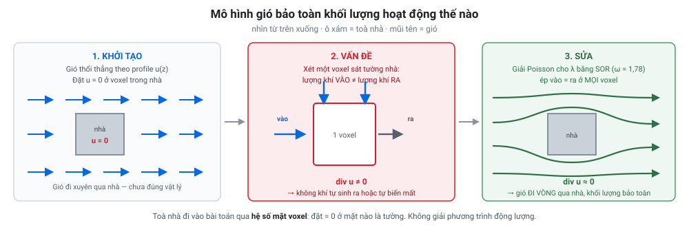
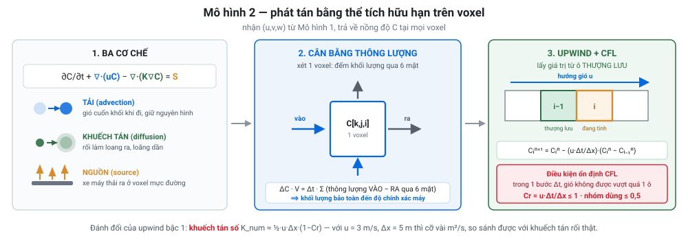
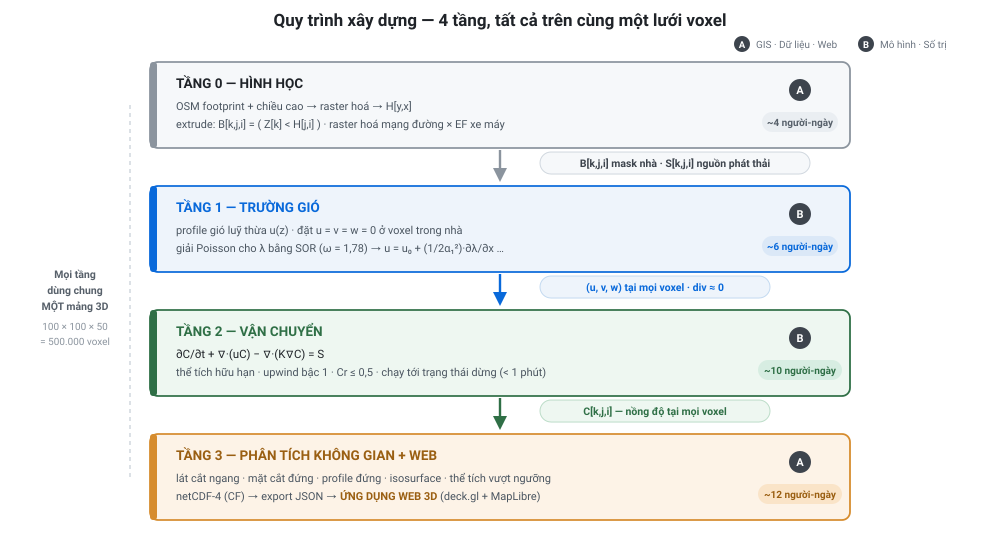

# SEMINAR — Mô phỏng lan truyền ô nhiễm không khí đô thị bằng mô hình GIS 3D

> **Nhóm:** ☐ ................................. · ☐ .................................
> **Thời lượng:** 10–12 phút trình bày + 3 phút hỏi đáp
> **Sản phẩm cuối của đồ án:** **ứng dụng web 3D** ([`ROADMAP.md`](./ROADMAP.md))
> **Tài liệu nền:** [`RESEARCH.md`](./RESEARCH.md) (số liệu + nguồn) · [`DECISION.md`](./DECISION.md) (phương án đầy đủ)

---

## 0. Checklist hành chính

| # | Yêu cầu của môn | ☐ | Ghi chú |
|---|---|---|---|
| 1 | Tối đa **2 sinh viên/nhóm** | ☐ | Đạt |
| 2 | Mỗi đề tài chỉ **1 nhóm** — nguyên tắc **đăng ký trước** | ☐ | ⚠️ **Làm ngay**, ai điền trước được trước |
| 3 | Điền tên nhóm/thành viên vào cột *"Nhóm đăng ký"*, sheet *"Danh sách đề tài"* | ☐ | Kiểm lại xem đã lưu chưa |
| 4 | Báo cáo đủ **5 mục bắt buộc** (§5) | ☐ | |
| 5 | Trình bày **10–12 phút** + 3 phút hỏi đáp | ☐ | **Bấm giờ tập ≥ 2 lần** |
| 6 | **Hạn chót** đăng ký và nộp báo cáo — GV thông báo trên lớp/LMS | ☐ | ⚠️ Kiểm LMS ngay, cả lộ trình neo vào mốc này |

---

# PHẦN A — MÔ HÌNH

## 1. Mô hình đã chọn là gì

### 1.1 Tên gọi chính xác

> **Mô hình gió chẩn đoán bảo toàn khối lượng** *(mass-consistent diagnostic wind model)*
> **+ phương trình tải–khuếch tán giải bằng thể tích hữu hạn** *(finite-volume advection–diffusion)*
> **— toàn bộ trên lưới voxel 3D.**

Đây là **hai mô hình ghép lại**, không phải một:


Thêm **mô hình chùm khói Gaussian giải tích** (hệ số phát tán **Briggs ĐÔ THỊ**) làm **baseline và chuẩn kiểm chứng**.

> ⚠️ **Đừng gọi nhầm là "mô hình Röckle".** Röckle = tham số hoá thực nghiệm 7 vùng **+** bảo toàn khối lượng. Nhóm chỉ cài vế thứ hai. Gọi sai là lộ ngay chỗ chưa nắm.

### 1.2 Mô hình 1 hoạt động thế nào



**Bước 1 — Khởi tạo.** Cho gió vào theo profile luỹ thừa `u(z) = u_ref·(z/z_ref)^p`, và đặt **u = v = w = 0 ở mọi voxel nằm trong toà nhà**.

**Bước 2 — Vấn đề.** Trường vừa tạo **sai về mặt vật lý**: ở nhiều voxel, lượng khí chảy vào ≠ lượng khí chảy ra (`div u ≠ 0`), tức là không khí tự sinh ra hoặc tự biến mất.

**Bước 3 — Sửa.** Hiệu chỉnh trường gió sao cho **vào = ra ở mọi voxel**, mà **thay đổi ít nhất** so với trường ban đầu. Bài toán tối ưu có ràng buộc này quy về giải một phương trình Poisson cho nhân tử Lagrange λ:

```
∂²λ/∂x² + ∂²λ/∂y² + (α₁/α₂)²·∂²λ/∂z² = R        (R = div của trường ban đầu)
```

giải bằng **SOR** (Successive Over-Relaxation, ω = 1,78), rồi khôi phục:

```
u = u₀ + (1/2α₁²)·∂λ/∂x        (tương tự v, w)
```

**Toà nhà đi vào bài toán ở đâu?** Ở **hệ số mặt voxel** `e,f,g,h,m,n` trong công thức SOR — đặt bằng **0** ở mặt nào là tường. Chỉ vậy thôi.

**Kết quả:** gió **đi vòng qua toà nhà**, tăng tốc ở khe hẹp, chậm lại phía sau — và khối lượng được bảo toàn.

### 1.3 Mô hình 2 hoạt động thế nào

Giải chính phương trình mà **mọi mô hình CFD đều giải**:



Rời rạc trên voxel: **upwind bậc 1** cho số hạng tải + **sai phân trung tâm** cho khuếch tán, **sơ đồ hiện**, ràng buộc ổn định CFL `Cr = Δt(|u|/Δx + |v|/Δy + |w|/Δz) ≤ 0,5`.

Chạy tới **trạng thái dừng** (~800–1.200 bước) chứ không chạy đủ giờ đồng hồ → **dưới 1 phút/kịch bản**.

### 1.4 ⭐ Vì sao chọn mô hình này — 4 lý do

**Lý do 1 — Đây là tầng DUY NHẤT thoả cả ba ràng buộc cùng lúc.**

| Ràng buộc | Gaussian | **Mô hình nhóm** | CFD/LES |
|---|---|---|---|
| Phân giải được toà nhà | ❌ | ✅ | ✅ |
| Chạy được trên laptop | ✅ | ✅ | ❌ |
| Native voxel (đúng kỹ thuật đề bài) | 🟡 | ✅ | 🟡 |

**Lý do 2 — Khoảng cách chi phí tới CFD là 2–3 bậc độ lớn.**
Mô hình chẩn đoán "nhanh hơn LES và DNS **hai đến ba bậc độ lớn**" ([Front. Earth Sci. 2023](https://doi.org/10.3389/feart.2023.1251056)). Cụ thể: **dưới 1 phút** so với **4.744 GPU-giờ = 6,7 ngày trên 32 GPU** cho một ca LES Michel-Stadt. Với 2 người và 8 tuần bán thời gian, con số này tự nó quyết định.

**Lý do 3 — Mọi biến sống trên cùng một mảng 3D.**
Mask toà nhà `B[k,j,i]`, gió `u,v,w[k,j,i]`, nhân tử `λ[k,j,i]`, nồng độ `C[k,j,i]` — **cùng một lưới, cùng một shape**. Đây đúng là *"mô hình 3D Array/voxel"* mà đề bài yêu cầu, không phải một mô hình khác rồi ép vào voxel sau.

**Lý do 4 — Tự viết được nên giải thích được.**
Chạy phần mềm đóng gói (GRAL, AUSTAL) cho vật lý tốt hơn nhưng nhóm không kiểm soát nội bộ. Tự viết cho vật lý kém hơn nhưng **giải thích được từng dòng và viết được phân tích ổn định CFL**. Với một đồ án môn học, trục thứ hai quan trọng hơn.

---

## 2. Ưu điểm — Nhược điểm

### ✅ Ưu điểm

| # | Ưu điểm | Cụ thể |
|---|---|---|
| 1 | **Đúng bản chất bài toán** | Nồng độ là **trường vô hướng thể tích**; chỉ voxel lưu giá trị ở **mọi** điểm trong khối khí, kể cả trên mái và trong hẻm |
| 2 | **Toà nhà làm lệch dòng khí** | Gió đi vòng qua nhà — khác hẳn mô hình Gaussian phẳng |
| 3 | **Bảo toàn khối lượng chính xác** | Thể tích hữu hạn bảo toàn đến độ chính xác máy; **kiểm được bằng số** và đưa vào báo cáo |
| 4 | **Chi phí rất thấp** | 500.000 voxel, 2 MB/trường float32, **< 1 phút/kịch bản trên laptop** |
| 5 | **Minh bạch, bảo vệ được** | Tự viết → trả lời được mọi câu hỏi "tại sao ra số này" |
| 6 | **Có lý thuyết ổn định viết ra được** | CFL, von Neumann — điểm cộng học thuật rõ ràng |
| 7 | **Dữ liệu lấy được hết ở Việt Nam, miễn phí** | OSM + Google Open Buildings 2.5D + Open-Meteo + EF xe máy Hà Nội |
| 8 | **Kết quả dùng lại được** | netCDF-4 chuẩn CF → mở thẳng trong QGIS/ArcGIS, và feed được cho web viewer |

### ❌ Nhược điểm — **nói thẳng, đây là mục ghi điểm**

| # | Nhược điểm | Mức | Hệ quả cụ thể |
|---|---|---|---|
| 1 | **Không có xoáy tái tuần hoàn sau nhà và xoáy hẻm phố** | **Cao** | Đã lược bỏ tham số hoá thực nghiệm 7 vùng (Röckle) vì vượt ngân sách → **nồng độ trong hẻm phố bị ước lượng THẤP** |
| 2 | **Khuếch tán số** | **Cao** | Upwind bậc 1 sinh khuếch tán giả `K_num ≈ ½·u·Δx·(1−Cr)`. Với u = 3 m/s, Δx = 5 m thì cỡ **vài m²/s — so sánh được với khuếch tán rối vật lý** → chùm khói nhoè hơn thực tế |
| 3 | **Không có rối do giao thông (TPT)** | Cao | [OSPM](https://envs.au.dk/en/research-areas/air-pollution-emissions-and-effects/the-monitoring-program/air-pollution-models/ospm/description-of-the-ospm-model): *"lặng gió → cơ chế phát tán duy nhất là TPT"* → **sai lệch lớn nhất đúng lúc ô nhiễm nặng nhất** |
| 4 | **Chỉ verification, chưa validation** | Cao | Mới so với nghiệm giải tích; **chưa so với hầm gió hay hiện trường**. Lý do: dựng lại hình học Michelstadt + trích 196 điểm cảm biến vượt ngân sách |
| 5 | **Bất định lưu lượng giao thông** | **Rất cao** | Không có bộ đếm mở nào cho Hà Nội/TP.HCM → dùng cấp đường OSM làm proxy tương đối |
| 6 | **Chiều cao toà nhà chưa kiểm định ở Đông Nam Á** | Cao | Google ghi rõ MAE 1,5 m nhưng *"đánh giá chỉ giới hạn ở Bắc Mỹ, châu Âu và Nhật Bản — không phải Global South"*. Nhà ống VN là ca khó |
| 7 | **LoD1** — nhà là khối hộp | Thấp | Ở voxel 5 m thì hợp lý, mái dốc LoD2 không sống sót qua rời rạc hoá |
| 8 | **Không có hoá học** | TB | Đúng với PM2.5; **sai với NO₂** (phản ứng NO+O₃) → chọn PM2.5 làm chất chính |

---

## 3. Ba trade-off cốt lõi

### Trade-off 1 — Độ chính xác đổi lấy chi phí là **phi tuyến**


**Đọc:** bậc thang **đầu tiên là rẻ nhất mà đổi được nhiều nhất** — từ "không có toà nhà" sang "có toà nhà" chỉ tốn ×50 chi phí của một mô hình vốn đã chạy trong vài giây. Bậc cuối tốn thêm ×1000 nhưng lợi ích tăng thêm ít hơn nhiều. **Với đồ án sinh viên, bậc đầu là nơi tỉ lệ lợi ích/chi phí cao nhất.**

### Trade-off 2 — Độ phân giải đổi lấy bộ nhớ là **bậc ba**

Giảm một nửa kích thước ô → **×8 bộ nhớ, ×16 thời gian** (8× số ô × 2× số bước do CFL).

Bằng chứng chọn điểm dừng — [CAIRDIO](https://doi.org/10.5194/gmd-14-1469-2021), đối chiếu dữ liệu hầm gió:

| Δ ngang | NMSE | FAC2 |
|---|---|---|
| **5 m** | **0,10** | **0,84** |
| 10 m | 0,25 | — |
| **20 m** | **1,35** | — |
| 80 m | — | 0,32 |

Mọi độ phân giải đều "đạt" tiêu chí chấp nhận đô thị, **nhưng NMSE xấu đi hơn một bậc độ lớn từ 5 m lên 20 m**. → **Chọn 5 m.**

### Trade-off 3 — Vật lý đổi lấy **tính minh bạch**

| | Chạy phần mềm đóng gói (GRAL, AUSTAL) | Tự viết (phương án nhóm) |
|---|---|---|
| Vật lý | Tốt hơn | Kém hơn |
| Giải thích được nội bộ | ❌ | ✅ |
| Viết được phân tích ổn định | ❌ | ✅ |
| Nội dung GIS 3D để trình bày | Rất ít (chỉ chuẩn bị input + bấm nút) | Toàn bộ |
| Thời gian | Ít hơn | Nhiều hơn |

Với một **đồ án môn học GIS 3D**, cột phải quan trọng hơn cột trái.

---

## 4. Bảng so sánh với các mô hình khác

### 4.1 Bảng tổng hợp

| | **Box** | **Gaussian** | **Street canyon** | ⭐ **MÔ HÌNH NHÓM** | **Röckle đầy đủ** | **CFD RANS** | **LES / LBM** | **CTM (CMAQ)** |
|---|---|---|---|---|---|---|---|---|
| Giải cái gì | cân bằng khối lượng | nghiệm giải tích | hộp + chùm khói | **bảo toàn khối lượng + tải-khuếch tán** | + vùng thực nghiệm | RANS + vận chuyển | Navier–Stokes lọc | hoá học-vận chuyển vùng |
| Toà nhà làm lệch dòng | ❌ | ❌ | 🟡 tham số | ✅ | ✅ | ✅ | ✅ | ❌ |
| Xoáy tái tuần hoàn sau nhà | ❌ | ❌ | 🟡 | **❌** | ✅ | ✅ | ✅ | ❌ |
| Xoáy hẻm phố | ❌ | ❌ | ✅ | **❌** | 🟡 | ✅ | ✅ | ❌ |
| Rối do xe cộ (lặng gió) | ❌ | ❌ | ✅ | ❌ | ❌ | 🟡 | 🟡 | ❌ |
| Trường 3D theo z | ✅ | ✅ | 🟡 1 giá trị/phố | ✅ **native voxel** | ✅ | ✅ | ✅ | ✅ nhưng thô |
| Δ điển hình | thành phố | 10–100 m | đoạn phố | **5 m** | 1–10 m | 0,5–5 m | < 1 m | **1–12 km** |
| **Chi phí thực đo** | tức thì | 1 M điểm ~3 phút | giây | **< 1 phút** | 2–10 phút | vài phút–155 giờ | **4.744 GPU-giờ** | **11.520 CPU-giờ** |
| Độ chính xác (FAC2) | — | thường < 0,5 | SIRANE 0,73–0,90 | (chưa có số công bố) | QES-Plume 0,59 | tới ~0,95 | cao nhất | — |
| Mã nguồn mở | tự viết | ✅ AERMOD | 🟡 MUNICH | tự viết | ✅ URock, QES | ✅ OpenFOAM | ✅ PALM, OpenLB | ✅ CMAQ |
| **Khả thi 2 SV / 8 tuần** | ✅ | ✅ | ✅ | ✅ **CHỌN** | 🟡 | ❌ | ❌ | ❌ |

### 4.2 Trade-off của TỪNG mô hình

> Mỗi mô hình đổi cái gì lấy cái gì — đây là phần hay bị hỏi nhất.

| Mô hình | **ĐƯỢC gì** | **TRẢ giá gì** | Vì sao nhóm không chọn |
|---|---|---|---|
| **Box model** | Đơn giản tuyệt đối, 1 phương trình, kiểm tra được cân bằng khối lượng toàn cục | **Không có cấu trúc không gian nào cả** — 1 giá trị cho cả thành phố | Không ra trường 3D → lạc đề. **Giữ làm phép kiểm tra tổng khối lượng** |
| **Gaussian plume** | Nghiệm giải tích, khả vi, song song tầm thường; z là biến tường minh nên hợp lưới voxel; chuẩn mực, dễ bảo vệ | Không có toà nhà; không xử lý được lặng gió (giả định **u ≥ 1 m/s**); cấp ổn định rời rạc; hệ số Briggs đô thị chỉ là nhám trung bình vùng | Bỏ mất **đúng chế độ gây ô nhiễm nặng nhất ở VN** (lặng gió). **Giữ làm baseline + chuẩn kiểm chứng** |
| **Street canyon** (OSPM, SIRANE) | Là họ **duy nhất trong nhóm rẻ** xử lý đúng bẫy ô nhiễm trong hẻm và **rối do giao thông khi lặng gió**; đã kiểm định rộng (SIRANE FAC2 0,73–0,90) | **Không phải mô hình trường 3D** — 1 giá trị/đoạn phố, không có profile đứng trong hẻm; cần nồng độ nền làm đầu vào | Không cho mảng 3D → không đáp ứng kỹ thuật đề bài. OSPM/SIRANE cũng **không mã nguồn mở** |
| ⭐ **Mass-consistent + voxel** *(nhóm)* | Toà nhà làm lệch dòng; native voxel; < 1 phút; minh bạch; bảo toàn khối lượng chính xác | **Không có xoáy tái tuần hoàn**; khuếch tán số; không có TPT; không giải động lượng | **← Đã chọn** |
| **Röckle đầy đủ** (QUIC-URB, URock) | Thêm cavity + wake + xoáy hẻm phố, tức là **bù đúng nhược điểm số 1** của phương án nhóm; URock mã nguồn mở, chạy trong QGIS | Phải cài **7 vùng hình học cho từng toà nhà theo từng hướng gió** — ~15–20 người-ngày; vẫn không giải động lượng | Vượt ngân sách 8 tuần. **Là hướng phát triển số 1** |
| **CFD RANS** (OpenFOAM) | Vật lý rối thật, phân giải tách dòng sau vật cản tù; có bộ hướng dẫn chuẩn (COST 732, AIJ) | Chia lưới `snappyHexMesh` trên hình học thật tốn **4–6 tuần**; kỹ năng mô hình phụ thuộc hằng số *"tối ưu tuỳ ca và không biết trước"* | Thời gian nằm ở chia lưới chứ không ở vật lý; và kết quả phụ thuộc một tham số phải chỉnh tay → khó bảo vệ |
| **LES / LBM-LES** (PALM, OpenLB) | Chính xác nhất; phân giải được cấu trúc rối | **404,9 → 4.744 GPU-giờ cho MỘT ca**; cần Fortran + MPI + HPC; dựng static driver mất nhiều tuần | Chi phí sai một bậc so với nguồn lực. 📌 Nhưng PALM dùng **lưới so le Arakawa C — về cấu trúc giống hệt lưới voxel của nhóm** |
| **CTM** (CMAQ, CAMx, WRF-Chem) | Có hoá học đầy đủ, quy mô vùng, nền đô thị | EPA nói thẳng: *"pha loãng tức thời phát thải điểm ra toàn bộ thể tích ô lưới"*; ô nhỏ nhất **1 km**; cần WRF + SMOKE + HPC | **Không phân giải được toà nhà về mặt CẤU TRÚC**, không phải cấu hình. 1 km vs 5 m = chênh 200×/chiều |
| **Nội suy 3D** (kriging, IDW) | Rất rẻ, bám dữ liệu thật tại điểm đo | **Không phải mô hình phát tán** — 3–10 cảm biến mặt đất chỉ cho những "đốm trơn"; không khớp được variogram 3D bất đẳng hướng từ < 30 điểm | Gió và toà nhà mới là thứ đặt chất ô nhiễm vào đúng chỗ. **Giữ làm baseline cần vượt qua** |
| **ML surrogate** (CNN, GNN, cGAN) | Suy luận mili-giây; cGAN đạt FAC2 = 0,925, nhanh hơn CFD ~18.000 lần | **Cần kho dữ liệu CFD để huấn luyện** mà nhóm không có | Không chạy được CFD thì không train được surrogate. Khả thi nếu dùng bộ UrbanFlow-3K có sẵn → hướng mở rộng |

### 4.3 Tổng kết một câu

> **Nhóm chọn bậc thang rẻ nhất mà vẫn đưa được toà nhà vào động lực học của trường gió.** Bậc dưới (Gaussian) không có toà nhà; bậc trên (Röckle đầy đủ) rẻ hơn tưởng nhưng vẫn vượt ngân sách 8 tuần; bậc trên nữa (CFD/LES) sai một đến ba bậc độ lớn về chi phí.

---

# PHẦN B — BÁO CÁO VÀ TRÌNH BÀY

## 5. Báo cáo seminar — 5 mục bắt buộc

### 5.1 ▸ Bối cảnh ứng dụng thực tế

**Vấn đề.** Ô nhiễm không khí đô thị ở Việt Nam bị chi phối bởi **giao thông**, trong đó **xe máy là nguồn chủ đạo** — khác hẳn các thành phố nơi hầu hết mô hình chuẩn được hiệu chỉnh. Kiểm kê cho TP.HCM: giao thông đường bộ chiếm **88% NOₓ, 99% CO, 79% SO₂, 99% NMVOC, 88% PM** ([Ho et al. 2020](https://doi.org/10.34154/2020-jue-0101-29-38/euraass)).

**So sánh chuẩn.** PM2.5 trung bình năm: **QCVN 05:2023 = 25 µg/m³**, cao **gấp 5 lần** WHO 2021 (**5 µg/m³**). Ngưỡng 24 h: 50 vs 15 — gấp hơn 3 lần.

**Vì sao phải 3D.** [Ridzuan et al. 2020](https://doi.org/10.5194/isprs-archives-XLIV-4-W3-2020-355-2020) chỉ ra 3 khiếm khuyết của trực quan hoá 2D: (1) không biểu diễn được thông tin theo phương đứng; (2) không định vị chính xác vị trí 3D của chất ô nhiễm; (3) biểu diễn kém mô hình gió theo không gian. Bổ sung: người đi bộ (1,5 m), tầng 2 (6 m) và tầng 15 (45 m) chịu phơi nhiễm khác nhau — bản đồ 2D chỉ trả về **một con số cho cả toà nhà**.

**Ứng dụng của kết quả:** xác định tầng nào vượt ngưỡng · chọn vị trí đặt trạm quan trắc · đánh giá phương án quy hoạch · tính phơi nhiễm dân số theo độ cao.

### 5.2 ▸ Mô hình và dữ liệu GIS 3D sử dụng

**Mô hình dữ liệu: voxel / 3D array.** Nồng độ là **trường vô hướng thể tích** — chỉ voxel lưu giá trị ở **mọi** điểm:

| Mô hình | Lưu gì | Bản chất |
|---|---|---|
| Raster 2.5D (DEM/DSM) | một z cho mỗi (x,y) | hàm z = f(x,y), không có trường phía trên mặt đất |
| TIN | mặt tam giác hoá | mặt 2.5D |
| B-rep solid (CityGML) | các mặt **biên** của khối | 3D nhưng **chỉ biên** |
| Point cloud | mẫu 3D bất quy tắc | không lấp đầy không gian |
| ⭐ **Voxel / 3D array** | giá trị tại **mọi** ô lưới đều | **trường 3D** |

Tham chiếu: [Gorte et al. 2024](https://doi.org/10.5194/isprs-annals-X-4-2024-133-2024) · [Ridzuan et al. 2024](https://doi.org/10.22059/poll.2023.360562.1942).

**Thông số lưới:** miền 500 × 500 × 100 m · **Δx = Δy = 5 m, Δz = 2 m** · **500.000 voxel** · 2 MB/trường float32 · **LoD1**.

**Mô hình vật lý:** xem §1.

**Dữ liệu:**

| Nhu cầu | Nguồn | Cảnh báo |
|---|---|---|
| Footprint nhà | **OSM** (Geofabrik VN / Overpass), ODbL | |
| **Chiều cao nhà** | **Google Open Buildings 2.5D Temporal** (4 m hiệu dụng) + `building:levels × 3 m` | ⚠️ MAE 1,5 m **nhưng chỉ kiểm định ở Bắc Mỹ/châu Âu/Nhật, không phải Global South** |
| Địa hình | **Copernicus DEM GLO-30** | ⚠️ Là **DSM** (đã chứa nhà) → không extrude nhà lên trên |
| Khí tượng | **Open-Meteo** — miễn phí, không key, **19 mực áp suất + geopotential height + PBL** | Nguồn miễn phí duy nhất cho profile gió đứng thật |
| **Phát thải** | **Tran et al. 2024** — EF xe máy Hà Nội, open access: PM **0,053 g/km** | Đo tại chỗ ở Hà Nội |
| Lưu lượng giao thông | Cấp đường OSM (proxy tương đối) + chuẩn hoá EDGAR | ⚠️ **Không có bộ đếm mở nào** — bất định lớn nhất |
| Dân số | **WorldPop VNM 100 m** | |
| Quan trắc | **US Embassy Hà Nội** (cấp tham chiếu) + **OpenAQ v3** | |
| Ngưỡng | **QCVN 05:2023** + **WHO 2021** | |

**Công nghệ:** Python (numpy · scipy · xarray · rasterio · geopandas) · QGIS · **netCDF-4 chuẩn CF** · trực quan hoá PyVista + **web 3D (deck.gl + MapLibre)**.

### 5.3 ▸ Quy trình xây dựng



⭐ **Chiến thuật triển khai đáng nói:** cả Tầng 1 và Tầng 2 đều được **viết ở 2D trước** (mặt cắt x–z, lưới 100 × 50), kiểm chứng xong mới mở lên 3D. Ở 2D, một lỗi dấu upwind hay lỗi biên **nhìn ra ngay bằng mắt**; ở 3D chỉ thấy "số ra kỳ kỳ".

**Kiểm chứng:** so với **nghiệm Gaussian giải tích** trong dòng đều, mục tiêu sai số **< 6%** (mốc QES-Plume: 5,91%) + kiểm **bảo toàn khối lượng**.

### 5.4 ▸ Kết quả minh hoạ

> 🔴 **BẮT BUỘC có hình do nhóm tự tính** — đề bài ghi rõ *"kết quả minh hoạ (hình ảnh/demo)"*.

| # | Hình | Cho thấy gì |
|---|---|---|
| **H1** | **Mô hình voxel thành phố** (PyVista) | *"Đây là thành phố ở dạng mảng 3D"* |
| **H2** | ⭐ **Hai lát cắt ngang cạnh nhau: z = 1,5 m và z = 15 m** | **Bằng chứng trực quan mạnh nhất cho "phải 3D"** — hai bản đồ khác hẳn nhau |
| **H3** | **Mặt cắt đứng** qua hẻm phố + vector gió | Cấu trúc theo độ cao + dòng khí đi vòng qua nhà |
| **H4** | **Isosurface** ở ngưỡng QCVN 50 và WHO 15 µg/m³ lồng nhau | Hai "bong bóng" lồng nhau |
| **H5** | Đồ thị **kiểm chứng** số vs giải tích | Sai số 【...%】 |
| **H6** | 🎬 **Demo web** (nếu kịp trước seminar) | Sản phẩm cuối |

**Số liệu cần điền:** nồng độ PM2.5 ở z=1,5 m 【...】 µg/m³ · ở z=15 m 【...】 · tỉ lệ giảm 【...】% · thể tích vượt QCVN 【...】 m³ · vượt WHO 【...】 m³ · sai số kiểm chứng 【...】% · thời gian chạy 【...】 s.

### 5.5 ▸ Đánh giá ưu – nhược điểm

→ Trình bày theo **§2** (ưu/nhược), **§3** (trade-off) và **§4** (so sánh với các mô hình khác).

---

## 6. Kịch bản trình bày — 11 phút

| # | Slide | Phút | Nội dung |
|---|---|---|---|
| 1 | Tiêu đề + nhóm | 0:00–0:20 | |
| 2 | **Bối cảnh: vì sao Việt Nam** | 0:20–1:30 | 88% NOₓ / 99% CO / 88% PM từ giao thông TP.HCM · xe máy chủ đạo · **PM2.5: QCVN 25 vs WHO 5 — gấp 5 lần** |
| 3 | ⭐ **Vì sao phải 3D** | 1:30–2:30 | 3 khiếm khuyết của 2D + người đi bộ 1,5 m vs tầng 15 ở 45 m |
| 4 | **Mô hình dữ liệu: voxel** | 2:30–3:10 | Bảng voxel vs TIN/B-rep/point cloud. **Nồng độ là trường thể tích → chỉ voxel lưu ở mọi điểm** |
| 5 | ⭐⭐ **MÔ HÌNH ĐÃ CHỌN** | 3:10–4:30 | Sơ đồ 2 mô hình ghép (§1.1) + giải thích SOR ép div = 0 (§1.2) |
| 6 | ⭐ **Vì sao chọn — trade-off bằng số** | 4:30–5:40 | Thang 4 bậc (§3 trade-off 1): **< 1 phút** vs **4.744 GPU-giờ** → 2–3 bậc độ lớn |
| 7 | **Bảng so sánh các mô hình** | 5:40–6:40 | Bảng §4.1 rút gọn còn 5 cột + 1 dòng trade-off/mô hình |
| 8 | **Độ phân giải nào đủ** | 6:40–7:10 | CAIRDIO: NMSE **0,10 ở 5 m → 1,35 ở 20 m** → chọn 5 m |
| 9 | **Quy trình + dữ liệu** | 7:10–8:00 | Sơ đồ 4 tầng + bảng dữ liệu VN |
| 10 | ⭐⭐ **KẾT QUẢ** | 8:00–9:30 | H1 · **H2 hai lát cắt** · H3 mặt cắt đứng · H4 isosurface |
| 11 | **Ưu – nhược điểm** | 9:30–10:30 | Ưu 4 gạch. **Nhược nói thật**: thiếu xoáy hẻm phố, khuếch tán số, chưa validation, bất định giao thông |
| 12 | **Hướng phát triển → đồ án** | 10:30–10:55 | **Ứng dụng web 3D** · thêm 7 vùng Röckle · validation hầm gió |
| 13 | Tài liệu tham khảo | 10:55–11:00 | 8–10 nguồn chính |

### Ba câu phải nói

1. > *"Nồng độ chất ô nhiễm là một trường vô hướng thể tích. Chỉ mô hình voxel mới lưu một giá trị ở mọi điểm trong khối không khí — kể cả phía trên mái nhà và bên trong hẻm phố."*
2. > *"Khoảng cách chi phí giữa mô hình gió chẩn đoán và LES là hai đến ba bậc độ lớn: bên này chạy dưới một phút trên laptop, bên kia tốn 4.744 GPU-giờ cho một ca. Với hai người và tám tuần, con số đó quyết định phương án."*
3. > *"Mô hình của em chưa có xoáy tái tuần hoàn trong hẻm phố, nên nồng độ trong hẻm bị ước lượng thấp. Em nêu rõ điều đó thay vì giấu, và đó là hạng mục đầu tiên trong hướng phát triển."*

### Phân vai trình bày

| | Slide | |
|---|---|---|
| **Người A** | 1–4, 9–10 | Bối cảnh, dữ liệu, kết quả — phần trực quan |
| **Người B** | 5–8, 11–12 | Mô hình, trade-off, so sánh, đánh giá — phần kỹ thuật |
| Cả hai | Hỏi đáp | Ai nắm mảng nào trả lời mảng đó |

---

## 7. Chuẩn bị 3 phút hỏi đáp

| Câu hỏi | Trả lời |
|---|---|
| **"Đây có phải mô hình Röckle không?"** | **Không hẳn.** Röckle = tham số hoá thực nghiệm 7 vùng **+** bảo toàn khối lượng. Em chỉ cài vế thứ hai, nên gọi đúng là **mô hình gió chẩn đoán bảo toàn khối lượng** — họ của CALMET và MATHEW. Phần 7 vùng là hướng phát triển số 1. |
| **"Sao không dùng CFD cho chính xác?"** | Chia lưới `snappyHexMesh` trên hình học đô thị thật tốn 4–6 tuần trước khi chạm tới phát tán, và nghiên cứu Michelstadt ghi rõ kỹ năng mô hình phụ thuộc một hằng số *"tối ưu tuỳ ca và không biết trước"*. Em giữ CFD làm tầng trên của thang so sánh. |
| **"Mô hình có kiểm định không?"** | Có **verification** — so nghiệm Gaussian giải tích, sai số 【...%】, mục tiêu < 6%, cộng kiểm bảo toàn khối lượng. **Chưa có validation** với số liệu thực nghiệm, vì dựng lại hình học Michelstadt và trích 196 điểm cảm biến vượt ngân sách 8 tuần. Em nêu rõ trong Hạn chế. |
| **"Số liệu giao thông lấy ở đâu?"** | **Không có bộ đếm mở nào cho Hà Nội.** Em dùng cấp đường OSM làm bộ phân bổ **tương đối**, nhân hệ số phát thải xe máy **đo tại Hà Nội** (Tran et al. 2024, open access), chuẩn hoá tổng theo EDGAR. Đây là bất định lớn nhất. |
| **"Chiều cao toà nhà chính xác không?"** | Google Open Buildings 2.5D báo MAE 1,5 m, **nhưng chính Google ghi rằng đánh giá đó chỉ làm ở Bắc Mỹ, châu Âu và Nhật Bản, không phải Global South.** Nhà ống VN là ca khó cho sản phẩm 4 m từ Sentinel-2. Em đối chứng với `building:levels` của OSM. |
| **"Voxel 5 m đủ mịn chưa?"** | CAIRDIO cho thấy NMSE tăng từ 0,10 ở 5 m lên 1,35 ở 20 m — 5 m là chỗ mô hình chưa mất kỹ năng nhanh. Em chạy thêm ở 10 m để kiểm độ nhạy. |
| **"Khuếch tán số ảnh hưởng thế nào?"** | Upwind bậc 1 sinh khuếch tán giả cỡ ½·u·Δx·(1−Cr). Với u = 3 m/s, Δx = 5 m thì cỡ vài m²/s — **so sánh được với khuếch tán rối vật lý**. Em đo và báo cáo con số này như hạn chế đã lượng hoá. |
| **"Mô hình thiếu xoáy hẻm phố thì kết quả còn dùng được không?"** | Dùng được cho **so sánh tương đối** giữa các vị trí và các độ cao, và cho **cấu trúc theo phương đứng** — đó là mục tiêu của đồ án. Không dùng được để khẳng định nồng độ tuyệt đối trong lòng hẻm, vì hướng sai lệch đã biết là **ước lượng thấp**. |
| **"Sao không dùng ảnh vệ tinh kiểm định?"** | Sentinel-5P cho **cột đứng tầng đối lưu** (mol/m²), không phải nồng độ bề mặt. So trực tiếp với µg/m³ mặt đất là sai về vật lý. Vệ tinh chỉ dùng cho mẫu hình không gian và điểm nóng. |
| **"Sao chọn PM2.5 mà không phải NO₂?"** | PM2.5 là chất **thụ động, không phản ứng**, hợp giả định mô hình. NO₂ có phản ứng NO+O₃ với thời gian phản ứng so sánh được với thời gian lưu trong hẻm phố → cần thêm module hoá học. |
| **"Có gì mới so với các bài đã công bố?"** | Em **không tuyên bố novelty phương pháp**. Đóng góp là một pipeline mở, đầu-cuối, cho một địa bàn Việt Nam, kèm ứng dụng web 3D và các cảnh báo chất lượng dữ liệu cho bối cảnh VN. Tiền lệ gần nhất: Shi et al. 2020 (3D grid + CA), Jjumba & Dragićević 2015 (voxel automata). |

---

## 8. Checklist trước ngày trình bày

**Nội dung**
- [ ] Đủ **5 mục bắt buộc** (§5)
- [ ] **≥ 4 hình kết quả do nhóm tự tính** (H1–H4)
- [ ] Mọi con số trên slide **truy được về nguồn**
- [ ] Slide "Nhược điểm" **không né tránh** — đủ 4 hạn chế chính
- [ ] Gọi **đúng tên mô hình** (không gọi nhầm là "Röckle")

**Trình bày**
- [ ] **Bấm giờ tập ≥ 2 lần**, đủ 10–12 phút
- [ ] Chốt phân vai từng slide
- [ ] Hình ≥ **300 dpi**, chữ đọc được từ cuối phòng
- [ ] Slide dự phòng cho câu hỏi §7: bảng thông số lưới, đồ thị kiểm chứng, bảng dữ liệu
- [ ] **Bản PDF dự phòng** của slide

**Hành chính**
- [ ] Đã điền tên nhóm vào sheet *"Danh sách đề tài"*
- [ ] Đã nộp báo cáo đúng hạn GV thông báo
- [ ] Biết trước phòng, thiết bị, thứ tự trình bày
